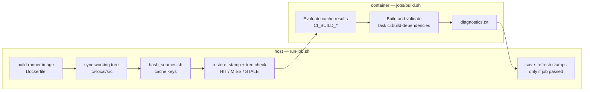

<!-- SPDX-License-Identifier: BSD-3-Clause -->
<!-- Copyright 2026 Intel Corporation -->

# Local CI

Runs the GitHub Actions jobs of this repository on your own machine, inside a
container that simulates the runner. The point is reproduction: a failure you
can only observe by pushing a commit and reading 40 MB of log takes minutes per
attempt, and the log rarely contains the state you actually need.

```sh
# everything a pull request triggers, in the order GitHub runs it
.github/ci-local/test-pr-locally.sh

# run the `build` job of .github/workflows/build.yml
.github/ci-local/run-job.sh build

# run .github/actions/validate-host as one matrix NIC would
.github/ci-local/run-job.sh validate-host --nic e810

# rebuild one component even though it is cached
.github/ci-local/run-job.sh build --force mtl

# throw away the working copy and take a fresh one
.github/ci-local/run-job.sh build --clean

# get a shell on the prepared runner instead of running the job
.github/ci-local/run-job.sh build --shell
```

The common entry points are also [Taskfile](../../Taskfile.yml) tasks, so a
local run and a runner run invoke the same command: `task ci:test-pr`,
`task ci:build`, `task ci:validate-host NIC=e830`, `task ebpf:check`.

An agent can drive local jobs and inspect production checks through the
`mtl-ci-local` MCP server (`.github/mcp/run_ci_server.sh`). Local tools include
`ci_test_pr`, `ci_run_job`, `ci_cache_status`, `ci_check_ebpf`, `ci_list_tasks`,
`ci_run_task`, `ci_last_log`, and `ci_diagnostics`. `ci_pr_checks` and
`ci_pr_failures` use the authenticated `gh` CLI to inspect a pushed PR. All
results are bounded; the production tools are read-only and never push, rerun,
comment, or merge.

The MCP layer is only an adapter. `ci_test_pr` calls
`test-pr-locally.sh`, and `ci_run_task` calls the root Taskfile.
Changes to `.github/mcp/mtl_ci_mcp_server.py` must exercise each affected
wrapper through result formatting; `py_compile` alone cannot detect failures
such as using a summary variable before assignment or calling the shared
summary helper with the wrong signature.

For pushed branches, call `ci_pr_checks` first. If it reports failures, call
`ci_pr_failures`; it prefers check-run annotations and falls back to a bounded,
prefix-stripped extract from failed-job logs. This avoids loading entire GitHub
Actions logs into the agent context.

## What `test-pr-locally.sh` covers

```text
Lint Code Base     linter.yml          (opt-in: --with-lint)
  └─ build          build.yml           produces .local_install/*
       └─ pr-gate    pr-gate.yml         would the test workflows run?
            └─ validate-host per NIC   smoke-tests.yml, gtest-bare-metal.yml
```

The tests themselves need a NIC, VFs, the Kahawai ICE driver and hugepages, so
they stay on real hardware. Cache restore, JPEG XS and ICE artifact validation,
library and plugin resolution, and ICE activation ordering run here. Activation
uses the production script's dry-run mode and never changes the host kernel.

Results land in `.ci-local/` (git-ignored):

| path                        | contents                                     |
| --------------------------- | -------------------------------------------- |
| `.ci-local/logs/<job>-*.log` | full job output, one file per run            |
| `.ci-local/out/diagnostics.txt` | environment state captured after every run |
| `.ci-local/src/`            | the checkout the job was built from           |

The checkout is taken from `git ls-files`, so it holds what a real checkout
holds and none of the host's build directories, which record absolute host
paths meson cannot relocate. It is updated in place rather than mirrored,
because the job downloads its own sources into the workspace — SVT-JPEG-XS,
the DPDK tarball, FFmpeg — and deleting those every run turns a 90 second
rerun into a 20 minute one. Use `--clean` when the copy needs to go.

The install tree is `.local_install/` in the repository root — the same path
the workflow uses — so it survives between runs and unchanged components are
not rebuilt.

## What maps to what

`run-job.sh` plays the parts GitHub plays. It never re-implements a job step;
the steps live in `jobs/<job>.sh`, one section per workflow step.

| GitHub                        | here                                        |
| ----------------------------- | ------------------------------------------- |
| `runs-on: dpdk`               | `Dockerfile`                                |
| `runs-on: ${{ matrix.nic }}`  | `Dockerfile.baremetal`, `run-job.sh --nic`  |
| `actions/checkout`            | `git ls-files` piped into `rsync`, into `.ci-local/src` |
| the `checksums` job           | `script/hash_sources.sh`, the same helper CI calls |
| `actions/cache` restore       | stamp files under `.local_install/.stamps/` |
| the job steps                 | `jobs/<job>.sh`                             |
| `.github/actions/validate-host` | `jobs/validate-host.sh`                   |
| `actions/cache` post: save    | stamps refreshed after the job, on success only |



## Cache integrity

The local harness and build workflow enforce the same two rules:

1. **A hit must be usable, not merely present.** `tree_is_usable()` in
   `run-job.sh` looks for the artifact that consumers actually resolve —
   `libdpdk.pc`, `mtl.pc`, the JPEG XS manifest and plugin, `libavcodec.pc`, a
   plugin `.so`, or the kernel-specific ICE module and metadata. A key match
   with an unusable tree is reported `STALE` and rebuilt.
1. **Only a passing job may write the cache.** Stamps are refreshed after the
   container exits, and only on success, so a broken tree can never become a
   permanent hit.

## Why the image exists

A bare `ubuntu:22.04` fails for reasons that have nothing to do with the code
under test, and each one costs a debugging round trip:

- apt resolves the Ubuntu mirrors over IPv6, which many hosts cannot route;
- `sudo` resets the environment, so the proxy variables and
  `DEBIAN_FRONTEND` are dropped and `tzdata` stops on an interactive prompt —
  `setup_environment.sh` installs everything through `sudo`;
- ~400 packages are downloaded on every single run.

The image fixes all three, and runs as your own uid with passwordless sudo, so
files it writes into the bind-mounted workspace stay yours.

It also installs packages the workflow itself never installs, because the
self-hosted runner already has them from earlier runs. See the second finding
below.

## What running it locally found

Reproducible with the commands above.

1. **`libdpdk` needs `libelf-dev`, which nothing installs.** It arrives only
   under `SETUP_BUILD_AND_INSTALL_EBPF_XDP`, which the `build` job leaves off.
   The runner has it from an earlier XDP run, so the job passes there and
   fails on any freshly provisioned machine whose DPDK cache is a hit —
   `Package 'libelf', required by 'libdpdk', not found`.
1. **The second MTL build step is a silent no-op.**
   `.github/scripts/setup_environment.sh` carries two `MTL_BUILD_AND_INSTALL`
   blocks. The first runs `./build.sh`, which builds. The second runs
   `./build.sh "${mtl_build_options}"`, and with fuzzing off that expands to
   `./build.sh ''` — an empty positional argument, which `build.sh` rejects by
   printing its usage and exiting **0**. `set -e` cannot catch a zero exit, so
   the step is reported as having built MTL. Harmless only because the first
   block already did.
1. **The GStreamer plugins were unloadable.** `validate-host` set
   `GST_PLUGIN_PATH` to the cached plugin directory but did not put that
   directory on `LD_LIBRARY_PATH`. The plugins there link against their own
   `libgstmtl_common.so`, which lives beside them and is not installed
   system-wide, so every one failed to load with
   `libgstmtl_common.so: cannot open shared object file`. Fixed in the action;
   `jobs/validate-host.sh` asserts `gst-inspect-1.0 mtl_st20p_tx` succeeds so it
   cannot regress silently.
1. **libbpf installed successfully but was invisible to `pkg-config`.** Its
   upstream default is `/usr/local/lib64`, which Ubuntu does not include in the
   default pkg-config search path. `build_ebpf_xdp.sh` installs bundled libbpf
   into `/usr/local/lib/$(cc -dumpmachine)` and refreshes `ldconfig`, matching
   the multiarch path used by the rest of the job.

## Adding a job

Add `jobs/<name>.sh`, mirroring the workflow steps in order and reading its
inputs from the `CI_LOCAL_*` variables `run-job.sh` exports. Then
`run-job.sh <name>`.
