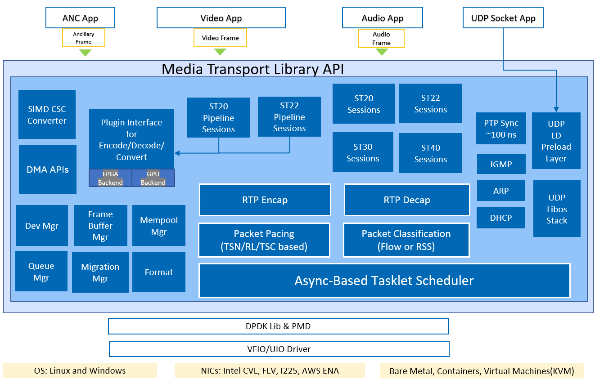

# Intel® Media Transport Library

[](https://github.com/OpenVisualCloud/Media-Transport-Library/actions/workflows/ubuntu_build.yml)
[](https://github.com/OpenVisualCloud/Media-Transport-Library/actions/workflows/centos_build.yaml)
[](https://github.com/OpenVisualCloud/Media-Transport-Library/actions/workflows/msys2_build.yml)
[](https://github.com/OpenVisualCloud/Media-Transport-Library/actions/workflows/clang_build.yml)
[](https://github.com/OpenVisualCloud/Media-Transport-Library/actions/workflows/ubuntu_build_with_gtest.yml)

## 1. Overview

The Intel® Media Transport Library is a solution based on DPDK prepared for transmitting and receiving media data with high throughput and low latency. It include a efficient user space LibOS UDP stack features designed for media transport, it also has a built-in compliant implementation to the SMPTE ST 2110 Professional Media Over Managed IP Networks suite of standards.

### 1.1 Features

* User-space LibOS UDP stack with POSIX socket compatible API.

#### 1.1.1 ST2110 features

* ST2110-10, ST2110-20, ST2110-21, ST2110-30, ST2110-40, ST2110-22, ST2022-7
* 1080p, 720p, 4k, 8k and other
* FPS: 120, 119.88, 100, 60, 59.94, 50, 30, 29.97, 25, 24, 23.98
* All the video format listed in ST2110-20, include YUV 4:2:2 10bit and others.
* CSC support status: [status](doc/convert.md)

### 1.2 Architecture

Intel® Media Transport Library takes advantage DPDK features to implement a highly efficient, real-time & low-latency media transport stack, software based media transport makes it feasible for edge and cloud deployment based on COTS hardware.<br>
The library introduce a tasklet async based scheduler to fully utilize CPU resources, easy integration with different packet processing unit and accelerators.<br>
The packet pacing module support different ways(algorithm) to achieve narrow pacing, RL(rate limit) is partially hardware offload while TSC is fully software based.<br>
The library also develope SIMD CSC(color space format covert), DMA, plugin interface to build a full video production ecosystem.
<div align="center">

</div>

## 2. Build

Please refer to [build guide](doc/build.md) for how to build DPDK, the library and the sample application.<br>
For Windows, please refer to [Win build guide](doc/build_WIN.md) for how to build.

## 3. Run ST2110

Please refer to [run guide](doc/run.md) for how to setup and run the demo pipeline application.<br>
For Windows, please refer to [Win run guide](doc/run_WIN.md) for how to setup and run the demo.<br>
For VF and VM support under Linux, please refer to [vf guide](doc/vf.md) for how to setup VF based on SRIOV, [vm guide](doc/vm.md) for how to setup VM based on VF passthrough.<br>
For AWS (cloud environment), please refer to [AWS run guide](doc/aws.md) for how to setup and run the demo.

## 4. ST2110 Programmers guide

For how to develop application quickly based on Intel® Media Transport Library, pls refer to [sample code](app/sample).

## 5. User space UDP stack guide

From 23.03.0 version, this lib extend the support to user-space UDP stack which run directly under current process context for performance consideration. Other user-space UDP stack usually run with client-service architect, it introduce a cross-core message cost which hurt the performance.
Our stack are running NIC tx/rx function from the sendto/recvfrom API directly which save the cross-core call and keep the data affinity(LLC) to the UDP consumer.

For how to use the LibOS UDP stack, pls refer to [udp doc](doc/udp.md).

## 6. How to Contribute

We welcome community contributions to the Intel® Media Transport Library project. If you have any ideas/issues, please share it with us by the GitHub issues or opening a pull request.

### 6.1 Coding style

We use super-linter action for the style check.

For C/C++ coding, run below command to quickly fix the style.

```bash
./format-coding.sh
```

For others, please check with below example command inside the docker.

```bash
# super-linter
docker run -it --rm  -v "$PWD":/opt/ --entrypoint /bin/bash github/super-linter

cd /opt/

# echo "shell check"
find ./ -name "*.sh" -exec shellcheck {} \;

# hadolint check
hadolint docker/ubuntu.dockerfile

# actionlint check
actionlint

# markdownlint check
find ./ -name "*.md" -exec markdownlint {} -c .markdown-lint.yml \;
# find ./ -name "*.md" -exec markdownlint {} --fix -c .markdown-lint.yml \;

# textlint
find ./ -name "*.md" -exec textlint {} \;
# find ./ -name "*.md" -exec textlint {} --fix \;
```
