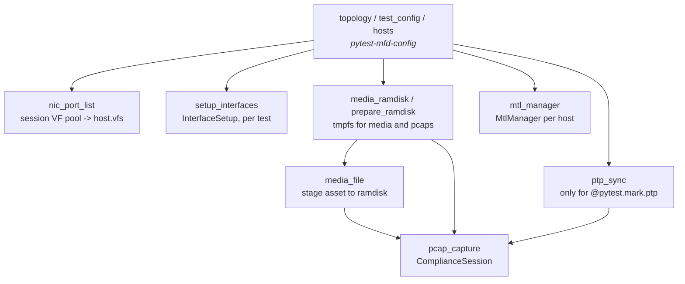

# MTL Acceptance Tests Architecture

Architectural map of `tests/acceptance/` for developers who know MTL and
ST 2110 but not this framework. For install/run commands see
[acceptance_quickstart.md](acceptance_quickstart.md).

Terms used throughout: **RxTxApp** is MTL's reference TX/RX sample
application; **MtlManager** is the privileged helper daemon MTL apps connect
to; **mfd** is the Intel `mfd-*` test library family that abstracts host
access ([§6](#6-remote-proofing-the-mfd-abstraction)); **PF/VF** are SR-IOV physical/virtual functions; **PHC** is the
NIC's PTP Hardware Clock; **EBU LIST** is the external open-source ST 2110
analyser used for compliance verdicts ([§5.3](#53-packet-compliance)); **SUT** is the system under
test.

## 1. Map of the code

| Group            | Path                                                                                                   | Owns                                                                                                        |
| ---------------- | ------------------------------------------------------------------------------------------------------ | ----------------------------------------------------------------------------------------------------------- |
| **Harness**      | `conftest.py` (~1.4k lines)                                                                            | Every fixture: topology load, host prep, VF pools, media staging, capture, clocks, logging, cleanup         |
| **Host control** | `common/nicctl.py`, `common/host_setup.py`                                                             | `Nicctl` (VF create/bind), `InterfaceSetup` (per-test interface allocation), hugepages, PF up, CPU governor |
| **Adapters**     | `mtl_engine/application_base.py`, `rxtxapp.py`, `ffmpeg.py`, `gstreamer.py`                            | `Application` ABC + its three concrete subclasses: command building, process lifecycle, result validation   |
| **Parameters**   | `mtl_engine/config/universal_params.py`, `rxtxapp_config.py`                                           | The single vocabulary of test knobs, and the RxTxApp JSON config template                                   |
| **Media**        | `mtl_engine/media_files.py`, `media_creator.py`, `ramdisk.py`                                          | Curated asset registry with metadata; synthetic asset generation; tmpfs staging                             |
| **Capture**      | `create_pcap_file/netsniff.py`, `mtl_engine/pcap_compliance.py`                                        | `NetsniffRecorder` (capture only) and `ComplianceSession` (capture lifecycle + EBU verdict)                 |
| **EBU client**   | `compliance/compliance_client.py`, `upload_pcap.py`                                                    | HTTP upload/poll against the EBU LIST analyser                                                              |
| **Integrity**    | `mtl_engine/integrity_session.py`, `mtl_engine/integrity.py`, `common/integrity/`                      | Frame/sample-exact comparison of source vs received media                                                   |
| **Reporting**    | `mtl_engine/csv_report.py`, `stash.py`, `common/collect_platform_info.py`, `common/generate_report.py` | CSV rows, per-test issue/result stash, platform snapshot, performance reports                               |
| **Tests**        | `tests/single/`, `tests/dual/`                                                                         | Scenario intent only ([§3](#3-what-a-test-case-owns))                                                       |
| **Legacy**       | `mtl_engine/RxTxApp.py`, `ffmpeg_app.py`, `GstreamerApp.py`                                            | Pre-adapter procedural modules ([§2.3](#23-legacy-modules))                                                 |

## 2. Application adapters

### 2.1 Adapters are independent, not a shared inheritance ladder

`Application` (in `application_base.py`) is an ABC owning everything
**application-agnostic**: parameter storage, process start/stop ladders,
timeout budgeting, the PTP startup allowance, and post-run oracle dispatch.
It knows nothing about RxTxApp's JSON schema or FFmpeg's argv.

Each adapter implements four abstract methods and nothing more:
`get_app_name()`, `get_executable_name()`, `_create_command_and_config()`
(turn `self.params` into `(command, config_dict|None)`), and
`validate_results(fail_on_error)` (the application-level oracle, [§5.1](#51-application-result)).

`RxTxApp`, `FFmpeg` and `GStreamer` are therefore **siblings, not
variants**. They share lifecycle, not behaviour: RxTxApp emits a JSON config
plus one process; FFmpeg emits argv only and runs an RX process plus N TX
processes; GStreamer runs two `gst-launch-1.0` pipelines. None can see the
others' internals, and a fourth adapter can be added by implementing the four
methods without touching the existing ones.

The one optional hook is `unsupported_reason(**params) -> str | None`, which
reports what the *application* cannot do (a plugin with no RTCP property, a
pixel format it never converts). `app_factory(application, **params)` calls it
and skips with that reason, so a shared test sweeps every dimension for every
application and never needs `if application == "..."`. A parameter combination
the hook does not mention is expected to work: an adapter must fail loudly
rather than silently substitute something it does support.

### 2.2 One execution path, two topologies

`execute_test()` is the single entry point. Three of its steps encode
invariants that are not obvious from the source:

1. It builds a `CaptureIntent` (the immutable snapshot of what MTL was told
   to transmit, later compared against the analyser report) **once** —
   `self.params` is mutable and must not be re-read later in the run.
2. `_run_proc_group()` starts each `ProcSpec` (one process's argv, log path,
   and whether it self-terminates) in order and fires the
   `after_first_start` / `after_last_start` hooks that arm capture.
   Unbounded processes are stopped with a **SIGINT → SIGKILL** ladder;
   SIGINT first so DPDK can run `rte_eal_cleanup` and release its VFIO
   group file descriptor.
3. `_finalize_run()` runs the compliance verdict and `validate_results()`
   **independently** — a crash must still be validated even when the
   capture is also non-compliant — then re-raises once at the end.

Where an adapter genuinely differs it overrides a concrete method and says
why in a comment. `FFmpeg.execute_test()` is a full override because
FFmpeg's traffic only flows once the *last* process is up, so it arms
capture on `after_last_start` rather than `after_first_start`.

Dual-host runs a TX process on one host and an RX process on another and
validates both applications. It does **not** capture packets; requesting
compliance on a dual-host run raises immediately rather than silently
skipping.

### 2.3 Legacy modules

`RxTxApp.py`, `ffmpeg_app.py`, and `GstreamerApp.py` predate the adapter
model and are procedural (module-level functions, no `Application`
subclass). Migration is **unfinished**, so they are far from dead:

* `RxTxApp.py` — still the backend for all of `tests/dual/st20p|st30p|st40/`
  and `tests/single/performance/` (28 importing test files). Note the
  capitalisation trap: `RxTxApp.py` is legacy, `rxtxapp.py` is the modern
  adapter.
* `ffmpeg_app.py` — command builders still called by the modern `ffmpeg.py`;
  its validation logic is not reused.
* `GstreamerApp.py` — backs dual-host and specialized single-host GStreamer
  tests. Shared single-host behavior runs through the `gstreamer.py` adapter.

Do not extend these, and do not add a 29th `RxTxApp.py` importer. New work
goes through `Application`.

## 3. What a test case owns

A test case is a **declaration of intent**, not a script. It should contain
only: markers (suite + side classification, [§5.4](#54-compliance-is-a-tx-side-oracle-only)); `parametrize` over the
dimension under test with `media_file` requested indirectly; fixture
requests; a `config_params` dict built from media metadata and the
parametrized dimension; `create_command()` then `execute_test()`; and any
*extra* oracle the scenario needs.

Everything else — VF creation, hugepages, IP allocation, media staging,
capture arming, process reaping, log capture, CSV rows — belongs to fixtures
and the adapter. A test that pokes at NIC state, sleeps to wait for a
process, or removes its own files is doing framework work in the wrong
place.

Authoring rules are enforced by
[mtl-acceptance-authoring.instructions.md](../.github/instructions/mtl-acceptance-authoring.instructions.md).

## 4. Inputs: configuration, fixtures, and media

### 4.1 The two config files

| File                           | Answers                                                                                                                                                                                |
| ------------------------------ | -------------------------------------------------------------------------------------------------------------------------------------------------------------------------------------- |
| `configs/topology_config.yaml` | *What hardware exists* — hosts, roles (`sut`/`client`), their NICs by `pci_device` + `interface_index`, SSH connection details, per-host `extra_info` (`mtl_path`, `media_path`)       |
| `configs/test_config.yaml`     | *How this run behaves* — `session_id` (drives IP subnets), default `test_time`, ramdisk sizes, `capture_cfg` (enable, pcap dir, sniff NIC, `phc_sync`), `ebu_server`, `interface_type` |

`configs/gen_config.py` generates both from CLI arguments and resolves a BDF
to `vendor:device`. `configs/examples/` holds minimal variants and
`configs/README.md` documents every key.

### 4.2 Fixture layers

`topology`, `test_config`, and `hosts` come from the `pytest-mfd-config`
plugin and are the root of everything else. Arrows below are real fixture
arguments; note that `nic_port_list` and `setup_interfaces` are
**independent** — tests request each directly.

Key policies encoded in fixtures, not in tests:

* **Session-scoped VF pool.** `nic_port_list` creates up to six VFs per
  participating PF once and stores them on `host.vfs` / `host.vfs_r`. Reuse
  is deliberate: repeated SR-IOV teardown is slow and can hang on a held
  VFIO group.
* **Per-test allocation.** `setup_interfaces` yields an `InterfaceSetup`;
  tests request `"VF"`, `"PF"`, `"VFxPF"`, mixed TX/RX types, or a
  PMD+kernel-socket pair. Its `cleanup()` releases only what that test
  created and rebinds PFs to the kernel driver.
* **Autouse hygiene.** Stray `ptp4l`/`phc2sys` daemons are reaped, stale
  DPDK processes holding `/dev/vfio/*` are killed, hugepage mappings are
  wiped, and libraries are `ldconfig`-registered — all before the first
  test.
* **Cleanup is a fixture responsibility.** `output_files.register(path)` is
  how a test asks for a file to be removed; `--keep all|failed|none`
  controls retention.

### 4.3 Media assets and NFS

Assets live on a shared mount (conventionally NFS at `/mnt/media`), pointed
to by `test_config.media_path` or a per-host `extra_info.media_path`. The
framework treats it as an ordinary path — the OS mount abstracts NFS away,
so remote and local hosts resolve the same string.

`media_files.py` is the registry: each entry carries `filename`, `width`,
`height`, `fps`, `file_format` (pixel format) and `format` (transport
format). NTSC rates are stored **as rational strings** (`"5994/100"`) and
truncated for the `pXX` label by `parse_fps_to_pformat()` (`→ "p59"`), which
matters when comparing against external analysers reporting the exact
rational.

The `media_file` fixture copies the requested asset from the shared mount
into the tmpfs ramdisk (so disk I/O is never the bottleneck) and returns
`(info_dict, staged_path)`. A **missing source asset skips** the test — an
environment gap, not a product defect. A failed copy **fails**.

## 5. Oracles: what actually proves a pass

Passing one oracle does not imply another ran. Tests opt in.

| Oracle             | Code                                                    | Proves                                                             |
| ------------------ | ------------------------------------------------------- | ------------------------------------------------------------------ |
| Application result | `validate_results()` per adapter                        | The process ran and its own log/result markers are good            |
| Media integrity    | `mtl_engine/integrity_session.py` + `common/integrity/` | Received payload matches the source                                |
| Packet compliance  | `mtl_engine/pcap_compliance.py` + `compliance/`         | The transmitted stream is valid ST 2110 with the expected schedule |
| Performance        | `mtl_engine/performance_monitoring.py`                  | A workload sustains a target session count or frame rate           |
| Reporting          | `csv_report.py`, `stash.py`                             | Not an oracle — the record of the above                            |

### 5.1 Application result

Adapter-owned. RxTxApp parses per-session-type result markers from stdout;
FFmpeg checks mode-specific output (frame counts, file sizes). This proves
operation, not payload identity or standards conformance.

### 5.2 Media integrity

`IntegritySession` (`mtl_engine/integrity_session.py`) owns one post-run
content-integrity verdict for one test, mirroring `ComplianceSession`:
`enabled` / `skip(reason)` / `evaluate(intent)` / `close()`. The
`media_integrity` fixture builds the session; a test hands it to
`execute_test(integrity=media_integrity)` and `Application._finalize_run()`
evaluates it -- strictly *before* `validate_results()` can delete the RX
output file, so tests never need to force-keep output just to survive to
this check. `NO_INTEGRITY` is the null-object stand-in a test gets by simply
not requesting the fixture.

`IntegrityIntent.kind` (built from the app's own `session_type`) selects
which `common/integrity/integrity_runner.py` Runner `evaluate()` shells out
to -- `FileVideoIntegrityRunner` (MD5-compares frames) for video sessions,
`FileAudioIntegrityRunner` (compares sample buffers) for audio sessions,
using size/count math from `mtl_engine/integrity.py`. A test that requests
`media_integrity` but never dispatches it fails in teardown, same as
`pcap_capture`.

The two dual-host integrity tests
(`tests/dual/st20p/integrity/`, `tests/dual/st30p/integrity/`) still call
`mtl_engine/integrity.py`'s local-file comparisons
(`check_st20p_integrity`/`check_st30p_integrity`) directly -- the fixture is
single-host only, since a dual-host run has no single `Application` whose
`_host` can own the verdict.

### 5.3 Packet compliance

`ComplianceSession` owns one capture and one verdict for one test:
`enabled` / `skip(reason)` / `arm(intent)` / `evaluate(intent)` / `close()`.
`NO_COMPLIANCE` is the null-object stand-in, so no caller needs a `None`
check. `NetsniffRecorder` underneath is capture-only and holds no compliance
state.

Capture uses a kernel-owned NIC via `netsniff-ng` with hardware RX
timestamps into nanosecond pcaps, so packet spacing reflects the wire and
not interrupt delivery. Interface selection priority: explicit
`sniff_interface` → `sniff_interface_index` → `sniff_pci_device` → topology
heuristic. Prefer explicit in CI; it documents the wiring.

`evaluate()` uploads the pcap to EBU LIST and fails the test when the report
disagrees with the `CaptureIntent` — ST 2110-21 schedule (narrow or
narrow_linear unless `allow_wide_compliance`), packing mode, resolution,
sampling + colour depth, and frame rate. A failed upload or an unparseable
response fails the test; it never silently passes. Capture is disabled for
8K, which the analyser does not support. A test that requests `pcap_capture`
but never dispatches it fails in teardown.

### 5.4 Compliance is a TX-side oracle only

EBU LIST measures what the TX side put on the wire and says nothing about
how RX processes that traffic. So `pcap_capture` belongs only to tests whose
parametrized dimension is TX-side. Parametrizing a purely RX-side feature
(e.g. `rss_mode`) over compliance is wasted CI time and analyser load — the
verdict is identical for every value.

This is why every test carries exactly one of `tx_side` / `rx_side` /
`tx_and_rx`, describing the property it *validates* rather than the data
flow (nearly every single-host test loops traffic both ways). `rx_side`
tests must not request `pcap_capture`. Not enforced by fixture code today;
enforce it in review.

## 6. Remote-proofing: the `mfd` abstraction

Nothing in the framework shells out directly. Every command goes through a
host object supplied by the `pytest-mfd-config` plugin — see the harness
instructions for the exact call surface.

| Package               | Provides                                                                         |
| --------------------- | -------------------------------------------------------------------------------- |
| `pytest-mfd-config`   | The `topology`, `test_config`, and `hosts` fixtures; `TopologyModel`             |
| `mfd-connect`         | `SSHConnection` / `LocalConnection`, `execute_command`, `start_process`, `path`  |
| `mfd-network-adapter` | `NetworkInterface`: `.name`, `.pci_address`, `.virtualization.get_current_vfs()` |
| `mfd-common-libs`     | Structured logging levels (`TEST_FAIL`, `TEST_INFO`, `TEST_PASS`)                |

This is what makes the design **remote-proof**: swapping
`connection_type: LocalConnection` for `SSHConnection` in
`topology_config.yaml` moves an entire suite to another machine with zero
test edits, and dual-host tests are just two host objects instead of one.
The corollary is a discipline: **never use `subprocess` or a hardcoded
interface name.** Either silently breaks the moment the host is not local.

`host.topology.role` (`sut` vs `client`) is how dual-host tests and capture
selection decide which machine does what.

## 7. Topology and interface rules

**Single-host ordering convention:** `network_interfaces[0]` is primary/TX,
`network_interfaces[1]` is redundant/RX. Several fixtures depend on this;
append extra interfaces, never insert before the primary pair. Auto-selected
capture takes the highest-index interface — configure
`capture_cfg.sniff_interface` explicitly on hosts with more complex layouts.

**Dual-host:** the capture host is the one named `client` when present,
otherwise the first host; auto-selection prefers a kernel PF with no active
VFs.

**VF mode** (the default) uses the session pool described in [§4.2](#42-fixture-layers). **PF
mode** binds the physical port to `vfio-pci`, removing existing VFs first,
and rebinds to the kernel driver during cleanup.

**PF mode plus capture requires separate IOMMU groups.** The capture port
must stay kernel-owned, so a DPDK-bound PF may not share its IOMMU group.
`InterfaceSetup._check_pf_not_capture_group()` compares the requested PF's
group against the capture NIC's and calls `pytest.fail()` on a match — it
does not fall back to another PF. This **fails rather than skips** because a
PF test that asked for capture is asserting the host has the hardware.

## 8. Clock model

Four independent mechanisms, easily confused:

| Mechanism                 | Owner           | Purpose                                                                   | Needs a grandmaster              |
| ------------------------- | --------------- | ------------------------------------------------------------------------- | -------------------------------- |
| Default application clock | MTL app         | Normal execution                                                          | No                               |
| `enable_ptp=True`         | MTL app         | Requests MTL's PTP/PHC path, adds startup time                            | Only to *prove* network-PTP sync |
| `@pytest.mark.ptp`        | Fixture         | Runs slave-only `ptp4l` on the capture NIC and suppresses `phc2sys` there | Yes, for real lock               |
| `capture_cfg.phc_sync`    | Capture fixture | Disciplines the capture PHC from `CLOCK_REALTIME` + kernel TAI-UTC offset | No                               |

For ordinary compliance runs no PTP daemon is involved: the framework gives
capture timestamps a correct absolute timebase locally (UTC from
`CLOCK_REALTIME`, leap seconds from the live `CLOCK_TAI − CLOCK_REALTIME`
offset, `phc2sys` onto the capture PHC). This does not synchronise the DUT
and does not prove network PTP lock.

Two traps. The `ptp_sync` fixture checks once at startup that `ptp4l`
launched and never re-checks, so **[the `@pytest.mark.ptp` marker](#8-clock-model) is not a PTP
conformance oracle** — a test claiming synchronisation must check lock or
offset itself. The fixture also early-returns when `capture_cfg.enable` is
falsy, making the marker a no-op with capture disabled.

All `ptp4l`/`phc2sys` processes are reaped by **process name** at test and
session boundaries. The SSH/sudo wrapper is not the daemon, so killing only
the wrapper leaks a clock owner into later NIC reconfiguration.

## 9. Environment contract

| Requirement               | Behaviour when unmet                                                     |
| ------------------------- | ------------------------------------------------------------------------ |
| Root-capable host access  | Needed for NIC/VFIO/capture/clock/hugepages; not pre-checked             |
| Build in `.local_install` | All app paths resolve here, **not** `build/` — see `mtl_engine/const.py` |
| Hugepages, supported NIC  | Prepared by host fixtures                                                |
| SR-IOV                    | Required for VF mode                                                     |
| Kernel-owned capture NIC  | Required when capture is enabled                                         |
| Separate IOMMU group      | Enforced for PF mode + capture; test fails                               |
| Topology order/wiring     | Convention; auto-selection cannot verify a cable                         |
| Media assets              | Missing asset skips the test                                             |
| EBU LIST service          | Required for compliance-enabled tests                                    |
| FFmpeg/GStreamer builds   | Required only by their tests                                             |
| PTP grandmaster           | Only for a real network-PTP claim                                        |

`.github/scripts/acceptance_setup.sh` discovers (`status`) and prepares
(`setup`) this contract end-to-end — see
[acceptance_quickstart.md](acceptance_quickstart.md#recommended-automated-setup).
