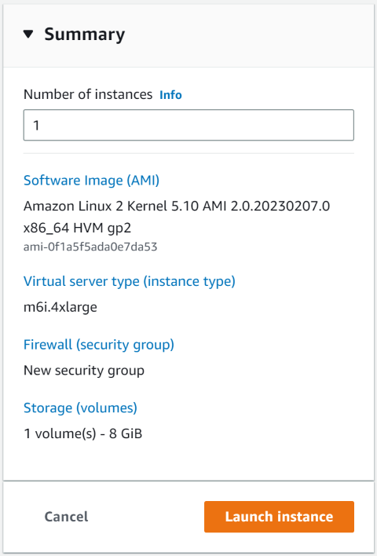

# Running on AWS

## 1. Create AWS instances

Instance type tested: **m6i.4xlarge** (6Gb bandwidth limit)

Image tested: **Amazon Linux 2 AMI**

Created 2 instances (TX and RX) with required storage.

Instance example:



## 2. Hugepage setting

Currently with no-iommu mode you have to enable 1G hugepage.

```shell
# under root user
echo GRUB_CMDLINE_LINUX=”default_hugepagesz=1G hugepagesz=1G hugepages=4”>>/etc/default/grub
grub2-mkconfig -o /boot/grub2/grub.cfg
```

Reboot instance.

## 3. Install MTL and other software

### 3.1 Build and install DPDK & MTL

Refer to CentOS part of [build.md](./build.md).

### 3.2 Apply vfio-pci patches

Since the default vfio driver does not support WC, ENA has some patches for the kernel.

```shell
git clone https://github.com/amzn/amzn-drivers.git
cd amzn-drivers/userspace/dpdk/enav2-vfio-patch
sudo get-vfio-with-wc.sh
```

## 4. IOMMU Setting

If you use bare metal, you can turn on IOMMU refer to [run.md](./run.md).

If you use VM, set NO-IOMMU mode for vfio after each boot.

```shell
echo 1 > /sys/module/vfio/parameters/enable_unsafe_noiommu_mode
```

## 5. Attach interfaces for DPDK

### 5.1 Create interfaces

(If you attach extra interfaces before starting the instance, you may not get the public DNS for ssh.)

Go to  EC2 > Network interfaces > Create network interface.

Choose same subnet for all new interfaces, set the right security groups for your RTP/UDP streams.

### 5.2 Attach interfaces

Right-click on your running instance, go to Networking > Attach network interface, choose an idle interface.

### 5.3 Bind interface to DPDK PMD

Load vfio-pci module, enable no-iommu mode if IOMMU is not supported.

```shell
modprobe vfio-pci
# echo 1 > /sys/module/vfio/parameters/enable_unsafe_noiommu_mode
```

Unbind the interface from kernel driver and bind to PMD.

```shell
ifconfig eth1 down
dpdk-devbind.py -b vfio-pci 0000:00:06.0
# check the interfaces
dpdk-devbind.py -s
```

## 6. Run the application

Refer to [run.md](./run.md) after section 3.3.

Features not supported on ENA:

* **PTP** (use system real_time)
* **Rate Limiting** based pacing (use TSC pacing)
* **Rte_flow** (use RSS queues)
* ... to be listed

## 7. General FAQ

**Q:** Compiler cannot find some dependencies.

**A:** run below commands

```shell
export PATH=$PATH:/usr/local/bin/
export PKG_CONFIG_PATH=/usr/local/lib64/pkgconfig/
export LD_LIBRARY_PATH=/usr/local/lib64/
```

---

**Q:** Cannot find ninja.

**A:** Edit build.sh, remove `sudo` in it, then run build.sh under root user.

---

## 8. Known issues

2M hugepages cannot be used under no_iommu mode or with igb_uio driver. As one 1080p frame needs 5MB memory, when buffer allocated, the physical memory may locate on different but not continues pages, this will cause invalid payload sent from TX.
