# CI Workflows

This page explains each GitHub Actions workflow of `.github/workflows/`: when it runs, what it
does, and what to do when it fails. The steps of most jobs are `task ci:*` commands from
`Taskfile.yml`, so `task --list` shows what you can run on your own machine.

The colors in the diagrams:

| Color | Meaning |
| --- | --- |
| Dark teal `#0B4F6C` | A job on a GitHub-hosted runner |
| Blue `#145C9E` | A job on a self-hosted runner: the DPDK build host or a host with an E810, E830, E835 or i225 NIC |
| Taupe `#CBB9A8` | A job that runs another workflow, for example PR Gate or Build |
| White, outlined | A result check: one status that sums up the jobs before it |
| Sand `#DCC7BE` | What starts the workflow, or a shared cache |

## Which workflow runs when

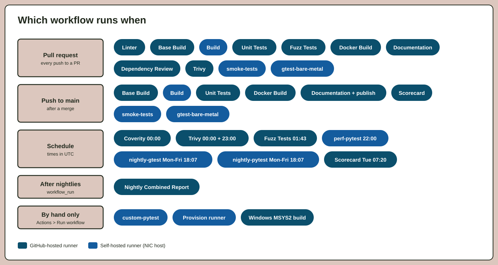

## How a pull request reaches the NIC hosts

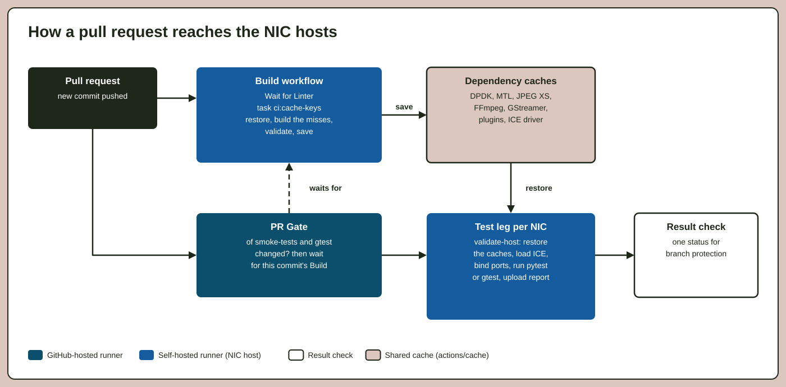

The hardware tests do not build MTL themselves. One **Build** run builds the dependencies on the
DPDK host and saves them as caches. Each test leg then restores the same caches:

1. **Build** computes one cache key for each dependency with `task ci:cache-keys`. A key is a
   hash of the sources that the dependency is built from, so a cache whose sources did not change is
   restored, not rebuilt.
2. The **PR Gate** of smoke-tests and gtest-bare-metal checks whether the change touches what the
   tests cover. If it does, it waits for the Build of the same commit.
3. Each test leg runs the `validate-host` action. It restores the caches, checks them with
   `task ci:validate-dependencies`, loads the ICE driver if the NIC needs it, and then runs its tests.

A test job installs nothing on its host. When a host is missing a package, run
[Provision runner](#provision-runner) on it; see also [CI runner setup](ci_runner_setup.md).

## Pull request checks

Most workflows first run a **Detect changes** job. It reads `.github/path_filters.yml` and skips the
work when the pull request changes nothing that the workflow checks. The result check still reports
success, so a skipped workflow does not block the pull request.

### Linter

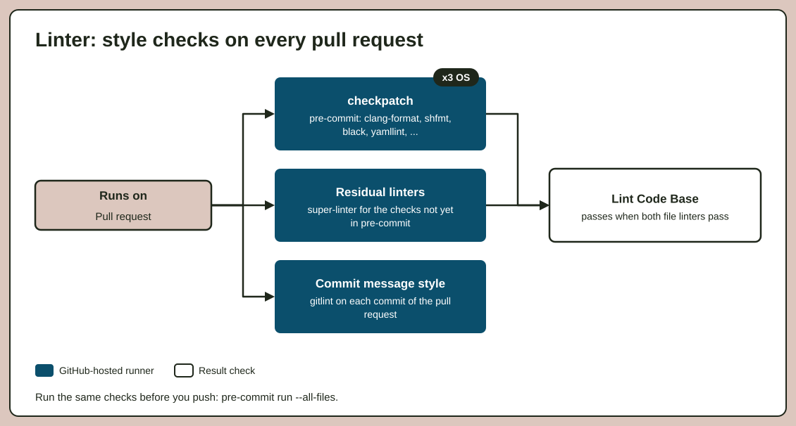

* **When:** each pull request.
* **What:** `checkpatch` runs pre-commit on Linux, macOS and Windows. super-linter runs the checks
  that are not in pre-commit yet. A separate job checks the commit message style with gitlint.
* **If it fails:** run `pre-commit run --all-files`, commit what it fixes, and see
  [Coding standard](coding_standard.md) for the commit message rules.

### Base Build

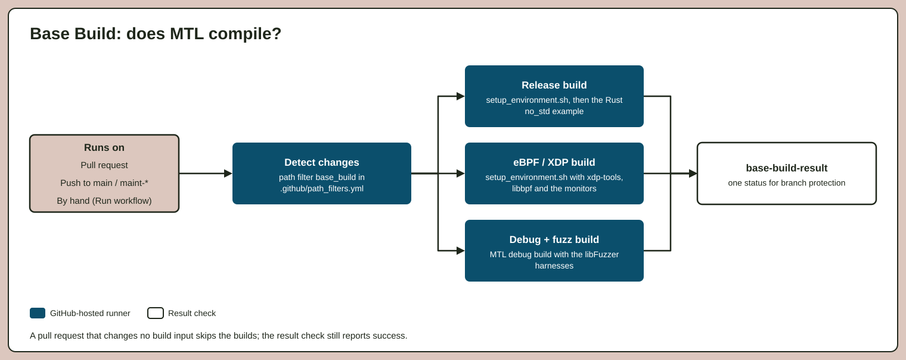

* **When:** each pull request and push to `main` or `maint-*` that changes a build input.
* **What:** three builds on GitHub-hosted Ubuntu: release (with the Rust `no_std` example),
  eBPF/XDP, and debug with the fuzz targets. All three use `.github/scripts/setup_environment.sh`.
* **If it fails:** reproduce it with `./build.sh` or `./build.sh debug`; see [Build](build.md).

### Build

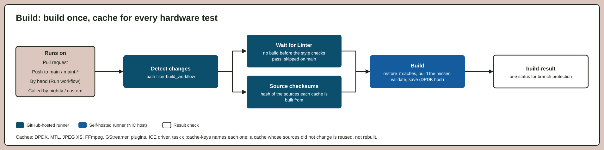

* **When:** each pull request and push to `main` or `maint-*`, and as the first job of the nightly
  and custom pytest workflows.
* **What:** after the linter passes, it restores the seven dependency caches on the DPDK host, builds
  only the dependencies that missed (`task ci:build-dependencies`), validates them and saves them.
* **If it fails:** the log says which dependency failed. A message that a cache is invalid at its exact
  key means that a saved cache is broken: bump `stash-v` in the `ci:cache-keys` task of `Taskfile.yml`.

### Unit Tests

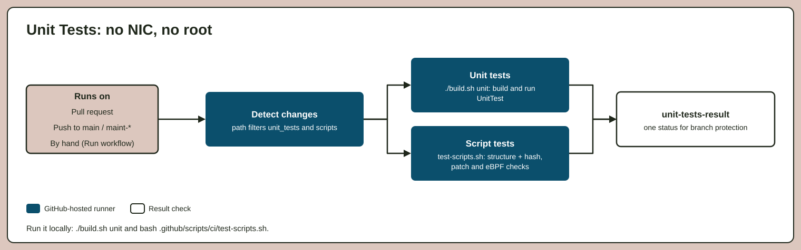

* **When:** each pull request and push that changes the unit sources or a script.
* **What:** `./build.sh unit` builds and runs the unit gtest suite, with no NIC and no root.
  `test-scripts.sh` checks that each script of `script/` has the common structure, and runs the ones
  that need no NIC.
* **If it fails:** run `./build.sh unit`, or `bash .github/scripts/ci/test-scripts.sh`.

### Fuzz Tests

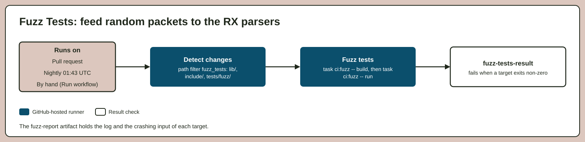

* **When:** each pull request that changes `lib/`, `include/` or `tests/fuzz/`, and each night.
* **What:** builds the libFuzzer harnesses with clang and ASan, and runs each target for 60 seconds
  on a pull request, 600 seconds at night.
* **If it fails:** download the `fuzz-report` artifact. It holds the log and the input that crashed
  the target. See [Fuzzing](../tests/doc/fuzz/index.rst).

### Docker Build

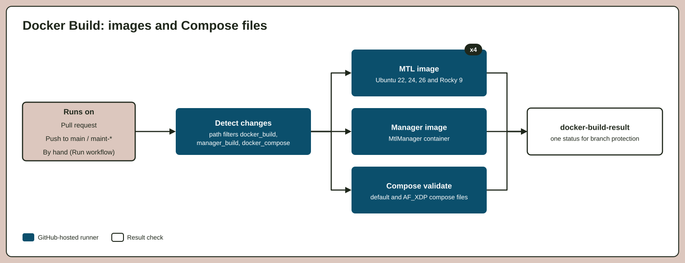

* **When:** each pull request and push that changes the Docker or Compose files, or the manager.
* **What:** builds the MTL image for Ubuntu 22.04, 24.04, 26.04 and Rocky 9, builds the MtlManager
  image, and validates the Compose files.

### Documentation

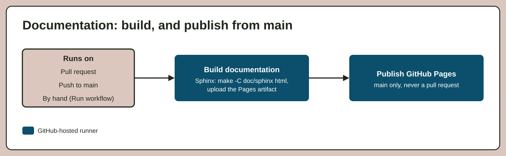

* **When:** each pull request, and each push to `main`.
* **What:** builds this documentation with Sphinx. On `main` it also publishes it to GitHub Pages.
* **If it fails:** Sphinx treats each warning as an error. See
  [Build the documentation](sphinx/build_docs.md).

### Dependency Review

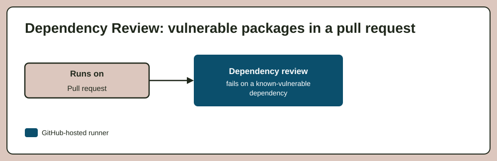

* **When:** each pull request.
* **What:** fails when the pull request adds a dependency version with a known vulnerability.

### Trivy

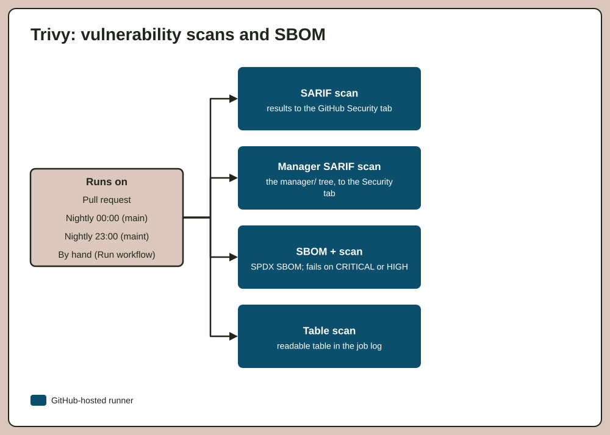

* **When:** each pull request, each night at 00:00 UTC for `main` and at 23:00 UTC for `maint-25.02`.
* **What:** four independent vulnerability scans. Two send their results to the GitHub Security tab,
  one writes an SPDX SBOM and fails on a CRITICAL or HIGH finding, and one prints a table in the log.

## Bare-metal tests

These workflows run only in `OpenVisualCloud/Media-Transport-Library`, because a fork has no
self-hosted runners.

### PR Gate

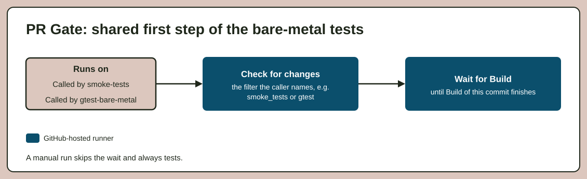

* **When:** called by smoke-tests and gtest-bare-metal; it never runs alone.
* **What:** decides whether the change needs the hardware tests, and waits for the Build of the same
  commit. Both callers share it, so the two cannot wait for different things.

### smoke-tests

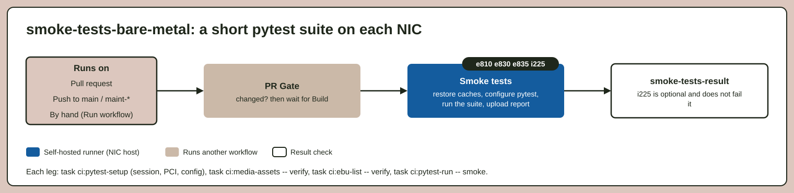

* **When:** each pull request and push to `main` or `maint-*` that changes what the smoke suite covers.
* **What:** the smoke pytest suite on the E810, E830 and E835 hosts, and a low-bandwidth variant on
  the i225 host. The i225 leg is optional and does not fail the run.
* **If it fails:** download the report artifact of the failed NIC. To run the same tests yourself,
  see [Acceptance quick start](acceptance_quickstart.md).

### gtest-bare-metal

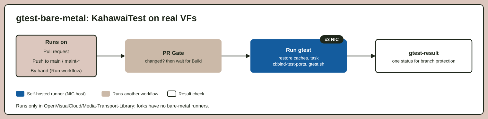

* **When:** each pull request and push to `main` or `maint-*` that changes what gtest covers.
* **What:** `KahawaiTest` on real VFs on the E810, E830 and E835 hosts. `task ci:bind-test-ports`
  binds the VFs and two DMA channels to `vfio-pci`, then `gtest.sh` runs the suite.
* **If it fails:** the log names the failed test case. See [Run](run.md) to run `KahawaiTest`
  with `--gtest_filter` on your own host.

## Nightly and scheduled

### nightly-gtest

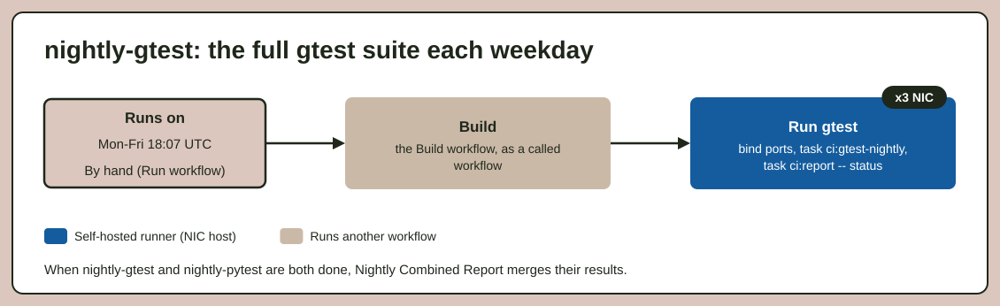

* **When:** Monday to Friday at 18:07 UTC.
* **What:** calls Build, then runs the full gtest suite on each NIC host and uploads the report and
  a status report of each host.

### nightly-pytest

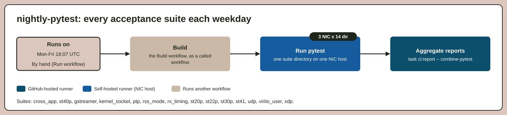

* **When:** Monday to Friday at 18:07 UTC.
* **What:** calls Build, then runs each of 14 pytest suite directories on each of the 3 NIC hosts,
  42 legs in all. The last job merges their reports into one.

### Nightly Combined Report

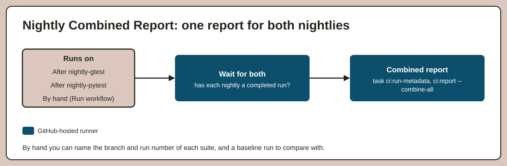

* **When:** after nightly-gtest or nightly-pytest completes. It makes the report only when both
  have a completed run.
* **What:** downloads both reports and writes one Excel and one HTML report. A manual run can name
  the branch and the run number of each suite, and a baseline run to compare with.

### perf-pytest

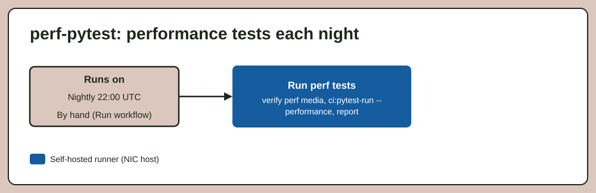

* **When:** each night at 22:00 UTC.
* **What:** the performance pytest suite on the performance host, with the number of sessions and
  the scheduler quota that you choose in a manual run. It writes a performance report.

### Coverity Build

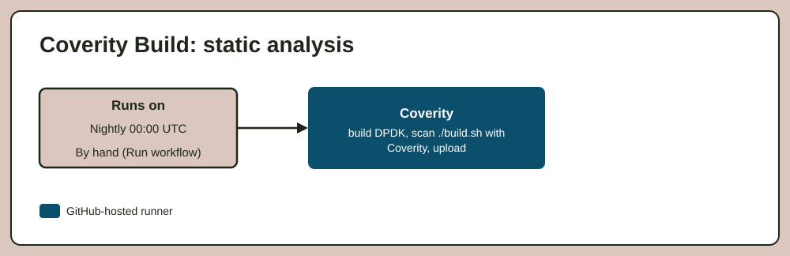

* **When:** each night at 00:00 UTC.
* **What:** builds DPDK, then builds MTL under the Coverity scanner and uploads the results.

### Scorecard

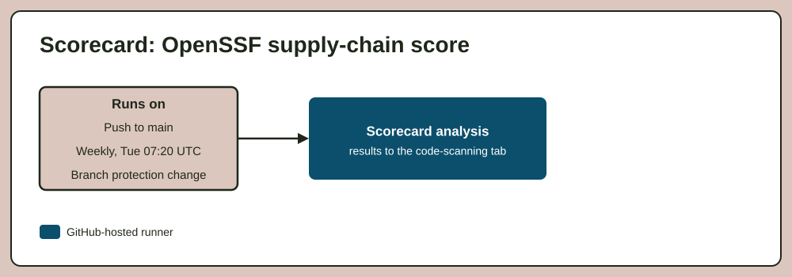

* **When:** each push to `main`, each Tuesday at 07:20 UTC, and when branch protection changes.
* **What:** the OpenSSF Scorecard supply-chain analysis. The results go to the code-scanning tab.

## Run by hand

Open **Actions**, pick the workflow, and press **Run workflow**.

### custom-pytest

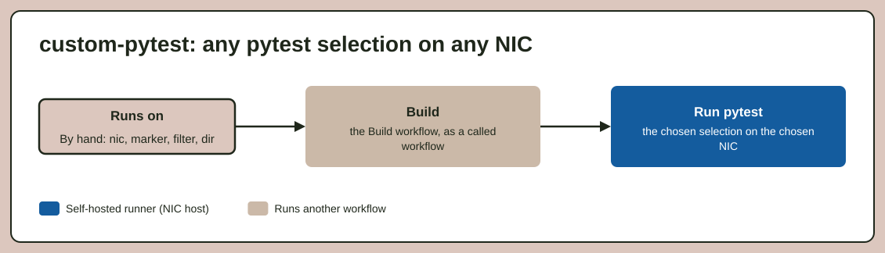

* **What:** runs one pytest selection on one NIC host: the NIC, a marker, a test filter and a
  directory. Use it to rerun a failed nightly test, or to try a new test on the hardware.

### Provision runner

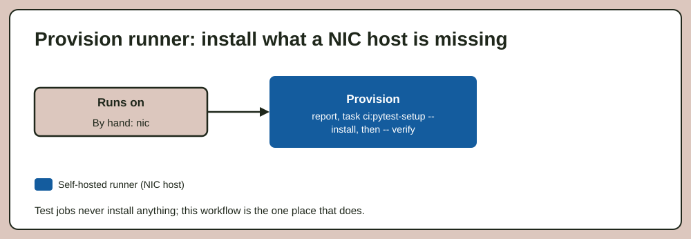

* **What:** installs the host build packages and the acceptance virtualenv on the chosen NIC host,
  then runs the same `verify` step that the test jobs run. This is the only workflow that installs
  anything on a host.

### Windows MSYS2 build

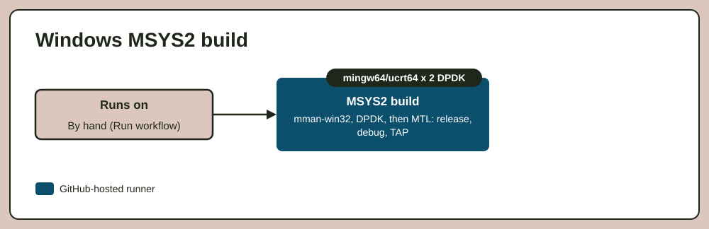

* **What:** builds DPDK and MTL on Windows with MSYS2, for the `mingw64` and `ucrt64` toolchains and
  two DPDK versions: a release, a debug and a TAP build. See [Build on Windows](build_WIN.md).
