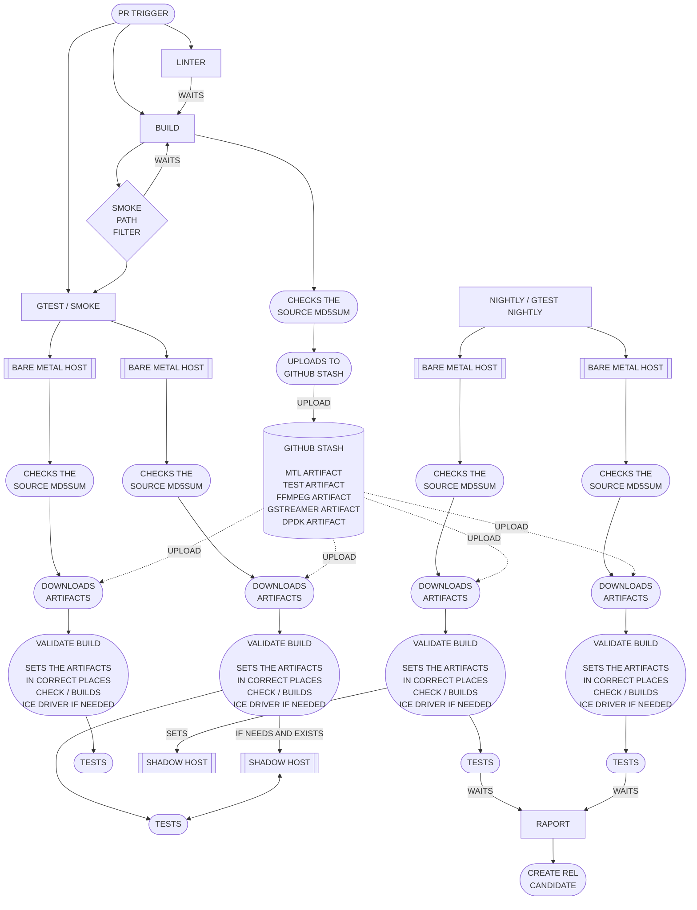

# Proposed setup of the architecture

To confirm the and run the project automatic validation you would need github
self hosted runners with tags e810 e830 e835 that will run validation.

here is propsed way you set it up in github.



## The stash, as implemented today

`BUILD` and the `GITHUB STASH` above are `.github/workflows/build.yml`. The
artifact store is `actions/cache`, keyed on a checksum of the sources that
produce each artifact, so a run only pays for the components a pull request
actually touched.

| stage in the diagram      | implementation                                      |
| ------------------------- | --------------------------------------------------- |
| `LINTER` / `WAITS`        | `wait-for-linter` job                               |
| `CHECKS THE SOURCE MD5SUM` | `checksums` job, `script/hash_sources.sh`          |
| `GITHUB STASH`            | `actions/cache`, keys `stash-<component>-<checksum>` |
| `BUILD`                   | `build` job on the self-hosted `dpdk` runner        |

The checksums waterfall, so that rebuilding a component invalidates everything
downstream of it:


The path lists that feed each hash live in `script/hash_sources_*.env`.

### The failure mode this design has

`actions/cache` saves in a post step that runs whether the job passed or not.
A run that dies part-way through installing a component still stores that
half-written tree under the key derived from its sources. Every later run with
the same sources restores it, reads `cache-hit == true`, skips the build, and
fails on whatever the tree is missing. The source checksum is unchanged, so
the poisoned entry cannot expire on its own — it has to be evicted by hand or
outlived.

Observed as: `MTL=HIT` in the cache notice, followed by
`ERROR: mtl >= 22.12.0 not found using pkg-config`, on a branch that had not
touched a single file feeding the `mtl` hash.

Two rules close it, both already implemented in the local harness below:

1. a restored tree counts as a hit only if it is structurally usable — the
   artifact consumers resolve is present (`libdpdk.pc`, `mtl.pc`,
   `libavcodec.pc`, a plugin `.so`) — otherwise it is treated as a miss;
2. the cache is written only when the job succeeded, which for
   `actions/cache` means splitting it into `actions/cache/restore` plus an
   explicit save step gated on `if: success()`.

## Running the pipeline locally

`.github/ci-local/` runs these jobs on a developer machine, in a container that
simulates the runner, against a persistent `.local_install` so that only what
changed is rebuilt.

```sh
.github/ci-local/run-job.sh build
```

It reuses the workflow's own moving parts rather than restating them — the same
`script/hash_sources.sh` for keys, the same
`.github/scripts/setup_environment.sh` for the build — so a failure reproduced
locally is the CI failure, and a fix proven locally is a fix. See
[.github/ci-local/README.md](../.github/ci-local/README.md) for the mapping
between each GitHub-provided step and its local stand-in.
