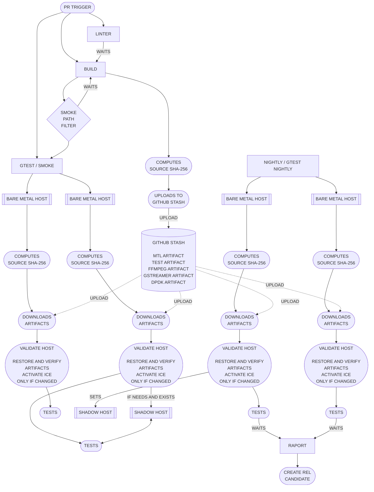
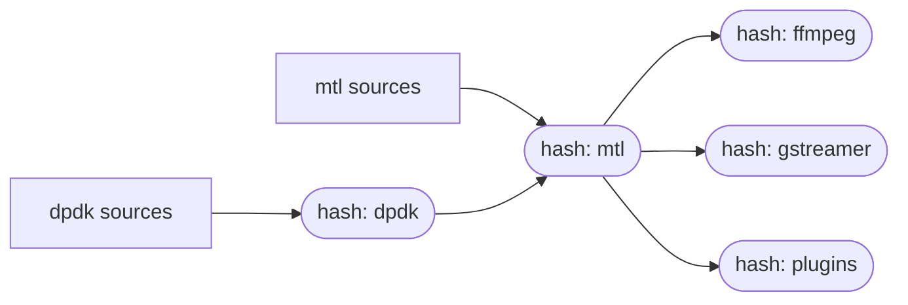
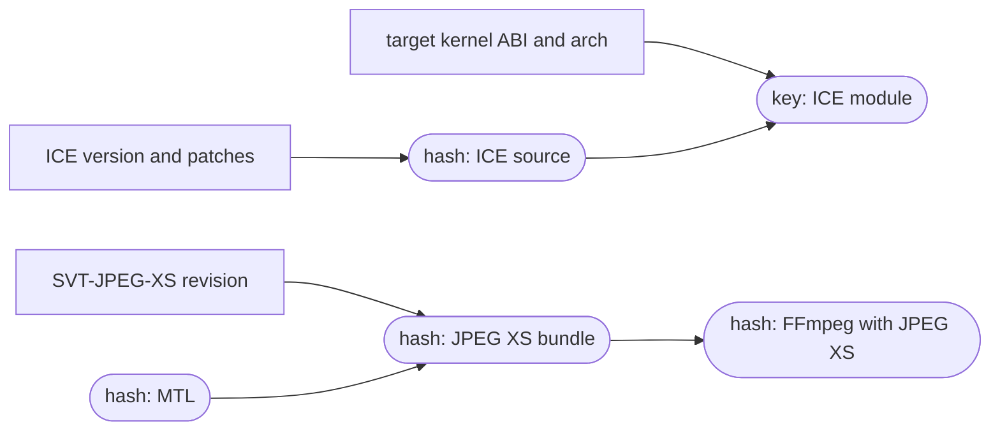

# Proposed CI/CD architecture

Automated hardware validation requires GitHub self-hosted runners labelled
`e810`, `e830`, and `e835`. The build runner produces reusable, content-addressed
outputs; bare-metal runners restore and validate those outputs before testing.

The proposed ICE and JPEG XS changes are tracked in
[GitHub Actions issue: prebuilt host dependencies](../.github/github_actions_issue.md).

The pipeline is organized as follows:

## The stash, as implemented today

`BUILD` and the `GITHUB STASH` above are `.github/workflows/build.yml`. The
artifact store is `actions/cache`, keyed on a checksum of the sources that
produce each artifact, so a run only pays for the components a pull request
actually touched.

| stage in the diagram      | implementation                                       |
| ------------------------- | ---------------------------------------------------- |
| `LINTER` / `WAITS`        | `wait-for-linter` job                                |
| `COMPUTES SOURCE SHA-256` | `checksums` job, `script/hash_sources.sh`            |
| `GITHUB STASH`            | `actions/cache`, keys `stash-<component>-<checksum>` |
| `BUILD`                   | `build` job on the self-hosted `e835` fleet runner   |

The checksums waterfall, so that rebuilding a component invalidates everything
downstream of it:

The path lists that feed each hash live in `script/hash_sources_*.env`.

## Proposed host dependency outputs

ICE and JPEG XS should join the existing cache waterfall, but they have
different compatibility boundaries.

The JPEG XS bundle is installed under `.local_install/jpegxs` and contains the
SVT runtime, `pkg-config` metadata, and MTL bridge plugin. Its hash includes the
SVT revision, MTL hash, architecture, toolchain/build options, and bridge
sources. Consumers update `LD_LIBRARY_PATH`, `PKG_CONFIG_PATH`, and the Kahawai
plugin registry to use that tree; they do not install it into `/usr/local`.

The ICE output contains the patched `ice.ko` plus metadata describing its
source hash, target kernel release, architecture, compiler, and vermagic.
Kernel release and architecture are part of the cache key. `validate-host`
rejects incompatible modules before touching the NIC and uses SHA-256, not
MD5, for identity.

There is one ICE producer in `build.yml`, running on the `e835` fleet runner so
the artifact is built against the validation kernel ABI. The dedicated `e810`,
`e830`, and `e835` hardware validation hosts share that ABI, so all validation
jobs restore the same ICE cache entry. NIC type is not part of the key and does
not require separate producer jobs. A kernel mismatch indicates runner drift
and fails validation instead of triggering a host-side build.

Driver activation is separate from driver compilation. Activation asks one
question — is the running driver already the cached module? — and does nothing
if it is. The kernel exposes no hash of a loaded module, so the answer comes
from the artifact being the file at the `updates/` path modprobe prefers, the
loaded `srcversion` matching that file, and the reported Kahawai version. On a
mismatch it stops NIC users, zeroes the VFs of the ice PFs, unloads dependent
modules and ICE, installs the validated module, and confirms the running driver
is that artifact. VFs are not recreated: the test jobs build the VF state they
need. Gtest and pytest jobs never compile, install, or reload a driver.

Preparing the NIC is likewise the job's step and not the suite's work. A gtest
job runs `sudo task ci:bind-test-ports`, which creates the trusted VFs on one
PF and binds two DMA channels on that PF's NUMA node; `.github/scripts/gtest.sh`
then only reads what that left, runs the cases and reports. A retry re-runs the
case on the same ports: a card rebuilt under a running suite is how a bare-metal
runner ends up wedged, and a case that only passes after its NIC was rebuilt is
not a pass worth reporting.

The detailed artifact contracts and acceptance criteria are maintained in
[the GitHub Actions issue](../.github/github_actions_issue.md).

### The failure mode this design has

`actions/cache` saves in a post step that runs whether the job passed or not.
A run that dies part-way through installing a component still stores that
half-written tree under the key derived from its sources. Every later run with
the same sources restores it, reads `cache-hit == true`, skips the build, and
fails on whatever the tree is missing. The source checksum is unchanged, so
the poisoned entry cannot expire on its own — it has to be evicted by hand or
outlived.

Observed as: `MTL=HIT` in the cache notice, followed by
`ERROR: mtl >= 22.12.0 not found using pkg-config`, on a branch that had not
touched a single file feeding the `mtl` hash.

Two rules close it:

1. a restored tree counts as a hit only if it is structurally usable — the
   artifact consumers resolve is present (`libdpdk.pc`, `mtl.pc`,
   `libavcodec.pc`, a plugin `.so`) — otherwise it is treated as a miss;
2. the cache is written only when the job succeeded, which for
   `actions/cache` means splitting it into `actions/cache/restore` plus an
   explicit save step gated on `if: success()`.

## Workflow authoring practices

Workflow YAML describes ordering, permissions, conditions, and runner
selection. It must not become the implementation layer. Do not add multi-line
`run: |` programs to workflows or composite actions. Add a named task to the
repository [Taskfile](../Taskfile.yml), and put substantial shell logic in a
focused script called by that task. A developer and GitHub Actions must invoke
the same task.

Two narrow one-line exceptions remain. A composite action that runs before
Task is installed may invoke a focused checked-in script through
`$GITHUB_ACTION_PATH`. An `actions/github-script` step may use a one-line
`require(...)` loader for a checked-in module because `github`, `context`, and
`core` only exist inside that action. The policy checker still rejects
multi-line `run` and `script` values recursively on active workflow and action
YAML; `.github/legacy` is intentionally excluded.

This gives every operation a short, searchable log label and a command that can
be reproduced outside GitHub. Tasks should be idempotent where practical,
validate their inputs, fail on the first unsafe condition, and leave enough
diagnostic output to identify the failed operation.

Apply these rules to new and modified workflows:

- pin third-party actions to immutable commit SHAs;
- use minimal job-level `permissions`;
- set explicit timeouts and per-host concurrency controls;
- keep build, host validation, test execution, and report collection separate;
- use caches for reusable dependencies and artifacts for run-specific outputs;
- validate restored cache contents and save caches only after successful builds;
- make cache-key inputs and job dependencies explicit;
- keep secrets out of logs, command lines, caches, and artifacts;
- use environment files or action outputs for structured hand-off between steps;
- keep cleanup steps explicit and guarded with `if: always()` where required;
- run the matching `task ci:*` command through the local CI harness before
    merging workflow changes.

These practices are informed by DevOps Directive's
[Complete GitHub Actions Course - From BEGINNER to PRO](https://www.youtube.com/watch?v=Xwpi0ITkL3U&t=6767s)
and adapted for MTL's persistent self-hosted runners and hardware lifecycle.
