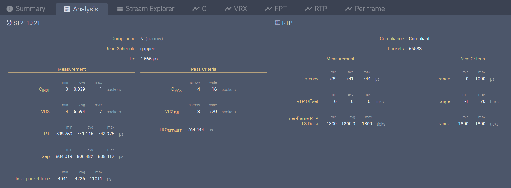
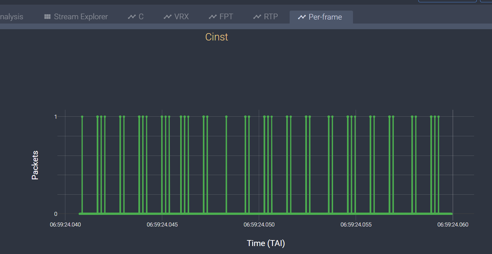
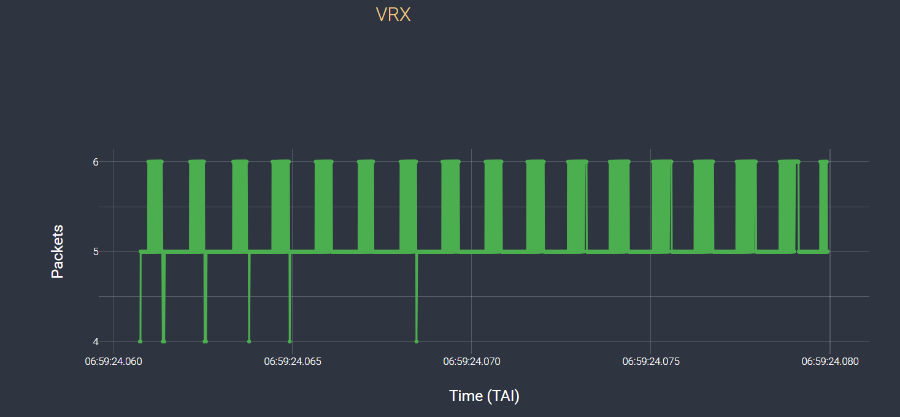
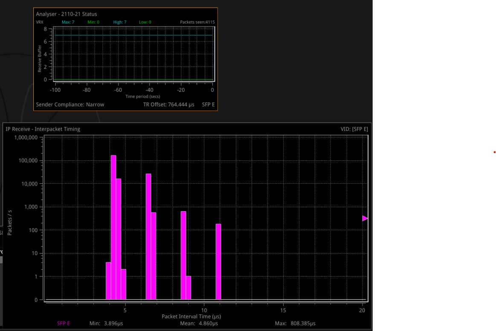
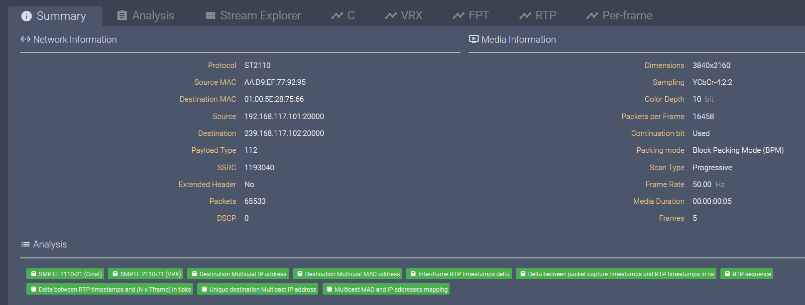
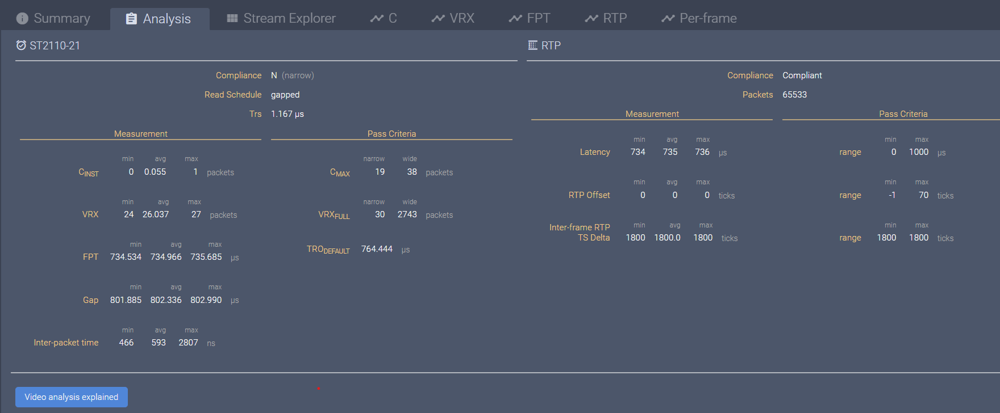
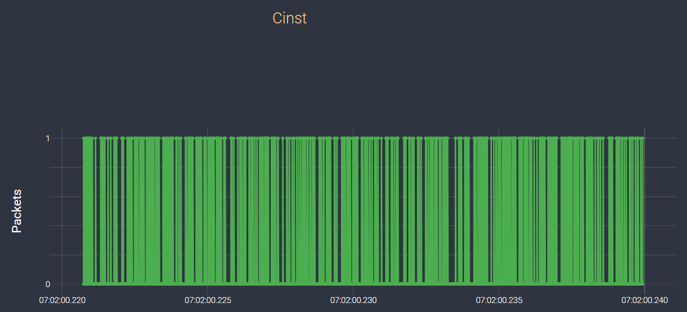
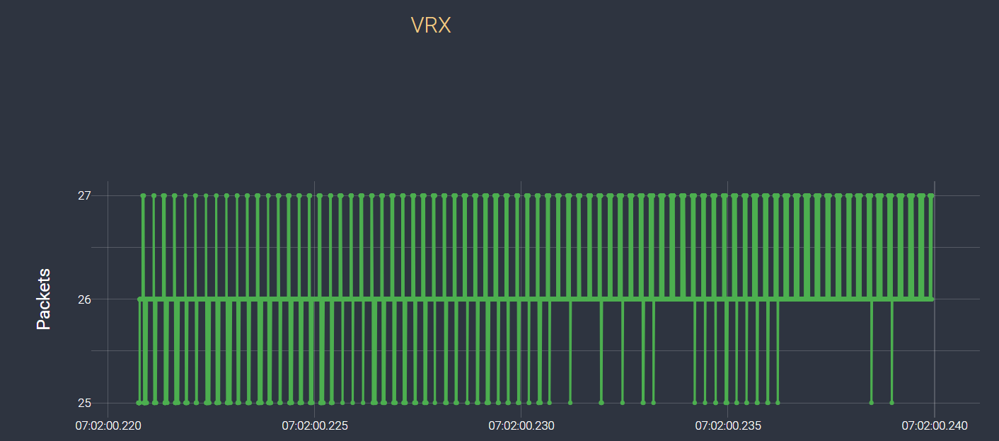
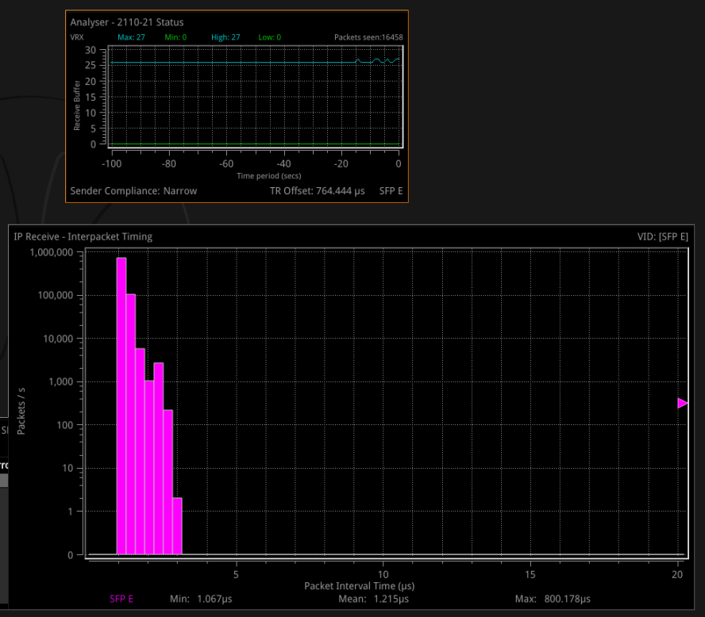

# The ST2110 compliance result

The Media Transport Library implements many software novel algorithms to achieve ST 2110’s strict narrow timing requirements. It's verified using third-party test equipments, please check below detail result:

## 1. Setup

Server Model: M50CYP2SBSTD  
Processor Information: Intel(R) Xeon(R) Platinum 8358 CPU @ 2.60GHz
                       2 Processor, 64 Cores  
Memory: 16 x 32G (DIMM DDR4 Synchronous 3200 MHz)  
NIC: Intel® E810 Series Ethernet Adapter
APP used: RxTxApp reference app

## 2. 1080p50

Matrox VERO: narrow gapping

VERO 1080p50 summary

 

VERO 1080p50 analysis

 

VERO 1080p50 Cinst per frame

 

VERO 1080p50 VRX per frame

 

Pharbrix 1080p50 analyser: gapping

 

## 2. 2160p50 (4k)

Matrox VERO: narrow gapping

VERO 2160p50 summary

 

VERO 2160p50 analysis

 

VERO 2160p50 Cinst per frame

 

VERO 2160p50 VRX per frame.png

 

Pharbrix 2160p50 analyser: gapping

 
