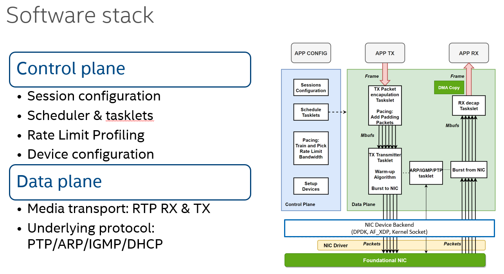
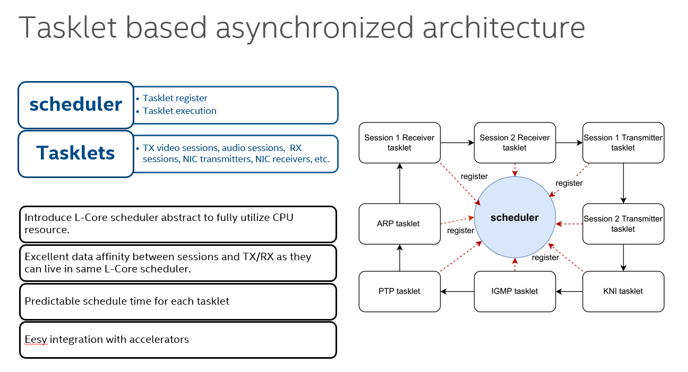
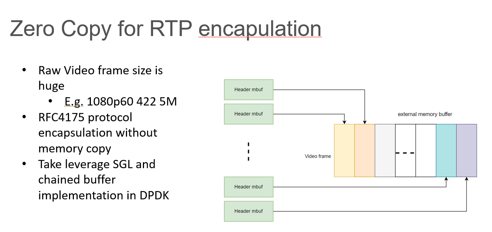
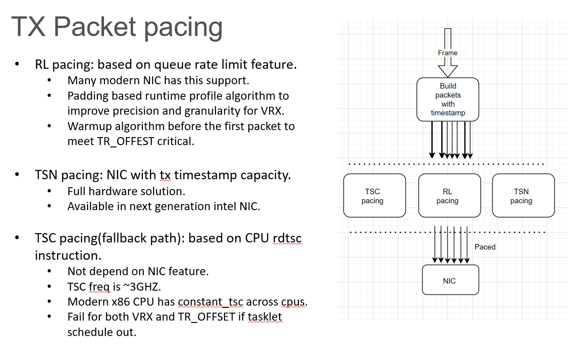
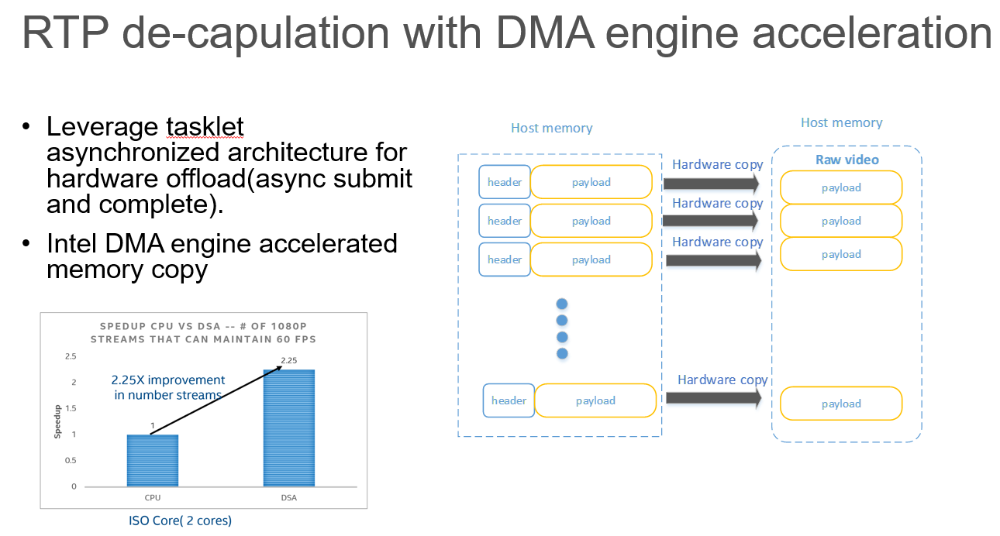

# Design Guide

## 1. Introduction

This section provides a detailed design concept of the Media Transport Library, offering an in-depth dive into the technology used.

Similar to other network processing libraries, it consists of a control plane and a data plane. In the data plane, a lockless design is adopted to achieve ultra-high performance.



## 2. Core management

MTL default uses busy polling, also known as busy-waiting or spinning, to achieve high data packet throughput and low latency. This technique constantly checks for new data packets to process rather than waiting for an interrupt. The polling thread is pinned to a single CPU core to prevent the thread from migrating between CPU cores.

Busy polling allows the application to detect and process packets as soon as they arrive, minimizing latency. It provides consistent and predictable packet processing times because there's no waiting time introduced by other scheduling mechanisms. It also avoids context switches between the kernel and user space, which can be costly in terms of CPU cycles.

The drawbacks is it can lead to 100% CPU usage because the cores are always active, checking for new work.

With this PMD design, it is expected that a CPU thread will always be utilized to 100%, even with only one stream active. In our configuration, one core can handle up to a maximum of 16 1080p transmission sessions, although the actual density may vary depending on the hardware configuration.

We provide an option `MTL_FLAG_TASKLET_SLEEP` that enables the sleep option for the PMD thread. However, take note that enabling this option may impact latency, as the CPU may enter a sleep state when there are no packets on the network. If you are utilizing the RxTxApp, it can be enable by `--tasklet_sleep` arguments.
Additionally, the `MTL_FLAG_TASKLET_THREAD` option is provided to disable pinning to a single CPU core, for cases where a pinned core is not feasible.



### 2.1. Tasklet design

To efficient utilize the pinned polling thread, MTL has developed asynchronous scheduler called tasklet. A tasklet is a small, lightweight function that runs in the context of the pinned polling thread and is scheduled by MTL scheduler. Tasklets are used for performing quick, non-blocking operations that can't go to sleep.
The operation of MTL's internal jobs is typically triggered by the availability of packets in the NIC's RX queue, space in the TX queue, or available data in the ring. Consequently, the tasklet design is highly suitable for these processes.
One primary advantage of using tasklets is that all tasklets associated with a single stream session are bound to one thread, allowing for more efficient use of the Last Level Cache (LLC) at different stages of processing.

### 2.2. Scheduler quota

A single scheduler (pinned polling thread) can have numerous tasklets registered. To manage the distribution of tasklets across schedulers, a 'quota' system has been implemented in each scheduler, indicating the total data traffic each core can handle.
Sessions will submit a request to the scheduler manager for a scheduler to manage their jobs. Upon receiving a request, the scheduler manager will assess whether the recent scheduler has enough quota to service this new request.
If not, a new scheduler will be created and allocated to the session for the upcoming tasklet registration. For further details, please refer to the scheduler source code in [here](../lib/src/mt_sch.c).

The performance of the setup can vary, so the data traffic quota for each scheduler is customizable by the application through the `data_quota_mbs_per_sch` parameter.

### 2.3. Session migrate

Additionally, MTL has introduced support for session migration with the `MTL_FLAG_TX_VIDEO_MIGRATE` and `MTL_FLAG_RX_VIDEO_MIGRATE` flags. This feature enables runtime CPU usage calculations. When the system detects that a scheduler is operating at 100% capacity, that overloaded scheduler will attempt to redistribute its last few sessions to other underutilized schedulers.
This migration capability adds flexibility to deployment, accommodating the often unpredictable capacity of a system.

### 2.4. Multi process support

MTL supports multi-process deployment through the use of SR-IOV. Each process operates with its own perspective on core usage, to prevent conflicts that arise when multiple processes attempt to use the same core, MTL utilizes a Manager service which ensures that each MTL instance is allocated a distinct and unused core.
Each instance sends a request to the Manager service, which in return assigns a free core to the instance. The Manager service is also responsible for detecting when an instance disconnects and will subsequently release the associated resources. For more details, please consult the [Manager guide](../manager/README.md)

If the background Manager service is not practical for your setup, there is a fallback method: managing the logical core (lcore) via shared memory. In this approach, all MTL instances loop through a shared memory structure to locate an unused core.
The instructions for this deprecated method can still be accessed in the [lcore Guide](shm_lcore.md). However, we strongly advise against this method and recommend using the Manager service instead, as it has the capability to detect when any instance has been unexpectedly closed.

### 2.5. The tasklet API for application

Applications can also leverage the efficient tasklet framework. An important note is that the callback tasklet function cannot use any blocking methods, as the thread resource is shared among many tasklets. For more information, please refer to the [MTL scheduler API](../include/mtl_sch_api.h). Example usage is provided below:

```c
    mtl_sch_create
    mtl_sch_register_tasklet
    mtl_sch_start
    mtl_sch_stop
    mtl_sch_unregister_tasklet
    mtl_sch_free
```

### 2.6. Runtime session

The session creation and release APIs can be invoked at any time, even while the MTL instance is running.

The standard inital flow is like below:
```c
  /* init mtl instance */
  mtl_init
  /* create sessions before starting mtl instance */
  st20p_tx_create
  st20p_rx_create
  st30_tx_create
  st30_rx_create
  ...
  /* start mtl instance */
  mtl_start
  ...
```

MTL also supports session creation after the MTL instance has been started; therefore, the following workflow operates correctly as well.
```c
  /* init mtl instance */
  mtl_init
  /* start mtl instance */
  mtl_start
  /* create sessions after mtl instance started */
  st20p_tx_create
  st20p_rx_create
  st30_tx_create
  st30_rx_create
  ...
  /* free sessions before stoping mtl instance */
  st20p_tx_free
  st20p_rx_free
  st30_tx_free
  st30_rx_free
  ...
```

### 2.7. Manual assigned lcores

By default, the lcore resources for each MTL instance are automatically assigned by the manager service. However, in certain scenarios, applications may need to manage lcore usage directly.

Additionally, timing-sensitive applications may require the execution of workloads on isolated cores for improved accuracy. To facilitate this, the `struct mtl_init_params` includes a parameter named `lcores`. This parameter allows applications to specify a custom list of logical cores that the MTL can utilize.

For user convenience, the built-in RxTxApp also offers a command-line option `--lcores <lcore list>` to enable users to customize their logical cores list.

## 3. Memory management

### 3.1. Huge Page

MTL utilizes hugepages for performance optimization when processing packets at high speed.

* Reduced TLB (Translation Lookaside Buffer) Misses. By using larger page sizes, more physical memory can be addressed with fewer entries in the TLB. Fewer TLB misses mean fewer CPU cycles are spent on memory address translation, which leads to better performance.
* Improved Cache Usage. Contiguous Physical Memory. And the physical memory is contiguous, which is beneficial for I/O operations and can improve DMA (Direct Memory Access) from devices that are used in high-speed packet processing.
* Avoiding Page Faults. With hugepages, more data can be kept in the CPU cache because of the reduced page overhead. This can lead to better cache utilization, reduced cache misses, and faster access to the data needed for packet processing.

HugePages come in two sizes: 2MB and 1GB. MTL recommends using the 2MB pages because they are easier to configure in the system; typically, 1GB pages require many additional settings in the OS. Moreover, according to our performance measurements, the benefits provided by 2MB pages are sufficient.
The hugepages size is dependent on the workloads you wish to execute on the system, usually a 2G huge page is a good start point, consider increasing the value if memory allocation failures occur during runtime.

### 3.2. Memory API

In MTL, memory management is directly handled through DPDK's memory-related APIs, including mempool and mbuf. In fact, all internal data objects are constructed based on mbuf/mempool to ensure efficient lifecycle management.

### 3.3. Public Memory API for application usage

Applications can allocate hugepage memory through the following public APIs:

```c
  mtl_hp_malloc
  mtl_hp_zmalloc
  mtl_hp_free
  mtl_hp_virt2iova
```

## 4. Data path

### 4.1. Backend layer

The library incorporates a virtual data path backend layer, designed to abstract various NIC implementation and provide a unified packet TX/RX interface to the upper network layer. It currently supports three types of NIC devices:

* DPDK Poll-Mode Drivers (PMDs): These drivers fully bypass the kernel's networking stack, utilizing the 'DPDK poll mode' driver.
* Native Linux Kernel Network Socket Stack: This option supports the full range of kernel ecosystems. Related code can be found from [mt_dp_socket.c](../lib/src/datapath/mt_dp_socket.c)
* AF_XDP with eBPF filter: AF_XDP represents a significant advancement in the Linux networking stack, striking a balance between raw performance and integration with the kernel's networking ecosystem. Please refer to [XDP Guide](xdp.md) for detail.

MTL selects the backend NIC based on input from the application. Users should specify both of the following parameters in `struct mtl_init_params`, the port name should follow the format described below, and the pmd type can be fetched using `mtl_pmd_by_port_name`.

```c
  /**
   *  MTL_PMD_DPDK_USER. Use PCIE BDF port, ex: 0000:af:01.0.
   *  MTL_PMD_KERNEL_SOCKET. Use kernel + ifname, ex: kernel:enp175s0f0.
   *  MTL_PMD_NATIVE_AF_XDP. Use native_af_xdp + ifname, ex: native_af_xdp:enp175s0f0.
   */
  char port[MTL_PORT_MAX][MTL_PORT_MAX_LEN];
  enum mtl_pmd_type pmd[MTL_PORT_MAX];
```

### 4.2. Queue Manager

The library incorporates a queue manager layer, designed to abstract various queue implementation. Please refer to [code](../lib/src/datapath/mt_queue.c) for details.

#### 4.2.1. TX

For transmitting (TX) data, there are two queue modes available:

Dedicated Mode: In this mode, each session exclusively occupies one TX queue resource.

Shared Mode: In contrast, shared mode allows multiple sessions to utilize the same TX queue. To ensure there is no conflict in the packet output path, a spin lock is employed. While this mode enables more efficient use of resources by sharing them, there can be a performance trade-off due to the overhead of acquiring and releasing the lock.
The TX queue shared mode is enabled by `MTL_FLAG_SHARED_TX_QUEUE` flag. Please refer to [code](../lib/src/datapath/mt_shared_queue.c) for details.

#### 4.2.2. RX

For RX data, there are three queue modes available:

Dedicated Mode: each session is assigned a unique RX queue. Flow Director is utilized to filter and steer the incoming packets to the correct RX queue based on criteria such as IP address, port, protocol, or a combination of these.

Shared Mode: allows multiple sessions to utilize the same RX queue. Each session will configure its own set of Flow Director rules to identify its specific traffic. However, all these rules will direct the corresponding packets to the same shared RX queue. Software will dispatch the packet to each session during the process of received packet for each queue.
The RX queue shared mode is enabled by `MTL_FLAG_SHARED_RX_QUEUE` flag. Please refer to [code](../lib/src/datapath/mt_shared_queue.c) for details.

RSS mode: Not all NICs support Flow Director. For those that don't, we employs Receive Side Scaling (RSS) to enable the efficient distribution of network receive processing across multiple queues. This is based on a hash calculated from fields in packet headers, such as source and destination IP addresses, and port numbers.
Please refer to [code](../lib/src/datapath/mt_shared_rss.c) for details.

#### 4.2.3. Queues resource allocated

The `mtl_init_params` structure offers two configuration options: `tx_queues_cnt` and `rx_queues_cnt`, which specify the number of transmit and receive queues, respectively, that MTL should use for an instance.
The number of queues typically depends on the anticipated number of sessions to be created, with each video session usually requiring one dedicated queue for packet transmission and reception over the network.

If the requested number of queues exceeds the maximum allowed by the hardware resources, then only the maximum permissible number of queues will be created.

### 4.3. ST2110 TX

After receiving a frame from an application, MTL constructs a network packet from the frame in accordance with RFC 4175 <https://datatracker.ietf.org/doc/rfc4175/> and ST2110-21 timing requirement.

#### 4.3.1. Zero Copy Packet Build

Most modern Network Interface Cards (NICs) support a multi-buffer descriptor feature, enabling the programming of the NIC to dispatch a packet to the network from multiple data segments. The MTL utilizes this capability to achieve zero-copy transmission when a DPDK Poll Mode Driver (PMD) is utilized, thereby delivering unparalleled performance.
In one typical setup, capable of sending approximately 50 Gbps (equivalent to 16 streams of 1080p YUV422 at 10-bit color depth and 59.94 fps) requires only a single core.

During the packet construction process, only the RTP header is regenerated to represent the packet position within a frame. The video data is carried in the second segment of an mbuf, which directly points to the original frame.

Note that if the currently used NIC does not support the multi-buffer feature, the MTL will need to copy the video frame into the descriptor, resulting in a loss of performance.



#### 4.3.2. ST2110-21 pacing

The specific standard ST2110-21 deals with the traffic shaping and delivery timing of uncompressed video. It defines how the video data packets should be paced over the network to maintain consistent timing and bandwidth utilization.

Due to the stringent timing requirements at the microsecond level, existing solutions are primarily built on hardware implementations, which introduce significant dependencies not conducive to cloud-native deployments. The MTL adopts a software-based approach, embracing cloud-native concepts.
MTL addresses this challenge by leveraging the NIC's rate-limiting features along with a software algorithm. This combination has successfully passed numerous third-party interoperability verifications.

The default NIC queue depth is set to 512 in MTL, and MTL will always ensure the queue is fully utilized by the tasklet engine. In the case of 1080p at 50fps, one packet time in ST2110-21 is approximately ~5us.
With a queue depth of 512, the MTL can tolerate a kernel scheduler jitter of up to ~2.5ms. If you observe any packet timing jitter, consider increasing the queue depth. MTL provides the `nb_tx_desc` option for this adjustment.
However, for a 4K 50fps session, the time for one packet is approximately ~1us, indicating that the duration for 512 packets is around ~500us. With a queue depth of 512, MTL can only tolerate a scheduler jitter of about ~500us. However, by adjusting the depth to the maximum hardware-permitted value of 4096, MTL should be capable of handling a maximum scheduler jitter of 4ms.

In the case that the rate-limiting feature is unavailable, TSC (Timestamp Counter) based software pacing is provided as a fallback option.



### 4.4. ST2110 RX

The RX (Receive) packet classification in MTL includes two types: Flow Director and RSS (Receive Side Scaling). Flow Director is preferred if the NIC is capable, as it can directly feed the desired packet into the RX session packet handling function.
Once the packet is received and validated as legitimate, the RX session will copy the payload to the frame and notify the application if it is the last packet.

#### 4.4.1. RX DMA offload

The process of copying data between packets and frames consumes a significant amount of CPU resources. MTL can be configured to use DMA to offload this copy operation, thereby enhancing performance. For detailed usage instructions, please refer to [DMA Guide](dma.md)



## 5. Control path

For the DPDK Poll Mode Driver backend, given its nature of fully bypassing the kernel, it is necessary to implement specific control protocols within MTL.

### 5.1. ARP

Address Resolution Protocol is a communication protocol used for discovering the link layer address, such as a MAC address, associated with a given internet layer address, typically an IPv4 address. This mapping is critical for local area network communication. The code can be found in [mt_arp.c](../lib/src/mt_arp.c)

### 5.2. IGMP

The internet Group Management Protocol is a communication protocol used by hosts and adjacent routers on IPv4 networks to establish multicast group memberships. IGMP is used for managing the membership of internet Protocol multicast groups and is an integral part of the IP multicast specification. MTL support the IGMPv3 version. The code can be found in [mt_mcast.c](../lib/src/mt_mcast.c)

### 5.3. DHCP

Dynamic Host Configuration Protocol is a network management protocol used on IP networks whereby a DHCP server dynamically assigns an IP address and other network configuration parameters to each device on a network, so they can communicate with other IP networks.
DHCP allows devices known as clients to get an IP address automatically, reducing the need for a network administrator or a user to manually assign IP addresses to all networked devices.

The DHCP option is disabled by default, enable it by setting `net_proto` in `struct mtl_init_params` to `MTL_PROTO_DHCP`.

The code implementation can be found in [mt_dhcp.c](../lib/src/mt_dhcp.c).

### 5.4. PTP

Precision Time Protocol, also known as IEEE 1588, is designed for accurate clock synchronization between devices on a network. PTP is capable of clock accuracy in the sub-microsecond range, making it ideal for systems where precise timekeeping is vital. PTP uses a master-slave architecture for time synchronization.
Typically, a PTP grandmaster is deployed within the network, and clients synchronize with it using tools like ptp4l.

MTL supports two type of PTP client settings, the built-in PTP client implementation inside MTL or using an external PTP time source.

#### 5.4.1. Built-in PTP

This project includes a built-in support for the PTP client protocol, which is also based on the hardware offload timesync feature. This combination allows for achieving a PTP time clock source with an accuracy of approximately 30ns.

To enable this feature in the RxTxApp sample application, use the `--ptp` argument. The control for the built-in PTP feature is the `MTL_FLAG_PTP_ENABLE` flag in the `mtl_init_params` structure.

Note: Currently, the VF (Virtual Function) does not support the hardware timesync feature. Therefore, for VF deployment, the timestamp of the transmitted (TX) and received (RX) packets is read from the CPU TSC (TimeStamp Counter) instead. In this case, it is not possible to obtain a stable delta in the PTP adjustment, and the maximum accuracy achieved will be up to 1us.

Applications can set a `ptp_sync_notify` callback within `mtl_init_params` to receive notifications whenever MTL's built-in Precision Time Protocol (PTP) synchronizes with a PTP grandmaster. This feature is typically utilized to align the MTL's built-in PTP time with the local system time.

Additionally, MTL exports two APIs: `mtl_ptp_read_time` and `mtl_ptp_read_time_raw`, which enable applications to retrieve the current built-in PTP time. The primary difference is that `mtl_ptp_read_time_raw` accesses the NIC's memory-mapped I/O (MMIO) registers directly, providing the most accurate time at the expense of increased CPU usage due to the MMIO read operation.
In contrast, `mtl_ptp_read_time` returns the cached software time, avoiding hardware overhead.

#### 5.4.2. Customized PTP time source by Application

Some setups may utilize external tools, such as `ptp4l`, for synchronization with a grandmaster clock. MTL provides an option `ptp_get_time_fn` within `struct mtl_init_params`, allowing applications to customize the PTP time source. In this mode, whenever MTL requires a PTP time, it will invoke this function to acquire the actual PTP time.
Consequently, it is the application's responsibility to retrieve the time from the PTP client configuration.

#### 5.4.3. 37 seconds offset between UTC and TAI time

There's actually a difference of 37 seconds between Coordinated Universal Time (UTC) and International Atomic Time (TAI). This discrepancy is due to the number of leap seconds that have been added to UTC to keep it synchronized with Earth's rotation, which is gradually slowing down.

It is possible to observe a 37-second offset in some third-party timing equipment using MTL in conjunction with external PTP4L. This is typically caused by the time difference between Coordinated Universal Time (UTC) and International Atomic Time (TAI).
While PTP grandmasters disseminate the offset in their announce messages, this offset is not always accurately passed to the `ptp_get_time_fn` function. The RxTxApp provides a `--utc_offset` option, with a default value of 37 seconds, to compensate for this discrepancy. Consider adjusting the offset if you encounter similar issues.

## 6. ST2110 API

There are 3 different types of API between MTL and application:

### 6.1. Frame mode

MTL orchestrates the packet processing from the frame level to L2 network packets and vice versa, with the frame buffer serving as the interface for video context exchange between MTL and the application.

For transmission, the MTL TX session will get the index of the next available frame buffer via the `get_next_frame` callback function. Once transmission of the entire frame to the network is complete, the application will be notified through the `notify_frame_done` callback.
It is crucial for the application to manage the lifecycle of the frame buffers, ensuring that no modifications are made to a frame while it is in the midst of being transmitted.

For reception, the MTL RX session will process packets received from the network. Once a complete frame is assembled, the application will be alerted via the `notify_frame_ready` callback. However, it is important to note that the application must return the frame to MTL using the `st**_rx_put_framebuff` function after video frame processing is complete.

Sample application code can be find in [tx_video_sample.c](../app/sample/legacy/tx_video_sample.c) and [rx_video_sample.c](../app/sample/legacy/rx_video_sample.c)

#### 6.1.1. Slice mode

Slice mode is an enhancement of frame mode that provides applications with more granular control at the slice level, enabling the achievement of ultra-low latency. In transmission, MTL slices use `query_frame_lines_ready` to determine the number of lines available for transmission to the network.
For reception, the application specifies the slice size using the `slice_lines` field in the `struct st20_rx_ops`. MTL will then inform the application via the `notify_slice_ready` callback when all packets of any slice have been received and are ready for the application to process.

Sample application code can be find in [tx_slice_video_sample.c](../app/sample/low_level/tx_slice_video_sample.c) and [rx_slice_video_sample.c](../app/sample/low_level/rx_slice_video_sample.c)

### 6.2. RTP passthrough mode

MTL manages the processing from RTP to L2 packet and vice versa, but it is the responsibility of the application to encapsulate/decapsulate RTP with various upper-layer protocols. This approach is commonly employed to implement support for ST2022-6, given that MTL natively supports only ST2110.

Sample application code can be find in [tx_rtp_video_sample.c](../app/sample/low_level/tx_rtp_video_sample.c) and [rx_rtp_video_sample.c](../app/sample/low_level/rx_rtp_video_sample.c)

### 6.3. Pipeline mode

An enhancement over frame mode, this feature provides more user-friendly get/put APIs with built-in frame cycle management and inherent SIMD color format converter. Given that the ST2110 format operates in network big-endian mode, and typically the CPU/GPU uses little endian, such functionality is essential for seamless integration. The implementation can be found in [pipeline API code](../lib/src/st2110/pipeline/).

The Get/Put API is straightforward to use; consider the following example:

```c
  st20p_tx_create
  while (active) {
    st20p_tx_get_frame
    /* the process to frame */
    st20p_tx_put_frame
  }
  st20p_tx_free
```

Sample application code can be find in [tx_st20_pipeline_sample.c](../app/sample/tx_st20_pipeline_sample.c) and [rx_st20_pipeline_sample.c](../app/sample/rx_st20_pipeline_sample.c)

By default, the `st20p_tx_get_frame` and `st20p_rx_get_frame` functions operate in non-blocking mode, which means the function call will immediately return `NULL` if no frame is available.
To switch to blocking mode, where the call will wait until a frame is ready for application use or one second timeout occurs, you must enable the `ST20P_TX_FLAG_BLOCK_GET` or `ST20P_RX_FLAG_BLOCK_GET` flag respectively during the session creation stage, and application can use `st20p_tx_wake_block`/`st20p_rx_wake_block` to wake up the waiting directly.

#### 6.3.1. Ancillary (ST40) pipeline

The same pipeline abstraction is now available for ancillary-only flows through `st40_pipeline_api.h`. It keeps the zero-copy RFC 8331 payload path but hides scheduler registration, frame queues, and pacing details behind the familiar get/put contract so applications only need to implement:

```c
st40p_tx_get_frame
st40p_tx_put_frame
st40p_rx_get_frame
st40p_rx_put_frame
```

- **TX pipeline (`st40p_tx_*`)** wraps the lower-level `st40_tx_*` APIs while honoring redundancy, user timestamps, and user-managed frame buffers (for example when `ST40P_TX_FLAG_EXT_FRAME` is enabled). The helper also exposes the maximum user data word (UDW) size via `st40p_tx_max_udw_buff_size()` so that producers can pack metadata deterministically.
- **RX pipeline (`st40p_rx_*`)** assembles ancillary packets into user buffers and can optionally dump metadata/UDW buffers directly to files for debugging through `st40p_rx_set_dump`. Each RX callback receives both the metadata blocks and the captured payload, mirroring the TX layout to simplify round-trip validation.
- **ST 2022-7 inter-path delay:** For redundancy testing, `st40_tx_test_config.redundant_delay_ns` inserts a configurable TSC busy-wait between primary (P) and redundant (R) port sends. This simulates real-world network path asymmetry so the RX dejitter/reorder buffer can be validated under realistic conditions. Pair this with `st40p_rx_ops.reorder_window_ns` (default 10 ms) on the RX side — the window must exceed the injected delay plus scheduling jitter. Typical test values: 5 ms delay with a 10 ms window.

Split-mode ancillary (packet-split) is supported via `tx_split_anc_by_pkt` on TX and
`rx_rtp_ring_size` plus `frame_info_path` on RX. Enable `tx_split_anc_by_pkt=true`
when you need to emit at most one ANC packet per RTP packet; the sender fragments a
field accordingly. In this context a field is the interlaced half-frame (or a full
progressive frame when not interlaced). The RTP marker bit (`rtp_marker`) is set on
the final packet of that field to signal completion. The receiver records each packet
under a field and can deliver as packets arrive or after the marker boundary. Frame-info
captures the per-field packet count (`pkts_total`) and sequence integrity (`seq_discont/seq_lost`)
so RX can detect discontinuities and the application can see how many packets were
accumulated. Use a power-of-two ring size to satisfy plugin validation and keep pacing
predictable.

For validation and debugging, the GStreamer harness surfaces the frame-info file
directly in the test logs. Setting `log_frame_info=True` in the ST40P tests dumps
each `frame-info-path` line and a parsed `FrameInfoSummary` (frames, marker hits,
seq_discont/seq_lost totals, and packets-per-frame histogram) so sequence gaps or
packet-count anomalies are immediately visible in CI output without opening the
artifact.

The GStreamer ST40P plugin also exposes test-only RTP/ANC mutation knobs to exercise error handling; see
[ecosystem/gstreamer_plugin/README.md](ecosystem/gstreamer_plugin/README.md#st40p-test-mode-knobs)
for the full list and usage. The knobs can be combined with `split-anc-by-pkt=true` to stress the
split-mode path, and the RX side can record the resulting frame-info via `frame-info-path` for
inspection.

Reference implementations live in `app/sample/tx_st40_pipeline_sample.c` and `app/sample/rx_st40_pipeline_sample.c`. They reuse the shared `sample_util` CLI so you can swap between ST20/22/30/40 pipelines with identical arguments while testing pacing, redundancy, and USDT probes.

The RxTxApp test tool also supports full ST40P pipeline sessions via the `"st40p"` JSON key (see [configuration_guide.md](configuration_guide.md#st40p-array-of-st40p-pipeline-sessions)). This enables pytest-driven ST 2022-7 redundancy tests with gap injection (`test_mode`, `test_pkt_count`, `test_frame_count`), inter-path delay simulation (`redundant_delay_ns`), and configurable RX dejitter windows (`reorder_window_ns`).

The ST40 pipeline samples now expose CLI toggles for the common ANC variants:
- `--interlaced` drives field-based cadence end-to-end (TX uses interlaced pacing; RX expects fields and delivers them individually).
- `--split_anc_by_pkt` enables one-ANC-per-RTP emission and RX accumulation with packet-level accounting (`pkts_total`, `seq_discont/seq_lost`).
Combine them to validate interlaced split-mode behavior without code changes; the flags propagate directly into the `st40p_tx_ops`/`st40p_rx_ops` settings used by the samples.

### 6.4. ST22 support

The support for ST 2110-22 JPEG XS can be categorized into two modes: ST 2110-22 raw codestream mode and ST 2110-22 pipeline mode. The pipeline mode leverages an MTL plugin to handle the decoding/encoding between the raw video buffer and the codestream.
We recommend using the pipeline mode, as it allows the application to concentrate on video content processing without needing to manage codec-specific differences. In contrast, the ST 2110-22 codestream mode requires the application to handle the codec operations directly.

#### 6.4.1. ST22 pipeline mode

Thanks to the plugin, the application can implement ST22 support using the following simplified example:

```c
  st22p_tx_create
  while (active) {
    st22p_tx_get_frame
    /* the process to frame */
    st22p_tx_put_frame
  }
  st22p_tx_free
```

The plugin guide can be found [here](plugin.md), the pipeline detail implementation can be find in [st22_pipeline_tx.c](../lib/src/st2110/pipeline/st22_pipeline_tx.c) and [st22_pipeline_rx.c](../lib/src/st2110/pipeline/st22_pipeline_rx.c).

Sample application code can be found in [tx_st22_pipeline_sample.c](../app/sample/tx_st22_pipeline_sample.c) and [rx_st22_pipeline_sample.c](../app/sample/rx_st22_pipeline_sample.c)

By default, the `st22p_tx_get_frame` and `st22p_rx_get_frame` functions operate in non-blocking mode, which means the function call will immediately return `NULL` if no frame is available.
To switch to blocking mode, where the call will wait until a frame is ready for application use or one second timeout occurs, you must enable the `ST22P_TX_FLAG_BLOCK_GET` or `ST22P_RX_FLAG_BLOCK_GET` flag respectively during the session creation stage, and application can use `st22p_tx_wake_block`/`st22p_rx_wake_block` to wake up the waiting directly.

#### 6.4.2. ST22 codestream mode

The API is similar to the frame mode of ST 2110-20, with the codestream utilizing the same frame concept. It is the application's responsibility to manage both the codec and the codestream frame buffer lifecycle. We recommend to use ST22 pipeline mode if possible.

Sample application code can be find in [tx_st22_video_sample.c](../app/sample/legacy/tx_st22_video_sample.c) and [rx_st22_video_sample.c](../app/sample/legacy/rx_st22_video_sample.c)

### 6.5. 2022-7 redundant support

All sessions within MTL incorporate redundancy support through a software-based approach. For transmission (TX), MTL replicates packets onto a redundant path once they have been assembled from a frame; these duplicates are then sent to the TX queue of a secondary network device.
For reception (RX), MTL concurrently captures packets from both primary and secondary network devices within the same tasklet, examining the RTP headers to ascertain each packet's position within a frame.
MTL identifies and flags any duplicate packets as redundant. Furthermore, applications can assess the signal quality of each network device by reviewing the `uint32_t pkts_recv[MTL_SESSION_PORT_MAX]` array within the `struct st20_rx_frame_meta` structure.

Enabling redundancy is straightforward with the setup parameters in the `st**_tx_create` and `st**_rx_create` calls. Simply set `uint8_t num_port` to 2 and provide the appropriate configurations for the redundant port and IP.

```c
  ops_tx.port.num_port = 2;
  if (ops_tx.port.num_port > 1) {
    memcpy(ops_tx.port.dip_addr[MTL_SESSION_PORT_R], ctx.tx_dip_addr[MTL_PORT_R],
             MTL_IP_ADDR_LEN);
    snprintf(ops_tx.port.port[MTL_SESSION_PORT_R], MTL_PORT_MAX_LEN, "%s",
               ctx.param.port[MTL_PORT_R]);
    ops_tx.port.udp_port[MTL_SESSION_PORT_R] = ctx.udp_port + i * 2;
  }
```

### 6.6. Interlaced support

In MTL, each field is treated as an individual frame, with fields being transmitted separately over the network, to avoid the need for new APIs specifically for fields. It is the application’s responsibility to recombine the fields into a full frame.

For instance, with a 1080i50 format, you should use the following session parameters when creating a session: `interlaced: true, width: 1920, height: 1080, fps: ST_FPS_P50`. It is important to note that the height parameter should reflect the full frame height of 1080, not half height, FPS is fields per second.
However, keep in mind that the buffer for each field (or frame) will only contain data for 540 lines.

For transmission (TX), users can specify whether the current field is the first or second by using the `second_field` flag within the `struct st20_tx_frame_meta`. Similarly, for reception (RX), applications can determine the field order with the `second_field` flag present in the `struct st20_rx_frame_meta`.
In the case of pipeline mode, the bool `second_field` within the `struct st_frame` also communicates field information between the application and MTL.

### 6.7. Get incomplete frame

By default, the RX session will only deliver complete frames, where all packets have been successfully received, to the application. Frames that are incomplete due to missing packets are discarded by MTL. However, in certain scenarios, an application may need to be aware of incomplete frames to apply its own logic for frame processing.
This behavior can be activated by setting the flag `ST**_RX_FLAG_RECEIVE_INCOMPLETE_FRAME` during session creation.

### 6.8. RTCP re-transmission

In cloud or edge computing environments, where network management can be challenging and packet loss may occur due to complex routing, ensuring reliable data transmission is critical. SMPTE ST 2110 utilizes the SMPTE 2022-7 redundancy standard for enhanced reliability, but this approach demands double the bandwidth, which can be costly.

As an alternative to the bandwidth-intensive 2022-7 standard, MTL supports RTCP-based retransmission for handling occasional packet loss. On the reception (RX) side, MTL monitors for missing packets by inspecting the RTP headers. If packet loss is detected, MTL promptly issues a retransmission request to the transmitter (TX).
The TX side maintains a buffer ring that retains recently transmitted packets. Upon receiving a retransmission request from RX, TX checks this buffer ring to determine if the requested packet is available. If so, the packet is resent, mitigating the packet loss without duplicating the entire transmitted data, thus saving bandwidth.

It's important to be mindful that the RTCP retransmission method used by MTL for packet loss recovery is not a standardized feature within the SMPTE ST 2110 suite. Consequently, this approach may not be compatible with non-MTL implementations.

It can be enabled by `ST**_TX_FLAG_ENABLE_RTCP` and `ST**_RX_FLAG_ENABLE_RTCP`, and the configuration for RTCP can be customized by `ops.rtcp` (`struct st_tx_rtcp_ops` and `struct st_rx_rtcp_ops`).

For more details, please refer to [RTCP doc](rtcp.md).

### 6.9. External frame

By default, the frame buffer is allocated by MTL using huge page memory, however, some advanced use cases may require managing the frame buffers themselves — especially applications that utilize GPU-based memory for additional video frame processing. MTL offers an external frame mode, allowing applications to supply frame information at runtime for increased flexibility.
MTL TX and RX will interact with the NIC using these user-defined frames directly. It is the application's responsibility to manage the frame lifecycle because MTL only recognizes the frame address.
Additionally, it's important to note that if a DPDK-based PMD backend is utilized, the external frame must provide an IOVA address, which can be conveniently obtained using the `mtl_dma_map` API, thanks to IOMMU/VFIO support.

For more comprehensive information and instructions on using these converters, please refer to the [External Frame API Guide](external_frame.md).

### 6.10. VSync

VSync events can be generated by MTL sessions, leveraging their tasklet-based scheduling which synchronizes with the PTP time source. Some applications may require VSync events to drive their video frame processing logic. This feature can be enabled using the `ST**_TX_FLAG_ENABLE_VSYNC` and `ST**_RX_FLAG_ENABLE_VSYNC` flags.
Consequently, the application will receive notifications through `notify_event` callback, containing `ST_EVENT_VSYNC`, which indicate the commencement of each epoch.

### 6.11. User timestamp and pacing control for TX

By default, applications simply push frames into MTL TX sessions, where the MTL TX session automatically assigns timestamps and epochs based on timing.

The ST**_TX_FLAG_USER_TIMESTAMP flag allows applications to assign the RTP timestamp for each frame. MTL retrieves the timestamp from st**_tx_frame_meta and calculates RTP timestamp straight from this value.
Transmission time in unchanged.

The ST**_TX_FLAG_USER_TIMESTAMP flag is provided to enable applications to use their own timestamp values for each frame. Consequently, the RTP timestamp for all packets that belong to that frame will be assigned the customized value.

### 6.12. SIMD for color space convert

MTL includes an array of built-in SIMD converters, providing high-performance data processing. The implementation details for these converters are available in the MTL library source files [st_avx512.c](../lib/src/st2110/st_avx512.c) and [st_avx512_vbmi.c](../lib/src/st2110/st_avx512_vbmi.c).
The API for these converters is publicly documented in the header file [st_convert_api.h](../include/st_convert_api.h). For more comprehensive information and instructions on using these converters, please refer to the [Convert Guide](convert.md).

### 6.13. Runtime update source and destination

To offer significant flexibility in switch/forward scenarios, it is advantageous for a session to be able to dynamically change the source or destination address at runtime, thereby obviating the need for applications to recreate a session. The MTL API below provides the capability to reconfigure the target address during runtime:

```c
  st20_tx_update_destination
  st20_rx_update_source
  st22_tx_update_destination
  st22_rx_update_source
  st30_tx_update_destination
  st30_rx_update_source
  st40_tx_update_destination
  st40_rx_update_source
  st20p_tx_update_destination
  st20p_rx_update_source
  st22p_tx_update_destination
  st22p_rx_update_source
```

### 6.14. Ecosystem

The MTL provides comprehensive documentation that includes reference code, demonstrating the seamless integration with popular media frameworks. Currently, MTL supports the following plugins and SDKs:

FFMPEG plugin: Enhance your FFMPEG-based applications by incorporating MTL to accelerate media processing. For details please refer to [ffmpeg_plugin_guide](../ecosystem/ffmpeg_plugin/).

OBS plugin: Streamline live streaming workflow in OBS (Open Broadcaster Software) using the MTL plugin for optimized performance. For details please refer to [obs_plugin_guide](../ecosystem/obs_mtl/).

### 6.15. Sample code

In addition to the built-in RxTxApp, MTL also provides numerous sample codes that demonstrate how to construct simple test programs using its APIs. For more details, please refer to [sample](../app/sample/). We also provide some very useful forward application demo, details can be found [here](../app/sample/fwd/).

### 6.16. RX Timing Parser

To verify the compliance of incoming ST2110-20 RX streams with the ST2110 standard, MTL provides several utilities for analysis.
To support this functionality, if the Network Interface Card (NIC) supports the hardware time synchronization feature, MTL will read the RX timestamp directly from the NIC's hardware to obtain accurate timing. Please set `MTL_FLAG_ENABLE_HW_TIMESTAMP` flag to enable HW offload timestamp for all RX packets.

The fallback method is to read the time when MTL processes the packet. However, it's important to note that this fallback method cannot guarantee timing accuracy, potentially rendering the parsed results unreliable.

The simplest method is to enable the built-in status report. An application can activate the feature by setting the flag `ST20_RX_FLAG_TIMING_PARSER_STAT` or `ST20P_RX_FLAG_TIMING_PARSER_STAT`. Subsequently, MTL will engage the Timing Parser module and include the results in the status log.

For applications requiring access to the timing parser results for each frame, the flag `ST20_RX_FLAG_TIMING_PARSER_META` or `ST20P_RX_FLAG_TIMING_PARSER_META` can be enabled. This allows an application to retrieve detailed parsing results via the `struct st20_rx_tp_meta` found within the RX meta structure for each frame. Reference sample code is available in [rx_st20p_timing_parser_sample.c](../app/sample/rx_st20p_timing_parser_sample.c).

It also features a sample timing parser UI constructed using the MTL Python bindings, which can be found in [rx_timing_parser.py](../python/example/rx_timing_parser.py).

To increase the reliability of parsed results, it is recommended to use the `isocpus` kernel boot parameter to isolate a subset of dedicated CPUs specifically for time-sensitive parsing tasks. Isolating CPUs can help ensure that these tasks are not preempted by other processes, thus maintaining a high level of reliability.
After isolating the CPUs, you can manually assign these dedicated cores to an MTL instance. For detailed instructions on this manual assignment process, please refer to the section `#### 2.7 Manual Assigned lcores` in this documentation.

### 6.17. ST40(ancillary) Interlaced support

In MTL, similar to st20 video, each field is treated as an individual frame, with fields being transmitted separately over the network, to avoid the need for new APIs specifically for fields.

For instance, with a 1080i50 format, you should use the following session parameters when creating a session: `interlaced: true, fps: ST_FPS_P50`.

For transmission (TX), users can specify whether the current field is the first or second by using the `second_field` flag within the `struct st40_tx_frame_meta`. For reception (RX), RTP passthrough mode is the only supported, it's application's duty to check the if it's the first or second by inspecting the F bits in rfc8331 header.

## 7. Misc

### 7.1. Logging

By default, MTL uses the DPDK `RTE_LOG` for outputting logs.

Log levels are governed by the `enum mtl_log_level` definition. During the initialization stage, the log level can be customized using the `enum mtl_log_level log_level;` field within the `struct mtl_init_params`. Additionally, the log level can be altered at runtime using the `mtl_set_log_level` and `mtl_get_log_level` APIs.

To save the `RTE_LOG` output to a file, please use the `mtl_openlog_stream` API with a pointer to a `FILE*` as an argument.

MTL logging includes a timestamp prefix with each output to indicate the timing with second-level accuracy. If millisecond-level accuracy is required, use the `mtl_set_log_prefix_formatter` function to define a custom prefix. Below is an example of a user-defined prefix formatter that includes milliseconds:

```c
static void log_prefix_time_ms(char* buf, size_t sz) {
  struct timespec ts;
  struct tm tm;
  char time_s_buf[64];

  clock_gettime(CLOCK_REALTIME, &ts);
  localtime_r(&ts.tv_sec, &tm);
  strftime(time_s_buf, sizeof(time_s_buf), "%Y-%m-%d %H:%M:%S", &tm);
  snprintf(buf, sz, "%s.%u, ", time_s_buf, (uint32_t)(ts.tv_nsec / NS_PER_MS));
}
```

Applications can register a custom log printer by utilizing the `mtl_set_log_printer` API. This ensures that whenever MTL requires logging, the specified callback function is executed. Below is an example of a callback implementation; note that a variadic argument list is passed using `va_list`, and `vprintf` is utilized to handle the logging:

```c
static void log_user_printer(enum mtl_log_level level, const char* format, ...) {
  MTL_MAY_UNUSED(level);
  va_list args;

  /* Init variadic argument list */
  va_start(args, format);
  /* Use vprintf to pass the variadic arguments to printf */
  vprintf(format, args);
  /* End variadic argument list */
  va_end(args);
}
```

In a production system, the `enum mtl_log_level` is set to the `MTL_LOG_LEVEL_ERR` usually, in this cast USDT probes can be used to fetching the logging, for details see [usdt](usdt.md) doc, `#### 2.1.1 log_msg USDT` part.

### 7.2. USDT

MTL offer eBPF based User Statically-Defined Tracing (USDT) support to monitor status or issues tracking in a production system, for details see [usdt](usdt.md) doc.
