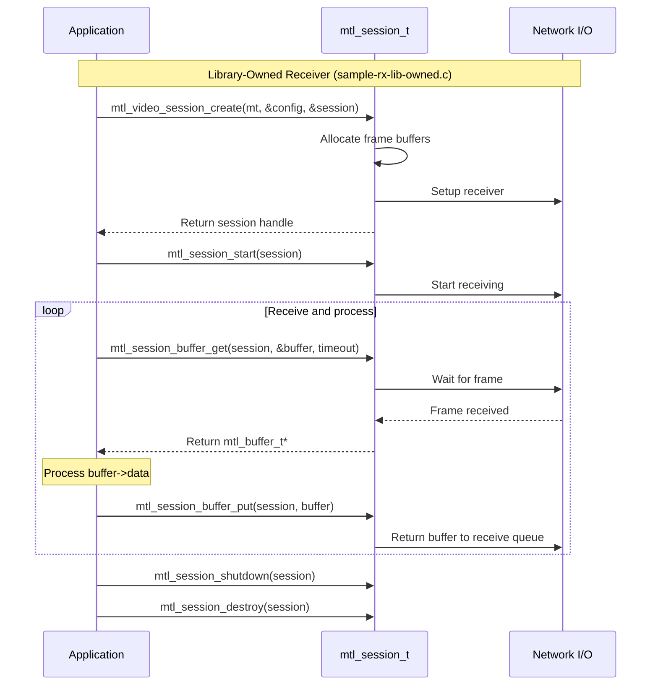
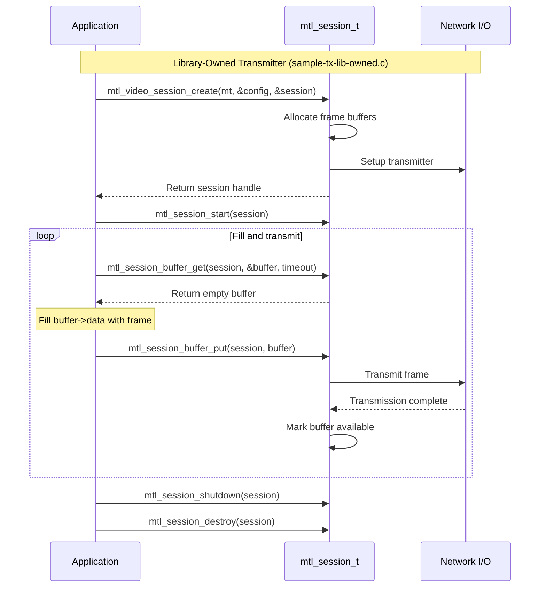
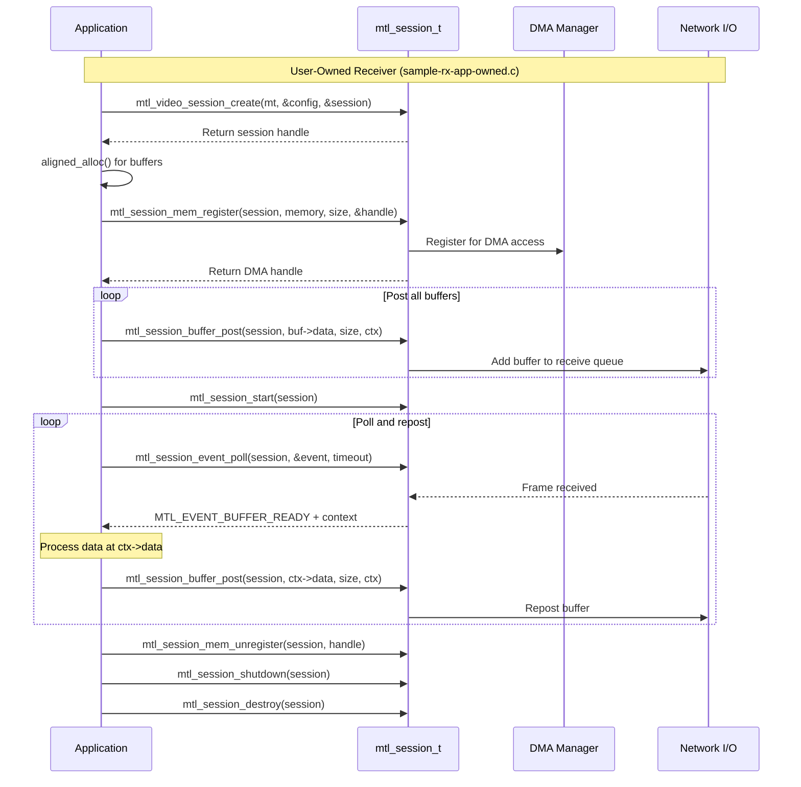
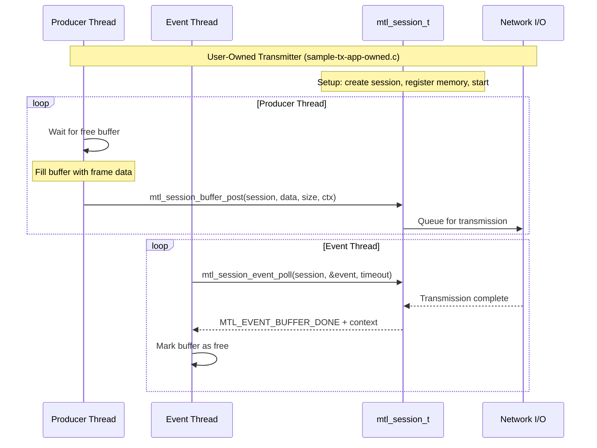
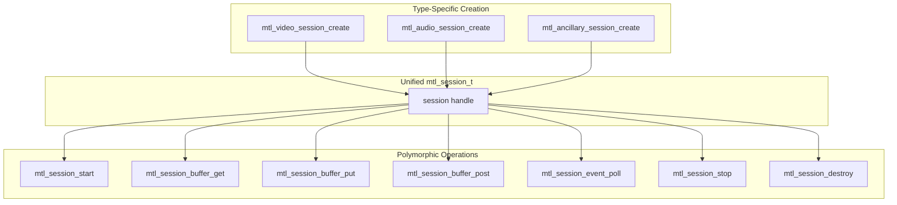
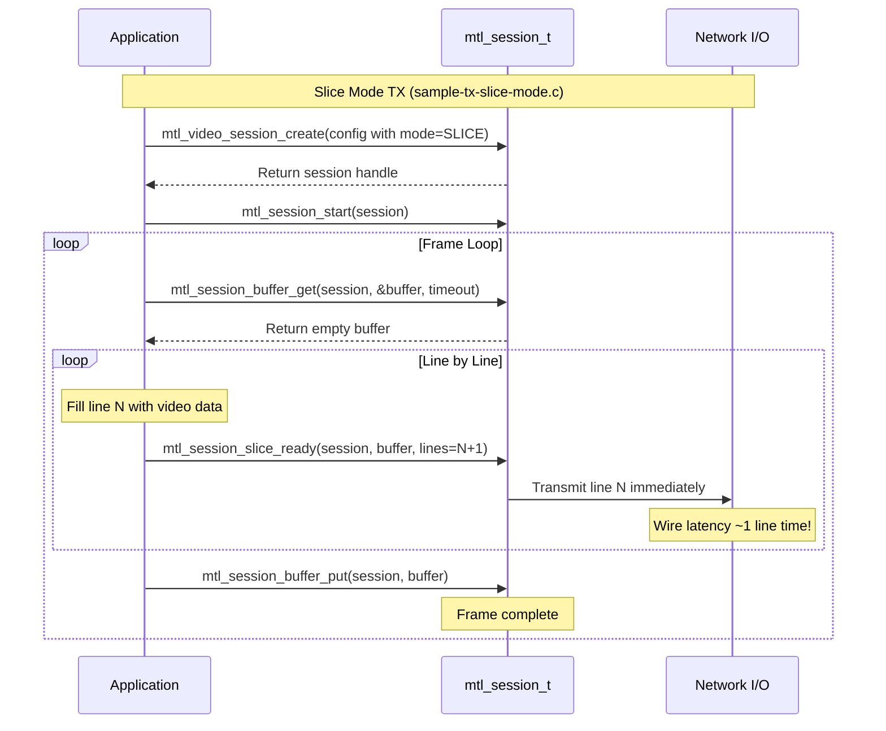
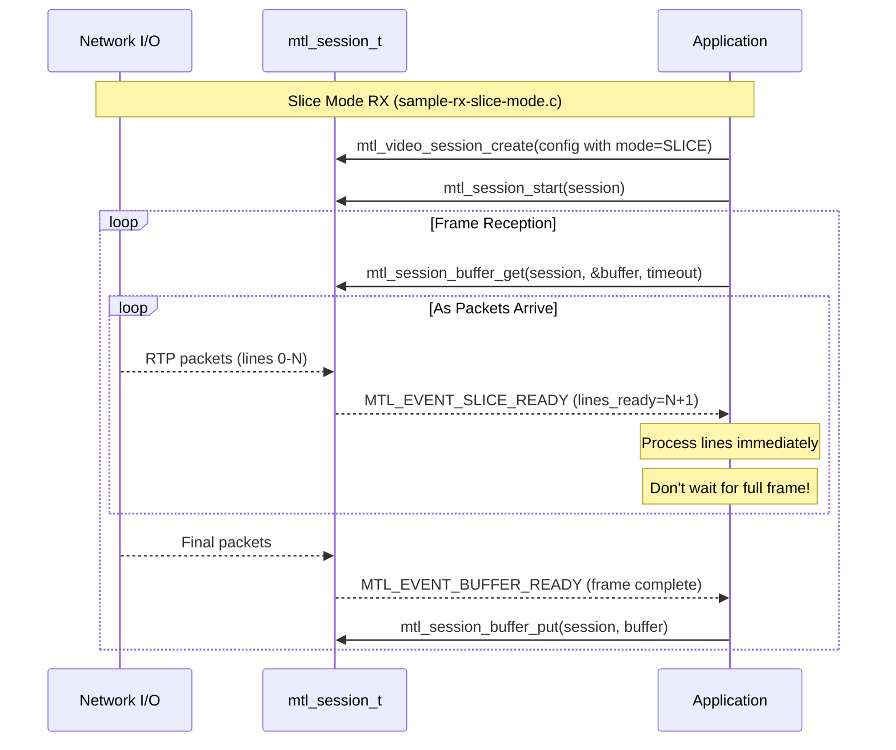
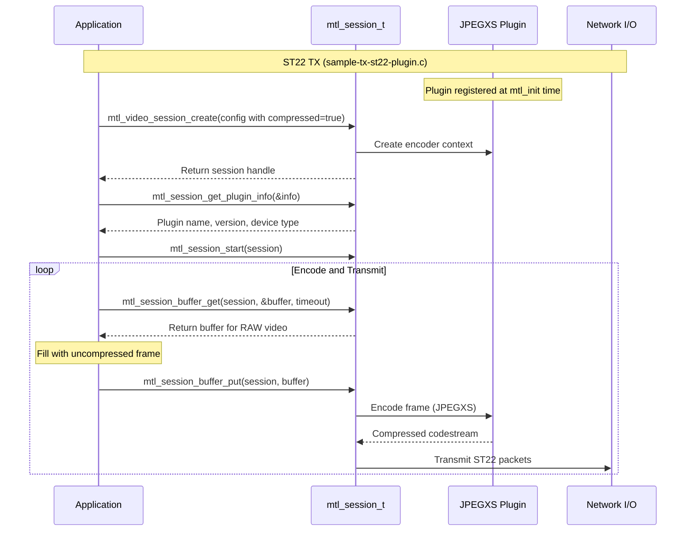

# Sequence Diagrams for Unified Session API

## Library-Owned RX Flow

## Library-Owned TX Flow

## User-Owned RX Flow (Zero-Copy)

## User-Owned TX Flow (Zero-Copy)

## Polymorphic Session - Same API for All Media Types

## Slice-Level TX Flow (Ultra-Low Latency)

## Slice-Level RX Flow (Ultra-Low Latency)

## ST22 Plugin Flow

