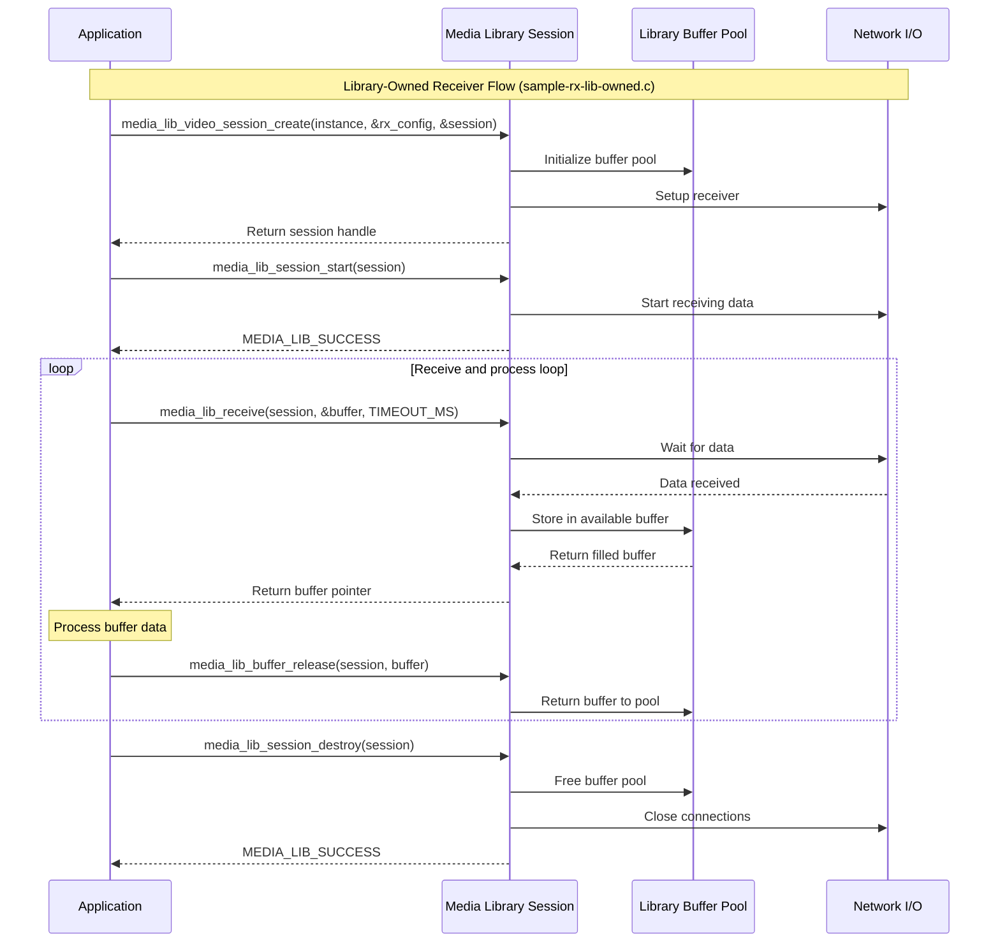
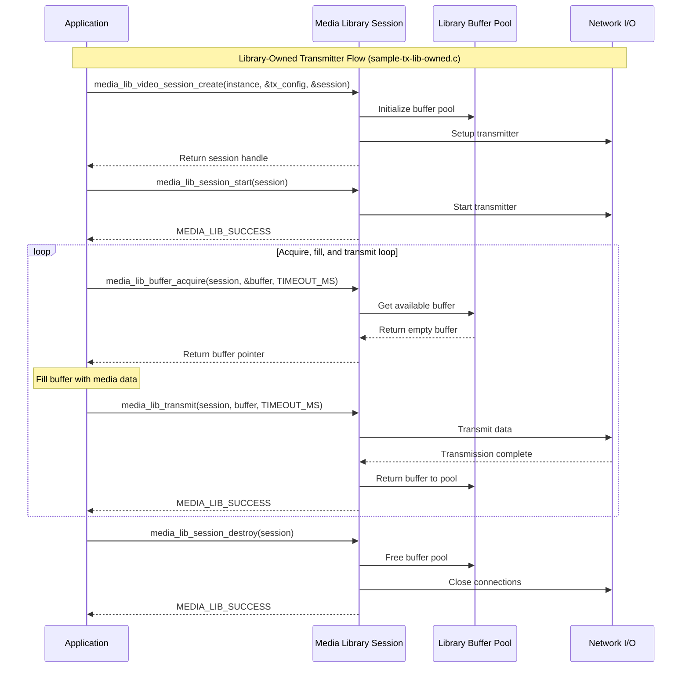
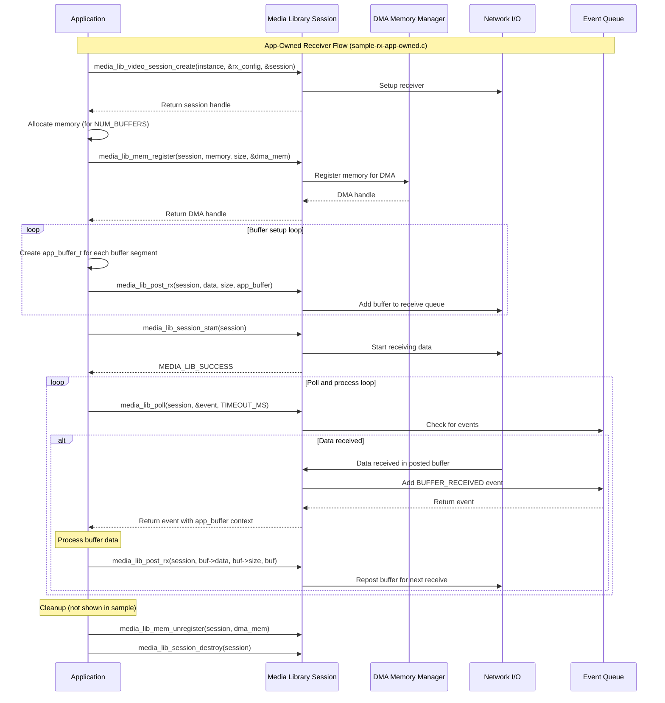
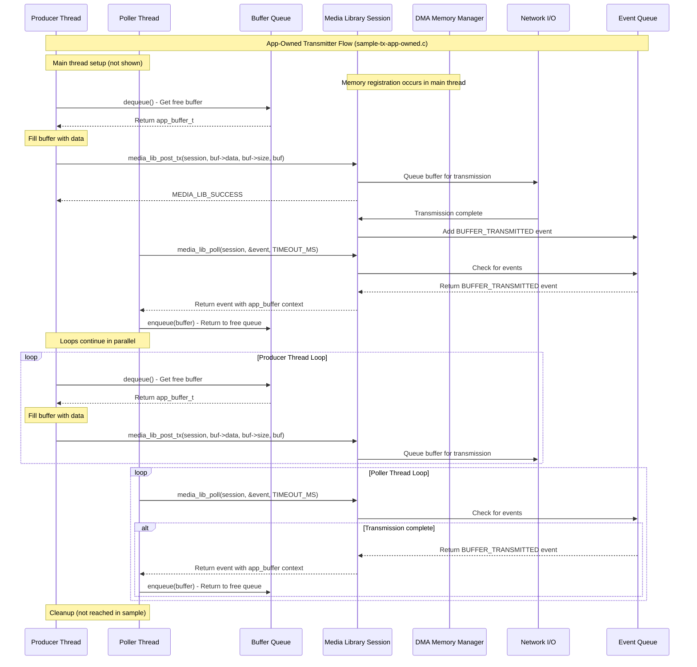

```mermaid
sequenceDiagram
    participant App as Application
    participant Session as Media Library Session
    participant LibBuffers as Library Buffer Pool
    participant Network as Network I/O

    Note over App,Network: Library-Owned Receiver Flow (sample-rx-lib-owned.c)
    
    App->>Session: media_lib_video_session_create(instance, &rx_config, &session)
    Session->>LibBuffers: Initialize buffer pool
    Session->>Network: Setup receiver
    Session-->>App: Return session handle
    
    App->>Session: media_lib_session_start(session)
    Session->>Network: Start receiving data
    Session-->>App: MEDIA_LIB_SUCCESS
    
    loop Receive and process loop
        App->>Session: media_lib_receive(session, &buffer, TIMEOUT_MS)
        Session->>Network: Wait for data
        Network-->>Session: Data received
        Session->>LibBuffers: Store in available buffer
        LibBuffers-->>Session: Return filled buffer
        Session-->>App: Return buffer pointer
        
        Note over App: Process buffer data
        
        App->>Session: media_lib_buffer_release(session, buffer)
        Session->>LibBuffers: Return buffer to pool
    end
    
    App->>Session: media_lib_session_destroy(session)
    Session->>LibBuffers: Free buffer pool
    Session->>Network: Close connections
    Session-->>App: MEDIA_LIB_SUCCESS

```

```mermaid
sequenceDiagram
    participant App as Application
    participant Session as Media Library Session
    participant LibBuffers as Library Buffer Pool
    participant Network as Network I/O
    
    Note over App,Network: Library-Owned Transmitter Flow (sample-tx-lib-owned.c)
    
    App->>Session: media_lib_video_session_create(instance, &tx_config, &session)
    Session->>LibBuffers: Initialize buffer pool
    Session->>Network: Setup transmitter
    Session-->>App: Return session handle
    
    App->>Session: media_lib_session_start(session)
    Session->>Network: Start transmitter
    Session-->>App: MEDIA_LIB_SUCCESS
    
    loop Acquire, fill, and transmit loop
        App->>Session: media_lib_buffer_acquire(session, &buffer, TIMEOUT_MS)
        Session->>LibBuffers: Get available buffer
        LibBuffers-->>Session: Return empty buffer
        Session-->>App: Return buffer pointer
        
        Note over App: Fill buffer with media data
        
        App->>Session: media_lib_transmit(session, buffer, TIMEOUT_MS)
        Session->>Network: Transmit data
        Network-->>Session: Transmission complete
        Session->>LibBuffers: Return buffer to pool
        Session-->>App: MEDIA_LIB_SUCCESS
    end
    
    App->>Session: media_lib_session_destroy(session)
    Session->>LibBuffers: Free buffer pool
    Session->>Network: Close connections
    Session-->>App: MEDIA_LIB_SUCCESS

```

```mermaid
sequenceDiagram
    participant App as Application
    participant Session as Media Library Session
    participant DMA as DMA Memory Manager
    participant Network as Network I/O
    participant Events as Event Queue
    
    Note over App,Events: App-Owned Receiver Flow (sample-rx-app-owned.c)
    
    App->>Session: media_lib_video_session_create(instance, &rx_config, &session)
    Session->>Network: Setup receiver
    Session-->>App: Return session handle
    
    App->>App: Allocate memory (for NUM_BUFFERS)
    App->>Session: media_lib_mem_register(session, memory, size, &dma_mem)
    Session->>DMA: Register memory for DMA
    DMA-->>Session: DMA handle
    Session-->>App: Return DMA handle
    
    loop Buffer setup loop
        App->>App: Create app_buffer_t for each buffer segment
        App->>Session: media_lib_post_rx(session, data, size, app_buffer)
        Session->>Network: Add buffer to receive queue
    end
    
    App->>Session: media_lib_session_start(session)
    Session->>Network: Start receiving data
    Session-->>App: MEDIA_LIB_SUCCESS
    
    loop Poll and process loop
        App->>Session: media_lib_poll(session, &event, TIMEOUT_MS)
        Session->>Events: Check for events
        
        alt Data received
            Network->>Session: Data received in posted buffer
            Session->>Events: Add BUFFER_RECEIVED event
            Events-->>Session: Return event
            Session-->>App: Return event with app_buffer context
            
            Note over App: Process buffer data
            
            App->>Session: media_lib_post_rx(session, buf->data, buf->size, buf)
            Session->>Network: Repost buffer for next receive
        end
    end
    
    Note over App: Cleanup (not shown in sample)
    App->>Session: media_lib_mem_unregister(session, dma_mem)
    App->>Session: media_lib_session_destroy(session)

```

```mermaid
sequenceDiagram
    participant ProducerThread as Producer Thread
    participant PollerThread as Poller Thread
    participant BufferQueue as Buffer Queue
    participant Session as Media Library Session
    participant DMA as DMA Memory Manager
    participant Network as Network I/O
    participant Events as Event Queue
    
    Note over ProducerThread,Events: App-Owned Transmitter Flow (sample-tx-app-owned.c)
    
    Note over ProducerThread,PollerThread: Main thread setup (not shown)
    
    Note over Session,DMA: Memory registration occurs in main thread
    
    ProducerThread->>BufferQueue: dequeue() - Get free buffer
    BufferQueue-->>ProducerThread: Return app_buffer_t
    
    Note over ProducerThread: Fill buffer with data
    
    ProducerThread->>Session: media_lib_post_tx(session, buf->data, buf->size, buf)
    Session->>Network: Queue buffer for transmission
    Session-->>ProducerThread: MEDIA_LIB_SUCCESS
    
    Network->>Session: Transmission complete
    Session->>Events: Add BUFFER_TRANSMITTED event
    
    PollerThread->>Session: media_lib_poll(session, &event, TIMEOUT_MS)
    Session->>Events: Check for events
    Events-->>Session: Return BUFFER_TRANSMITTED event
    Session-->>PollerThread: Return event with app_buffer context
    
    PollerThread->>BufferQueue: enqueue(buffer) - Return to free queue
    
    Note over ProducerThread,PollerThread: Loops continue in parallel
    
    loop Producer Thread Loop
        ProducerThread->>BufferQueue: dequeue() - Get free buffer
        BufferQueue-->>ProducerThread: Return app_buffer_t
        Note over ProducerThread: Fill buffer with data
        ProducerThread->>Session: media_lib_post_tx(session, buf->data, buf->size, buf)
        Session->>Network: Queue buffer for transmission
    end
    
    loop Poller Thread Loop
        PollerThread->>Session: media_lib_poll(session, &event, TIMEOUT_MS)
        Session->>Events: Check for events
        alt Transmission complete
            Events-->>Session: Return BUFFER_TRANSMITTED event
            Session-->>PollerThread: Return event with app_buffer context
            PollerThread->>BufferQueue: enqueue(buffer) - Return to free queue
        end
    end
    
    Note over ProducerThread,PollerThread: Cleanup (not reached in sample)

```