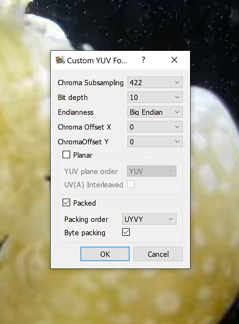

# Run Guide

The DPDK based PMD requires VFIO (IOMMU) and huge pages to run, but it also supports non-root run, making it easy to deploy within Docker/Kubernetes environments.

## 1. IOMMU Setup

### 1.1. [IOMMU Setup](chunks/_iommu_setup.md)

```{include} chunks/_iommu_setup.md
```

## 2. Kernel Mode NIC Driver Setup

For Intel® E810 and E830 Series Ethernet Adapter, refer to [Intel® E800 Series Ethernet Adapters driver guide](e800_series_drivers.md). For other NICs, you may need to follow the steps on the [DPDK site](http://doc.dpdk.org/guides/nics/overview.html).

## 3. DPDK PMD Setup

DPDK utilizes the Linux kernel's VFIO module to enable direct NIC hardware access from user space with the assistance of an IOMMU (Input/Output Memory Management Unit).
To use DPDK's Poll Mode Drivers (PMDs), NICs must be bound to the `vfio-pci` driver. Before manipulating VFIO devices, it's necessary to configure user permissions and system rules to allow the current user to access VFIO devices.

### 3.1. Allow Current User to Access /dev/vfio/* Devices

This section guides you through creating a dedicated group, granting the appropriate permissions, and setting up udev rules to maintain these settings across system reboots and devices re-creations.

Add a new group named `vfio` with GID `2110` to control the VFIO devices, and add your current user to that group. If GID `2110` is in use, consider using a different one.

```bash
getent group 2110 || sudo groupadd -g 2110 vfio
sudo usermod -aG vfio $USER
```

Re-login and check the group `vfio` successfully added using the `groups` command:
```bash
groups
```
should result with:
```text
(...) sudo docker libvirt vfio
```

Create or edit a udev rules file, for example, `/etc/udev/rules.d/10-vfio.rules`, with your preferred text editor. For instance, using `vim`:

```bash
sudo vim /etc/udev/rules.d/10-vfio.rules
```

Add the following line to set the group ownership to vfio and enable read/write access for the group to any VFIO devices that appear:

```text
SUBSYSTEM=="vfio", GROUP="vfio", MODE="0660"
```

Then reload the udev rules with:

```bash
sudo udevadm control --reload-rules
sudo udevadm trigger
```

### 3.2. Bind NICs to DPDK PMD

Note: It is important to repeat this operation again after rebooting the system. The steps mentioned should be followed again to ensure that the desired configuration is maintained after a reboot.

For the Intel® E800 Series Ethernet Adapters (E810 or E830), which supports Virtual Functions (VFs) based on Single Root I/O Virtualization (SR-IOV), please refer to [Create Intel® E800 series VFs and Bind to DPDK PMD](#321-create-intel-e800-series-vfs-and-bind-to-dpdk-pmd) to learn how to create VFs and bind them to the DPDK Poll Mode Driver (PMD).

For other Network Interface Cards (NICs), please verify if your NIC is supported by DPDK by referring to the following link: <https://doc.dpdk.org/guides/nics/>. If it is, follow the guide provided there for further instructions.

If your NIC is not supported by DPDK's native Poll Mode Driver (PMD), MTL provides an alternative in the form of kernel socket-based transport support. This enables an MTL application to send and receive UDP packets via the Kernel.
Please refer to [kernel TX config](../tests/tools/RxTxApp/script/kernel_socket_json/tx.json) and [kernel RX config](../tests/tools/RxTxApp/script/kernel_socket_json/rx.json) for how to config the kernel transport in JSON config. However, it's important to note that this is an experimental feature intended solely for trial usage. Consequently, its performance and pacing accuracy may be limited.

#### 3.2.1. Create Intel® E800 series VFs and Bind to DPDK PMD

Get Device to Bus info mapping:

```bash
lshw -c network -businfo
```

```text
Bus info          Device       Class          Description
=========================================================
pci@0000:af:00.0  ens801f0     network        Ethernet Controller E810-C for QSFP
pci@0000:af:00.1  ens801f1     network        Ethernet Controller E810-C for QSFP
```

Below is the command to create VF for BDF `0000:af:00.0`  (shown above in example), and bind the VFs to DPDK PMD.

```bash
cd $mtl_source_code
sudo -E ./script/nicctl.sh create_vf 0000:af:00.0
```

To find the VF BDF (Bus Device Function) information, please check the output below. In this example, the VF BDFs range from 0000:af:01.0 to 0000:af:01.5. Remember these VF BDFs as you will need them when running the sample application.

```text
0000:af:00.0 'Ethernet Controller E810-C for QSFP 1592' if=enp175s0f0 drv=ice unused=vfio-pci *Active*
Bind 0000:af:01.0(enp175s0f0v0) to vfio-pci success
Bind 0000:af:01.1(enp175s0f0v1) to vfio-pci success
Bind 0000:af:01.2(enp175s0f0v2) to vfio-pci success
Bind 0000:af:01.3(enp175s0f0v3) to vfio-pci success
Bind 0000:af:01.4(enp175s0f0v4) to vfio-pci success
Bind 0000:af:01.5(enp175s0f0v5) to vfio-pci success
Create VFs on PF bdf: 0000:af:00.0 enp175s0f0 succ
```

And please verify that the newly created VFIO device is correctly assigned to the vfio group as specified by your udev rules from section [3.1 Allow current user to access /dev/vfio/* devices](#31-allow-current-user-to-access-devvfio-devices). Use the command:
```bash
ls -lg /dev/vfio/*
```
and below is sample output:
```text
crw-rw---- 1 vfio  235,   0 Dec 12 09:34 /dev/vfio/162
crw-rw---- 1 vfio  235,   2 Dec 12 09:34 /dev/vfio/163
crw-rw---- 1 vfio  235,   3 Dec 12 09:34 /dev/vfio/164
crw-rw---- 1 vfio  235,   4 Dec 12 09:34 /dev/vfio/165
```

If the creation of VF BDFs fails, you can check the kernel dmesg log to find possible reasons for the failure. The dmesg log contains valuable information that can help identify any issues or errors related to the VF creation process. Please review the dmesg log for any relevant messages or error codes that can provide insights into why the creation of VF BDFs was unsuccessful.

```bash
sudo dmesg
```

#### 3.2.2. Bind PF to DPDK PMD

If your Network Interface Card (NIC) is not from the Intel® E800 Series, but is supported by DPDK, you have the option to directly bind the Physical Function (PF) to the DPDK Poll Mode Driver (PMD) for Bus Device Function (BDF) 0000:32:00.0 using the command provided below.

```bash
cd $mtl_source_code
sudo ./script/nicctl.sh bind_pmd 0000:32:00.0
```

## 4. Setup Hugepage

Note: After rebooting the system, it is essential to configure hugepages again, as the configuration will be lost.

For example, if you want to enable 2048 2M huge pages, which would total to 4GB of memory, you can follow the step below:

```bash
sudo sysctl -w vm.nr_hugepages=2048
```

The number is dependent on the workloads you wish to execute. Consider increasing the value if memory allocation failures occur during runtime.

## 5. Run the Sample Application

> **WARNING:** It is crucial to run the MTL Manager using the Bash command
> ```bash
> sudo MtlManager
> ```
> before attempting to run more than one MTL process per machine or server.
>
> Failure to do so will result in improper logical core (lcore) management, as all MTL
> processes will allocate on the same cores, leading to severe performance degradation
> and potential system instability.
>
> For detailed instructions and further information, please refer to the [manager/README.md](../manager/README.md)

### 5.1. Prepare Source Files

Please note that the input YUV source file for the sample application is in the RFC4175 YUV422BE10 (big-endian 10-bit) pixel group format, which is defined in the ST2110 specification. This project includes a simple tool to convert the format from YUV422 planar 10-bit little-endian format.

#### 5.1.1. Prepare a yuv422p10le File

The following command shows how to decode two frames from the encoder file and convert it from 420 to 422 planar file. Change the 'vframes' value if you want to generate more frames.

```bash
wget https://larmoire.org/jellyfish/media/jellyfish-3-mbps-hd-hevc-10bit.mkv
ffmpeg -i jellyfish-3-mbps-hd-hevc-10bit.mkv -vframes 2 -c:v rawvideo yuv420p10le_1080p.yuv
ffmpeg -s 1920x1080 -pix_fmt yuv420p10le -i yuv420p10le_1080p.yuv -pix_fmt yuv422p10le yuv422p10le_1080p.yuv
```

#### 5.1.2. Convert yuv422p10le to yuv422rfc4175be10

Below is the command to convert yuv422p10le file to yuv422rfc4175be10 pg format(ST2110-20 supported pg format for 422 10bit)

```bash
./build/app/ConvApp -width 1920 -height 1080 -in_pix_fmt yuv422p10le -i yuv422p10le_1080p.yuv -out_pix_fmt yuv422rfc4175be10 -o yuv422rfc4175be10_1080p.yuv
```

The yuv422rfc4175be10 files can be viewed by [YUV Viewer tools](https://github.com/IENT/YUView). Below is the custom layout.


#### 5.1.3. Convert yuv422rfc4175be10 Back to yuv422p10le

Below is the command to convert yuv422rfc4175be10 pg format(ST2110-20 supported pg format for 422 10bit) to yuv422p10le file

```bash
./build/app/ConvApp -width 1920 -height 1080 -in_pix_fmt yuv422rfc4175be10 -i yuv422rfc4175be10_1080p.yuv -out_pix_fmt yuv422p10le -o out_yuv422p10le_1080p.yuv
```

#### 5.1.4. v210 Support

This tools also support v210 format, use "v210" for the in_pix_fmt/out_pix_fmt args instead.

```bash
./build/app/ConvApp -width 1920 -height 1080 -in_pix_fmt yuv422rfc4175be10 -i yuv422rfc4175be10_1080p.yuv -out_pix_fmt v210 -o v210_1080p.yuv
./build/app/ConvApp -width 1920 -height 1080 -in_pix_fmt v210 -i v210_1080p.yuv -out_pix_fmt yuv422rfc4175be10 -o out_yuv422rfc4175be10_1080p.yuv
```

#### 5.1.5. yuv422 12bit Support

```bash
ffmpeg -s 1920x1080 -pix_fmt yuv420p10le -i yuv420p10le_1080p.yuv -pix_fmt yuv422p12le yuv422p12le_1080p.yuv
./build/app/ConvApp -width 1920 -height 1080 -in_pix_fmt yuv422p12le -i yuv422p12le_1080p.yuv -out_pix_fmt yuv422rfc4175be12 -o yuv422rfc4175be12_1080p.yuv
./build/app/ConvApp -width 1920 -height 1080 -in_pix_fmt yuv422rfc4175be12 -i yuv422rfc4175be12_1080p.yuv -out_pix_fmt yuv422p12le -o out_yuv422p12le_1080p.yuv
```

#### 5.1.6. yuv444 10bit Support

```bash
ffmpeg -s 1920x1080 -pix_fmt yuv420p10le -i yuv420p10le_1080p.yuv -pix_fmt yuv444p10le yuv444p10le_1080p.yuv
./build/app/ConvApp -width 1920 -height 1080 -in_pix_fmt yuv444p10le -i yuv444p10le_1080p.yuv -out_pix_fmt yuv444rfc4175be10 -o yuv444rfc4175be10_1080p.yuv
./build/app/ConvApp -width 1920 -height 1080 -in_pix_fmt yuv444rfc4175be10 -i yuv444rfc4175be10_1080p.yuv -out_pix_fmt yuv444p10le -o out_yuv444p10le_1080p.yuv
```

#### 5.1.7. yuv444 12bit Support

```bash
ffmpeg -s 1920x1080 -pix_fmt yuv420p10le -i yuv420p10le_1080p.yuv -pix_fmt yuv444p12le yuv444p12le_1080p.yuv
./build/app/ConvApp -width 1920 -height 1080 -in_pix_fmt yuv444p12le -i yuv444p12le_1080p.yuv -out_pix_fmt yuv444rfc4175be12 -o yuv444rfc4175be12_1080p.yuv
./build/app/ConvApp -width 1920 -height 1080 -in_pix_fmt yuv444rfc4175be12 -i yuv444rfc4175be12_1080p.yuv -out_pix_fmt yuv444p12le -o out_yuv444p12le_1080p.yuv
```

#### 5.1.8. Interlaced Support

ConvApp offers a `frame2field` option to convert a progressive YUV file into an interlaced file. The interlaced YUV file stores the first field followed by the second field, repeating this sequence.

For yuv422p10le:

```bash
./build/app/ConvApp --in_pix_fmt yuv422p10le --width 1920 --height 1080 --i yuv422p10le_1080p.yuv --o yuv422p10le_1080i.yuv --frame2field
```

For yuv422rfc4175be10:

```bash
./build/app/ConvApp --in_pix_fmt yuv422rfc4175be10 --width 1920 --height 1080 --i yuv422rfc4175be10_1080p.yuv --o yuv422rfc4175be10_1080i.yuv --frame2field
```

### 5.2. Run RxTxApp with JSON Config

Before running samples the JSON configuration files must be modified. The "name" tag in "interfaces" must be updated to VF BDF, e.g. 0000:af:01.0. No other changes are required to run samples.

```json
"interfaces": [
        {
            "name": "0000:af:01.0",
            "ip": "192.168.88.189"
        }
```

For the supported parameters in the JSON, please refer to [the JSON Configuration Guide](configuration_guide.md) for details.

Below is the command to run one video tx/rx session with JSON config.

```bash
./tests/tools/RxTxApp/build/RxTxApp --config_file config/tx_1v.json
```

If it runs well, you will see similar log output periodically:

```text
MTL: 2024-04-16 15:38:31, * *    M T    D E V   S T A T E   * *
MTL: 2024-04-16 15:38:31, DEV(0): Avr rate, tx: 2610.119496 Mb/s, rx: 0.001091 Mb/s, pkts, tx: 2465576, rx: 4
MTL: 2024-04-16 15:38:31, SCH(0:sch_0): tasklets 3, lcore 28(t_pid: 106158), avg loop 102 ns
MTL: 2024-04-16 15:38:31, CNI(0): eth_rx_rate 0.001091 Mb/s, eth_rx_cnt 4
MTL: 2024-04-16 15:38:31, PTP(0): time 1713253074859051552, 2024-04-16 15:37:54
MTL: 2024-04-16 15:38:31, TX_VIDEO_SESSION(0,0:app_tx_st20p_0): fps 59.900091, frame 599 pkts 2467208:2466608 inflight 147987:148099
MTL: 2024-04-16 15:38:31, TX_VIDEO_SESSION(0,0): throughput 2611.215061 Mb/s: 0.000000 Mb/s, cpu busy 0.655173
MTL: 2024-04-16 15:38:31, TX_st20p(0,app_tx_st20p_0), p(0:in_transmitting) c(1:converted)
MTL: 2024-04-16 15:38:31, TX_st20p(0), frame get try 600 succ 599, put 600
MTL: 2024-04-16 15:38:31, * *    E N D    S T A T E   * *
```

Then run a RX in another node/port.

```bash
./tests/tools/RxTxApp/build/RxTxApp --config_file config/rx_1v.json
```

If it runs well, you will see similar log output periodically:

```text
MTL: 2024-04-16 15:39:18, * *    M T    D E V   S T A T E   * *
MTL: 2024-04-16 15:39:18, DEV(0): Avr rate, tx: 0.000048 Mb/s, rx: 2602.516773 Mb/s, pkts, tx: 1, rx: 2465849
MTL: 2024-04-16 15:39:18, SCH(0:sch_0): tasklets 2, lcore 29(t_pid: 106309), avg loop 59 ns
MTL: 2024-04-16 15:39:18, CNI(0): eth_rx_rate 0.000000 Mb/s, eth_rx_cnt 0
MTL: 2024-04-16 15:39:18, PTP(0): time 1713253121113848589, 2024-04-16 15:38:41
MTL: 2024-04-16 15:39:18, RX_VIDEO_SESSION(0,0:app_rx_st20p_0): fps 59.999295 frames 600 pkts 2466461
MTL: 2024-04-16 15:39:18, RX_VIDEO_SESSION(0,0:app_rx_st20p_0): throughput 2611.054741 Mb/s, cpu busy 0.505297
MTL: 2024-04-16 15:39:18, RX_VIDEO_SESSION(0,0): succ burst max 96, avg 1.036124
MTL: 2024-04-16 15:39:18, RX_st20p(0,app_rx_st20p_0), p(1:free) c(0:ready)
MTL: 2024-04-16 15:39:18, RX_st20p(0), frame get try 599 succ 599, put 599
app_rx_st20p_stat(0), avrage latency 18.263382ms
MTL: 2024-04-16 15:39:18, * *    E N D    S T A T E   * *
```

This project also provides many loop tests (1 port as tx, 1 port as rx) config files. Please refer to [loop config](../tests/tools/RxTxApp/script/).

If it failed to run the sample, please help to collect the system setup status by `status_report.sh` and share the log for further analysis.

```bash
./script/status_report.sh
```

### 5.3. Available Parameters in RxTxApp

```text
--config_file <URL>                  : the json config file path
--ptp                                : Enable the built-in PTP implementation, default is disabled and system time is selected as PTP time source.
--lcores <lcore list>                : the DPDK lcore list for this run, e.g. --lcores 28,29,30,31. If not assigned, lib will allocate lcore from system socket cores.
--test_time <seconds>                : the run duration, unit: seconds
--dma_dev <DMA1,DMA2,DMA3...>        : DMA dev list to offload the packet memory copy for RX video frame session.
--log_level <level>                  : set log level. e.g. debug, info, notice, warning, error.
--log_file <file path>               : set log file for mtl log. If you're initiating multiple RxTxApp processes simultaneously, please ensure each process has a unique filename path. Default the log is writing to stderr.

--arp_timeout_s <sec>                : debug option, set the arp timeout in seconds if using unicast address. Default timeout value is 60 seconds.
--allow_across_numa_core             : debug option, allow the usage of cores across NUMA nodes
--no_multicast                       : debug option, disable the multicast join message, usually for the SDN switch case.
--rx_separate_lcore                  : debug option, if enabled, RX video session will run on dedicated lcores, it means TX video and RX video is not running on the same core.
--rx_mix_lcore                       : debug option, if enabled, it means TX video and RX video are possible to run on the same core.
--runtime_session                    : debug option, start instance before create video/audio/anc sessions, similar to runtime tx/rx create.
--rx_timing_parser                   : debug option, enable timing check for video rx streams.
--pcapng_dump <n>                    : debug option, dump n packets from rx video streams to pcapng files.
--rx_video_file_frames <n>           : debug option, dump the received video frames to a yuv file, n is dump file size in frame unit.
--rx_video_fb_cnt<n>                 : debug option, the frame buffer count.
--promiscuous                        : debug option, enable RX promiscuous( receive all data passing through it regardless of whether the destination address of the data) mode for NIC.
--cni_thread                         : debug option, use a dedicated thread for cni messages instead of tasklet.
--sch_session_quota <count>          : debug option, max sessions count for one lcore, unit: 1080P 60FPS TX.
--p_tx_dst_mac <mac>                 : debug option, destination MAC address for primary port.
--r_tx_dst_mac <mac>                 : debug option, destination MAC address for redundant port.
--nb_tx_desc <count>                 : debug option, number of transmit descriptors for each NIC TX queue, affect the memory usage and the performance.
--nb_rx_desc <count>                 : debug option, number of receive descriptors for each NIC RX queue, affect the memory usage and the performance.
--tasklet_time                       : debug option, enable stat info for tasklet running time.
--tsc                                : debug option, force to use tsc pacing.
--pacing_way <way>                   : debug option, set pacing way, available value: "auto", "rl", "tsc", "tsc_narrow", "ptp", "tsn".
--shaping <shaping>                  : debug option, set st21 shaping type, available value: "narrow", "wide".
--vrx <n>                            : debug option, set st21 vrx value, refer to st21 spec for possible vrx value.
--ts_first_pkt                       : debug option, to set the st20 RTP timestamp at the time the first
packet egresses from the sender.
--ts_delta_us <n>                    : debug option, to set the st20 rtp timestamp delta(us) to the start time of frame.
--mono_pool                          : debug option, use mono pool for all tx and rx queues(sessions).
--tasklet_thread                     : debug option, run the tasklet under thread instead of a pinned lcore.
--tasklet_sleep                      : debug option, enable sleep if all tasklet report done status.
--tasklet_sleep_us                   : debug option, set the sleep us value if tasklet decide to enter sleep state.
--app_bind_lcore                     : debug option, run the app thread under a pinned lcore.
--rxtx_simd_512                      : debug option, enable dpdk simd 512 path for rx/tx burst function, see --force-max-simd-bitwidth=512 in dpdk for detail.
--rss_mode <mode>                    : debug option, available modes: "l3_l4", "l3", "none".
--tx_no_chain                        : debug option, use memcopy rather than mbuf chain for tx payload.
--multi_src_port                     : debug option, use multiple src port for st20 tx stream.
--audio_fifo_size <count>            : debug option, the audio fifo size between packet builder and pacing.
--dhcp                               : debug option, enable DHCP for all ports.
--virtio_user                        : debug option, enable virtio_user ports for control plane packets. Linux only, need to set capability for the app before running, `sudo setcap 'cap_net_admin+ep' ./tests/tools/RxTxApp/build/RxTxApp`.
--phc2sys                            : debug option, enable the built-in phc2sys function to sync the system time to our internal synced PTP time. Linux only, need to set capability for the app before running, `sudo setcap 'cap_sys_time+ep' ./tests/tools/RxTxApp/build/RxTxApp`.
--ptp_sync_sys                       : debug option, enabling the synchronization of PTP time from MTL to the system time in the application. On Linux, need to set capability for the app before running, `sudo setcap 'cap_sys_time+ep' ./tests/tools/RxTxApp/build/RxTxApp`.
--rss_sch_nb <number>                : debug option, set the schedulers(lcores) number for the RSS dispatch.
--log_time_ms                        : debug option, enable a ms accuracy log printer by the api mtl_set_log_prefix_formatter.
--rx_video_file_frames <count>       : debug option, dump the received video frames to one yuv file
--rx_audio_dump_time_s <seconds>     : debug option, dump the received audio frames to one pcm file
--dedicated_sys_lcore                : debug option, run MTL system tasks(CNI, PTP, etc...) in a dedicated lcore
--bind_numa                          : debug option, all MTL threads bind to same numa of NIC
--not_bind_numa                      : debug option, MTL threads runs without NIC numa aware
--force_numa <id>                    : debug option, force the NIC port numa id instead of reading from PCIE topology
```


## 6. Tests

This project includes many automated test cases based on gtest. Below there is an example command to run. Customize the argument according to your setup.

```bash
./build/tests/KahawaiTest --p_port 0000:af:01.0 --r_port 0000:af:01.1
```

In case the test requires large huge page settings, please expand it to 8GB.

```bash
sudo sysctl -w vm.nr_hugepages=4096
```

## 7. Optional Setup

This section includes some optional guides. If you are not familiar with the details or do not require this information, you can skip this part.

### 7.1. [PTP Setup](chunks/_ptp_setup.md)

```{include} chunks/_ptp_setup.md
```

## 8. FAQs

### 8.1. Notes After Reboot

You need to repeat below steps to create Virtual Functions (VF), bind the VF to DPDK PMD, and set up the hugepages configuration again since it's lost after reboot.

```bash
# replace "0000:a1:00.0" with the port on your setup
sudo ./script/nicctl.sh create_vf 0000:a1:00.0
# setup hugepages, the number(2048) is dependent on the workloads you wish to execute.
sudo sysctl -w vm.nr_hugepages=2048
```

And, sometimes after a system reboot, it is possible for the operating system to update to a new kernel version. In such cases, it is important to remember to rebuild the NIC driver to ensure compatibility with the new kernel version.

### 8.2. Notes for non-root Run

When running as a non-root user, there may be some additional resource limits that are imposed by the system.

### 8.2.1. RLIMIT_MEMLOCK

RLIMIT_MEMLOCK (amount of pinned pages the process is allowed to have), if you see the below error at start up, it's likely caused by too small RLIMIT_MEMLOCK settings.

```text
EAL: Cannot set up DMA remapping, error 12 (Cannot allocate memory)
EAL: 0000:af:01.0 DMA remapping failed, error 12 (Cannot allocate memory)
EAL: Requested device 0000:af:01.0 cannot be used
```

Please increase the value of RLIMIT_MEMLOCK. Below is an example to enable unlimited RLIMIT_MEMLOCK.

Edit `/etc/security/limits.conf` file, append below two lines at the end of the file, change <USER> to the username currently logged in:
```text
<USER>    hard   memlock           unlimited
<USER>    soft   memlock           unlimited
```
```bash
sudo reboot
```

After reboot, double-check the limit is disabled.

```bash
ulimit -a | grep "max locked memory"
```
```text
max locked memory       (kbytes, -l) unlimited
```

### 8.3. BDF Port Not Bound to DPDK PMD Mode

The following error indicates that the port driver is not configured to DPDK PMD mode. Please run nicctl.sh to configure it:

```text
ST: st_dev_get_socket, failed to locate 0000:86:20.0
ST: st_dev_get_socket, please make sure the driver of 0000:86:20.0 is configured to DPDK PMD
```

### 8.4. Hugepage Not Available

If you encounter the following hugepage error while running, it is likely caused by the absence of 1G or 2M huge pages in the current setup.

```text
EAL: FATAL: Cannot get hugepage information.
EAL: Cannot get hugepage information.
```

This error message usually indicates that the mbuf pool creation has failed due to insufficient huge pages. Please try to allocate more huge pages.

```text
ST: st_init, mbuf_pool create fail
```

### 8.5. No Access to VFIO device

If you encounter the following error message, please check section 3.1 to create a group vfio and add the current user to the group:

```text
EAL: Cannot open /dev/vfio/147: Permission denied
EAL: Failed to open VFIO group 147
```

### 8.6. Link Not Connected

The following error indicates that the physical port link is not connected to a network. Please confirm that the cable link is working properly.

```text
ST: dev_create_port(0), link not connected
```

### 8.7. Bind BDF Port Back to Kernel Mode

```bash
sudo ./script/nicctl.sh bind_kernel 0000:af:00.0
```

### 8.8. Bind BDF Port to Pure DPDK PF Mode

```bash
sudo ./script/nicctl.sh bind_pmd 0000:af:00.0
```

### 8.9. Create Trusted VFs

To allow privileged usage in use cases that require Trusted Virtual Functions (VFs), you can utilize the following command:

```bash
sudo ./script/nicctl.sh create_tvf 0000:af:00.0
```

If you need to control the Trusted setting on a per-VF basis, you can use the following example command:

```bash
sudo ip link set enp24s0f0 vf 0 trust on
```

### 8.10. How to Find the BDF Number for NICs

```bash
dpdk-devbind.py -s
```

### 8.11. How to Find the BDF Number Which is Ready for MTL Usage

```bash
dpdk-devbind.py -s
```

And check the device which are DPDK-compatible.

```text
Network devices using DPDK-compatible driver
============================================
0000:af:01.0 'Ethernet Adaptive Virtual Function 1889' drv=vfio-pci unused=iavf
0000:af:01.1 'Ethernet Adaptive Virtual Function 1889' drv=vfio-pci unused=iavf
0000:af:01.2 'Ethernet Adaptive Virtual Function 1889' drv=vfio-pci unused=iavf
0000:af:01.3 'Ethernet Adaptive Virtual Function 1889' drv=vfio-pci unused=iavf
0000:af:01.4 'Ethernet Adaptive Virtual Function 1889' drv=vfio-pci unused=iavf
0000:af:01.5 'Ethernet Adaptive Virtual Function 1889' drv=vfio-pci unused=iavf
```

### 8.12. Lower fps if ptp4l&phc2sys is Enabled

You may have noticed a similar epoch drop log, which is likely caused by both NTP and phc2sys adjusting the system. To address this issue, please disable the NTP service.

```text
MT: DEV(0): Avr rate, tx: 4789 Mb/s, rx: 0 Mb/s, pkts, tx: 4525950, rx: 9
MT: PTP(0): time 1676254936223518377, 2023-02-13 10:22:16
MT: CNI(0): eth_rx_cnt 9
MT: TX_VIDEO_SESSION(0,0:app_tx_video_0): fps 27.499879, frame 275 pkts 4526532:4525984 inflight 279856:279869, cpu busy 75.286346
MT: TX_VIDEO_SESSION(0,0): dummy pkts 550, burst 550
MT: TX_VIDEO_SESSION(0,0): mismatch epoch troffset 275
MT: TX_VIDEO_SESSION(0,0): epoch drop 275
```

### 8.13. NO-IOMMU Mode for VFIO

The VFIO driver can run without the IOMMU feature. Enable it with the below command to bypass IOMMU. As the name suggests, `enable_unsafe_noiommu_mode` is considered unsafe and should only be used if you understand the risks.

```bash
sudo bash -c 'echo 1 > /sys/module/vfio/parameters/enable_unsafe_noiommu_mode'
```

### 8.14. Fail to load shared libraries

If you get a similar message when running the RxTxApp, it's likely an `ld` library path problem.

```text
./tests/tools/RxTxApp/build/RxTxApp: error while loading shared libraries: librte_dmadev.so.23: cannot open shared object file: No such file or directory
```

Try to find the path of this so and append it to `LD_LIBRARY_PATH`.

```bash
find / -name librte_dmadev.so.23
# /usr/local/lib64/librte_dmadev.so.23
```

```bash
# Note to change the path as the find result
export LD_LIBRARY_PATH=/usr/local/lib64/
# Or use ldconfig to update the cache
sudo ldconfig
```

### 8.15. Fail to Init lcore

This might happen after commit `4f46e49`, because the lcore_shm structure is [changed](https://github.com/OpenVisualCloud/Media-Transport-Library/commit/4f46e493b79451c7ca564d82e1be56c7916b0722#diff-7ff8a138885ebda032ff57250ff81174b30722cc168a26fe39d9a4ff501d48d0L710).

```text
MT: 2023-11-24 15:06:27, Error: sch_lcore_shm_init, can not get shared memory for lcore, Invalid argument
MT: 2023-11-24 15:06:27, Error: sch_init_lcores, lcore init fail -5
MT: 2023-11-24 15:06:27, Error: mt_dev_create, sch mgr init fail -5
MT: 2023-11-24 15:06:27, dev_stop_port(0), succ
MT: 2023-11-24 15:06:27, Error: mt_main_create, mt_dev_create fail -5
MT: 2023-11-24 15:06:27, Error: mtl_init, st main create fail -5
```

Follow the below steps to clear the old shared memory in the system:

```bash
# find the shmid of the old shm
ipcs -m
# delete the old shm
sudo ipcrm -m <shmid>
```
