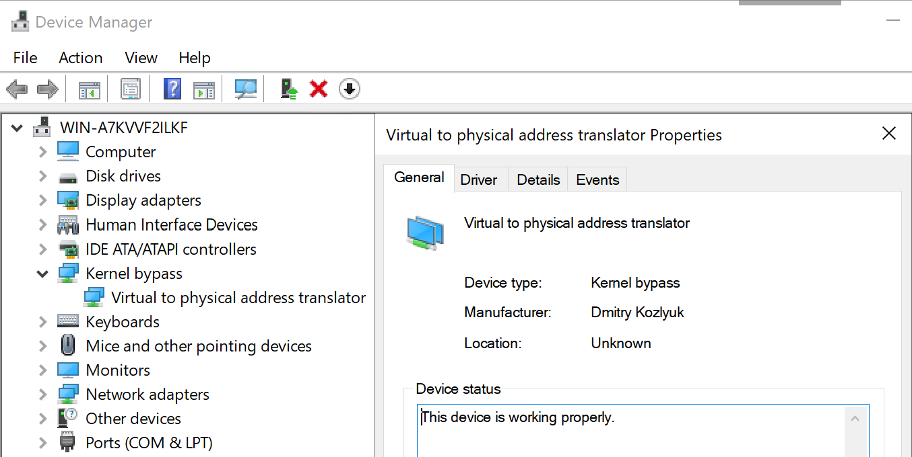
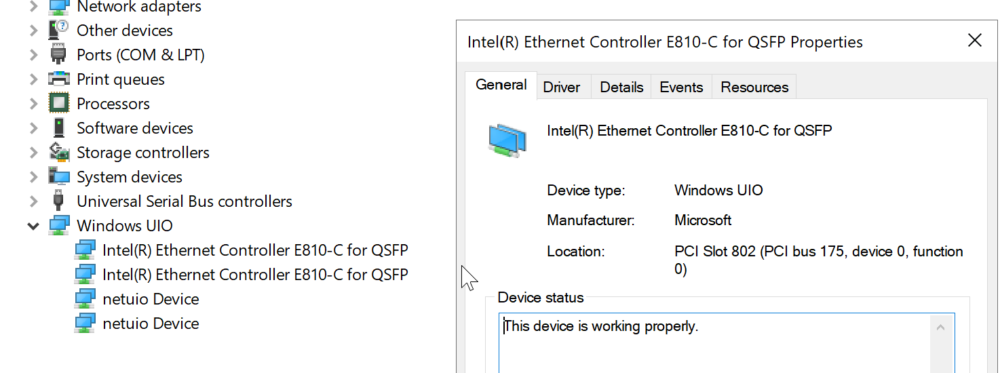

# Run Guide on Windows

Intel® Media Transport Library requires Windows netuio driver Windows virt2phys driver and huge page to run.

## 1. System setup

### 1.1 Enable test sign in Windows if you choose to build non-signed drivers

```powersehll
bcdedit /set loadoptions DISABLE_INTEGRITY_CHECKS
bcdedit /set TESTSIGNING ON
```

### 1.2 Add huge page rights in Windows

#### 1.2.1  Option 1: Local Security Policy

* Control Panel / Computer Management / Local Security Policy (
or Win+R, type `secpol`, press Enter).

* Open Local Policies / User Rights Assignment / Lock pages in memory.

* Add desired users or groups to the list of grantees.
Privilege is applied upon next logon. In particular, if privilege has been granted to current user, a logoff is required before it is available.

#### 1.2.2  Option 2: ntright.exe (if Local Security Policy is not available)

* Download and install rktools from <https://technlg.net/downloads/rktools.exe>

* Open PowerShell, run:

    ```powersehll
    ntrights.exe +r SeLockMemoryPrivilege -u Administrator
    ```

* Reboot to enable it.

## 2 Install virt2phys Driver

### 2.1 Compile the driver

Donwnload the source code from <git://dpdk.org/dpdk-kmods>.

Currently the virt2phy driver has a bug to get the valid iova (physical address), please checkout to d1a4940a (windows/virt2phys: add PnpLockdown directive).

Compile the virt2phys project using VS(Visual Studio) 2019, see README in dpdk-kmods repository.

### 2.2 Option 1: use devcon to install driver

Get devcon.exe from Windows WDK package (if you don't want WDK, you can refer to <https://networchestration.wordpress.com/2016/07/11/how-to-obtain-device-console-utility-devcon-exe-without-downloading-and-installing-the-entire-windows-driver-kit-100-working-method/> for how to get devcon.exe), copy the devcon.exe to your netuio driver folder.

execute command:

```powershell
devcon.exe install virt2phys.inf root\virt2phys
```

### 2.3 Option 2: manually install virt2phys driver

* From Device Manager, Action menu, select "Add legacy hardware".
* It will launch the "Add Hardware Wizard". Click "Next".
* Select second option "Install the hardware that I manually select from a list".
* On the next screen, "Kernel bypass" will be shown as a device class.
* Select it and click "Next".
* Click "Have Disk".
* Find location of your virt2phys.inf driver.
* Select it and click "Next".

The previously installed drivers will now be installed for the "Virtual to physical address translator" device. Here we just go through next and finish buttons.

### 2.4 When there is a problem with driver installation are needed more steps

* Test sign the driver using a test certificate and then boot the Windows in "Test mode", or

* Use the boot time option to "Disable driver signature enforcement".

### 2.5 Make sure that the driver was installed



## 3. Steps for netuio driver

### 3.1 Compile the driver

Compile the netuio project with latest dpdk-kmod code using VS 2019, see README in dpdk-kmods repository.

### 3.2 Option 1: use devcon to install driver

execute command:

```powershell
devcon.exe update netuio.inf "PCI\VEN_8086&DEV_1592"
```

"1592" is for E810, You can change it per your NIC type.

### 3.3 Option 2: manually install netuio driver

* Go to Device Manager -> Network Adapters.
* Right Click on target E810 network adapter -> Select Update Driver.
* Select "Browse my computer for driver software".
* In the resultant window, select "Let me pick from a list of available drivers on my computer".
* Select "DPDK netUIO for Network Adapter" from the list of drivers.
* The NetUIO.sys driver is successfully installed.

### 3.4 Make sure that the driver was installed



## 4. NIC setup

### 4.1 Update NIC FW and driver to latest version

Refer to <https://www.intel.com/content/www/us/en/download/15084/intel-ethernet-adapter-complete-driver-pack.html>.

### 4.2 Update the ICE DDP package file: ice.pkg

To get the latest DDP file (ice-1.3.30.0.pkg), visit <https://www.intel.com/content/www/us/en/download/19630/intel-network-adapter-driver-for-e810-series-devices-under-linux.html>, unzip the driver and go to the DDP directory.

The Windows ICE driver will try to search for the DDP file with the path "c:\dpdk\lib\ice.pkg" or ".\ice.pkg". Please place the latest DDP file in one of these locations and rename it to ice.pkg. Otherwise, you will see the following error when running the RxTxApp.

```bash
ice_load_pkg(): failed to search file path
ice_dev_init(): Failed to load the DDP package, Use safe-mode-support=1 to enter Safe Mode
```

### 4.3 Create the temp folder in root directory c:\temp

The library will generate or search for `kahawai.lcore` file in this path.

## 5. Run and test

You can bind the app to the cpu socket 0 ( if your NIC is inserted into the pcie slot belongs to cpu socket 0 )as following:
To identify the socket if you do not know it, in the NIC card driver property page, check the bus number, if the number is great than
0x80, then socket 1, else socket 0, for example

```powershell
start /Node 0 /B .\build\app\RxTxApp --config_file config\test_tx_1port_1v.json
```

Please refer to sections "5. Run the sample application" in the [linux run guide](run.md) for instructions on how to run the sample application. The Windows version shares the same codebase as the Linux version, and the application/library behavior is the same.

## 6. Windows TAP support (Optional)

### 6.1 Download openVPN driver by searching "OpenVPN-2.5.6-I601-amd64.msi" and download the installation file

### 6.2 Install windows TAP driver

In the Control Panel->Network and internet->Network Connections, find the "OpenVPN TAP-Windows6" device, set the adaptor IP address, such as `192.168.2.2`.

### 6.3 Rebuild and install MTL lib with "-Denable_tap=true"

```bash
meson tap_build -Ddpdk_root_dir=${DPDK_SRC_DIR} -Denable_tap=true
ninja -C tap_build install
```

### 6.4 Check if Ping is working

Ping `192.168.2.2` from other machine in the same network such as `192.168.2.3`, if have reply, the TAP works.
