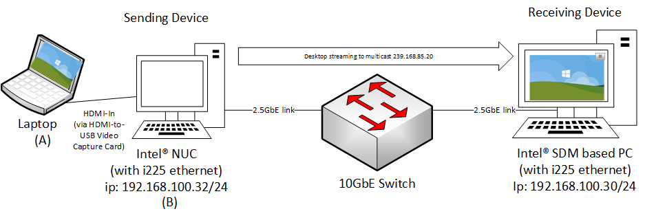
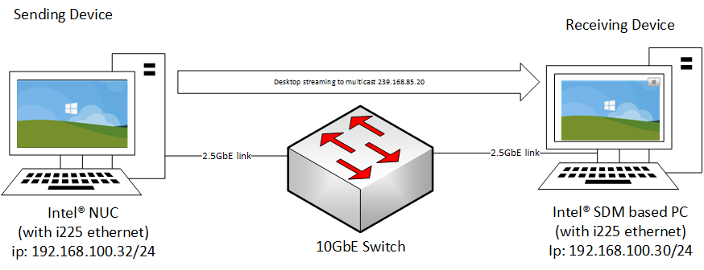

### Streaming video via Intel(r) SDM appliance

This document  contains instructions for streaming a desktop session to a Intel(r) SDM based display over a 2.5Gbps link (Intel I225 Ethernet) using Intel(r) Media Transport Library .

### 1. Use-case Scenario

Depicted below are 2 use-case scenario:

1. Synchronous playback scenario where output of a PC/Laptop is streamed via a sending device to the receiver.
   
   
   

2. Asynchronous playback - where the sending device is streaming a digital media generated (e.g framebuffer) / stored locally on the device to the receiver.
    

### 2. Required Hardware

1. Intel NUC11TNki5 (Codenamed Tiger Canyon) - Sending Device

2. Intel(r) Smart Display Module (SDM) devkit (Codenamed Alder Valley) - Receiving Device

3. Synchronous scenario - 1x HDMI-to-USB video capture device (e.g [Mukose SDI2USB3.0](https://www.google.com/url?sa=i&url=https%3A%2F%2Fwww.amazon.com%2FMOKOSE-USB3-0-Capture-Windows-Grabber%2Fdp%2FB071KPW3PH&psig=AOvVaw0JInBE6gygffG2clmni8sH&ust=1684225637669000&source=images&cd=vfe&ved=0CBIQjhxqFwoTCMjo9cnz9v4CFQAAAAAdAAAAABAE))

4. 10GbE Switch and few Cat6/7 cables

### 3. Required Software

1. Ubuntu 22.03 LTS

2. Intel&reg; Media Transport Library (Intel&reg; MTL codenamed Kahawai)

3. FFmpeg with kahawai encoder and decoder [patches](https://google.com)

### 2. Installation and configuration

The demo currently works only on Linux. Follow the steps below to install all the software components required for the demo.

#### Build Intel&reg; MTL

- See [build.md](./build.md) to build libmtl on linux.

#### Build ffmpeg (with kahawai encoder and decoder)

* See [../ecosystem/ffmpeg_plugin/README.md](./build.md) to build ffmpeg with Kahawai's encoder/decoder on Ubuntu.

* Follow instruction below (TBD)

#### Example command line to send ST2110 stream to the receiver using ffmpeg

- For **synchronous** playaback, i.e streaming HDMI output of a Laptop via the sender, run:

```
sudo LD_LIBRARY_PATH=path/to/ffmpeg/lib ./ffmpeg -f video4linux2 -video_size 1280x720 -framerate 30 -i /dev/video0  -vcodec rawvideo -vf scale=1280:720,format=rgb24 -udp_port 20000 -port 0000:02:00.0 -local_addr 192.168.100.55 -dst_addr 239.168.85.20 -f kahawai_mux -
```

**Note**: The cmdline above assume /dev/video0 is the Mukose's HDMI2USB capture device.


- For **asynchronous** playback, streaming the framebuffer of the sender (e.g Intel&reg; NUC), run:

```
sudo DISPLAY=$DISPLAY LD_LIBRARY_PATH=path/to/ffmpeg/lib ./ffmpeg -f x11grab -i $DISPLAY -framerate 30 -vcodec rawvideo -pix_fmt rgb24 -video_size 1920x1080 -vf scale=1280:720 -udp_port 20000 -port 0000:02:00.0 -local_addr 192.168.100.55 -dst_addr 239.168.85.20 -f kahawai_mux -
```

Streaming will begin once command is executed. Press CTRL-C to terminate.

At the receiver (Intel&reg; SDM), run:

```
sudo LD_LIBRARY_PATH=path/to/ffmpeg/lib ./ffmpeg -framerate 30 -pixel_format rgb24 -width 1280 -height 720 -udp_port 20000 -port 0000:58:00.0 -local_addr 192.168.100.55 -src_addr 239.168.85.20 -ext_frames_mode 0 -f kahawai -i k -f sdl2 -
```

An SDL2 window will pop-up at the receiver screen. Press CTRL-C to terminate.


**Note**:

- See [readme](../ecosystem/ffmpeg_plugin/README.md) for more info on the parameters supported by the kahawai's ffmpeg plugin.
- The example command line above stream the session at 1280x720@30fps in rgb24 pixel format.
- Provide the path to ffmpeg's DLLs if the ffmpeg in the step above is installed in a non-default directory (eg. /usr/lib).
  
  

### 3. Limitation

- This demo is only tested to transport desktop session in uncompressed raw RGB24 pixel format. 

- At 2.5Gbps bandwidth, we may only stream the session at 1920x1080@30fps in RGB24 pixel format. 

- No Windows* support for DPDK's IGC driver 
