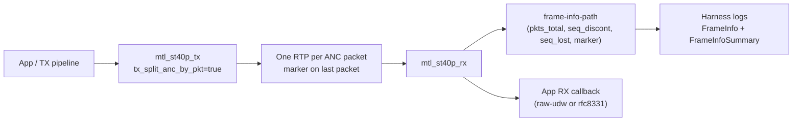
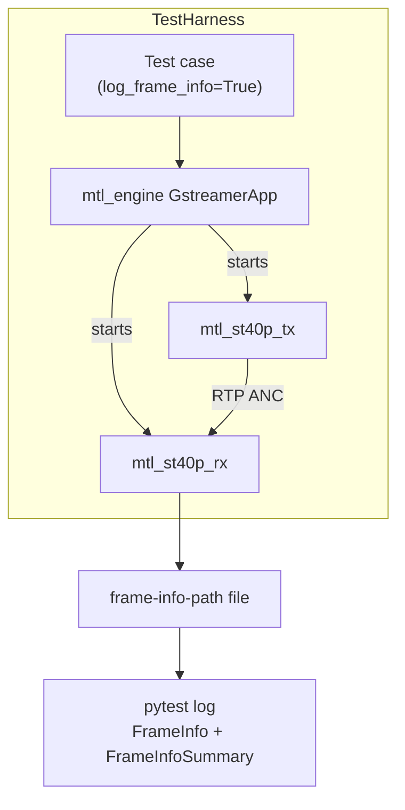

# ST40 Ancillary Validation Updates

This note captures all recent ST40/ST40p feature changes and the accompanying validation coverage. It is intentionally verbose so reviewers and CI users can see what changed, how to exercise it, and what signals to look for.

## What changed (feature highlights)

- **One-ANC-per-RTP split mode:** TX can enforce a single ANC packet per RTP packet (`tx_split_anc_by_pkt=true`). RX understands the fragmented field and records per-field packet counts via frame-info (`pkts_total`).
- **Sequence integrity surfacing:** RX tracks `seq_discont` and `seq_lost` per field and reports them in frame-info; the GStreamer harness emits a parsed `FrameInfoSummary` to logs.
- **Frame-info log surfacing:** When tests pass `log_frame_info=True`, the harness dumps the frame-info file and a summary directly into the test log (no artifact download needed).
- **ST40P test mutation knobs:** The GStreamer TX plugin accepts `tx-test-mode` with helpers for `no-marker`, `seq-gap`, `bad-parity`, and `paced` (optionally with `tx-test-pkt-count` and `tx-test-pacing-ns`). These drive targeted negative/edge-path tests.
- **Interlaced & split-mode coverage:** RX/TX can be flagged interlaced independently; mismatch fails fast. Split-mode plus marker handling is now covered in tests.
- **Integration safety nets:** New noctx integration tests for ST40 interlaced flows, and expanded GStreamer validation tests across single-host and dual-host (VF/VF) paths.

## Data path (split ANC per RTP)

## Frame-info signals

- Per-field frame-info line: `ts=<ts> meta=<N> rtp_marker=<0|1> seq_discont=<n> seq_lost=<n> pkts_total=<n> pkts_recv=<cum>`
- Parsed summary in log: `FrameInfoSummary: frames=<m> markers=<k> seq_discont=<d> seq_lost=<l> pkts_totals=[<pkt_count:frames>...] ts_range=<min_ts->max_ts>`
- Use `frame_info_path` on RX + `log_frame_info=True` in the harness to emit both raw and summary forms.

### Why frame-info is crucial

- **Correlates anomalies to RTP symptoms:** seq gaps and marker misuse surface as `seq_discont/seq_lost` and marker counts, letting you distinguish network loss from payload parsing issues without packet captures.
- **Proves split/aggregation behavior:** `pkts_total` per field confirms whether split-mode (one ANC per RTP) or multi-packet aggregation behaved as expected; mismatches point to pacing or fragmentation bugs.
- **Low-cost regression signal:** A few log lines give immediate pass/fail hints in CI without downloading artifacts or running Wireshark, accelerating triage for flaky environments.
- **Covers both happy and negative paths:** The same mechanism captures expected drops (bad parity, missing marker) and should show empty/zeroed entries, documenting that the rejection path executed.

## Progressive vs interlaced: what differs for ST40

- **Cadence and markers:** Progressive carries one field per frame; interlaced carries two fields (even/odd). Each field still ends with a single RTP marker. In interlaced paths the frame-info counters (`pkts_total`, `seq_discont`, `seq_lost`, `rtp_marker`) are recorded per field, so you can spot loss or pacing issues on a specific field rather than the whole frame.
- **Line addressing and ANC placement:** Interlaced ANC often lives on different line numbers per field (odd/even). The plugin does not rewrite line numbers; the tests rely on `rx-interlaced/tx-interlaced` to align expectations and fail fast when flags mismatch.
- **Buffering pressure:** Interlaced doubles the cadence of ANC bursts for the same nominal fps. If you use `tx_split_anc_by_pkt=true`, expect twice the packet rate compared to progressive at the same frame rate; ensure `rx_rtp_ring_size` and `frame-info-path` are set so accumulation cannot overrun silently.
- **Negative-path observability:** In interlaced mode, a missing marker or sequence gap can occur on just one field. Frame-info shows the gap on that field only, which is why `test_st40i_split_mode_frame_info_logging` and the noctx `st40i_split_seq_gap_reports_loss` exist—to prove per-field accounting is accurate.
- **Naming clarity:** The `p` in `st40p` refers to the pipeline API, not progressive-only transport. Interlaced support is a first-class, opt-in property (`tx-interlaced` / `rx-interlaced`) and is exercised in both GStreamer and C integration suites.

## API and plugin changes (developer-facing)

- **TX (GStreamer st40p):**
  - `tx_split_anc_by_pkt=true` emits one ANC per RTP packet.
  - `tx-test-mode` options:
    - `no-marker` — clears the RTP marker on the only packet in a field so RX refuses to surface a ready frame; validates marker enforcement and frame gating.
    - `seq-gap` — introduces an RTP sequence hole while keeping marker on the last packet; RX should log `seq_discont=1`, `seq_lost=1` and still record packet totals; probes loss accounting.
    - `bad-parity` — corrupts ANC parity bits so RX drops metadata/payload; frame-info should be absent or show meta=0, proving payload rejection.
    - `paced` — emits a bounded burst with `tx-test-pkt-count` and optional inter-packet spacing (`tx-test-pacing-ns`); used to verify packet accumulation (`pkts_total`) and timing tolerance in split mode.
- **RX (GStreamer st40p):**
  - Honors `frame-info-path` and records per-field packet count, marker, seq gaps.
  - Supports `rx_rtp_ring_size` for split-mode buffering.
- **C API:**
  - `st40_api.h` / `st40_pipeline_api.h` expose split-mode flags (`ST40_TX_FLAG_SPLIT_ANC_BY_PKT` / `ST40P_TX_FLAG_SPLIT_ANC_BY_PKT`) and the extended frame-info fields (`rtp_marker`, `seq_discont`, `seq_lost`).
  - `st40_tx_ops` / `st40p_tx_ops` accept `st40_tx_test_config` so C API users can inject the same mutation patterns (no-marker, seq-gap, bad-parity, paced) used by the GStreamer tests.
  - Pipeline RX accumulates packets per field and reports discontinuities.

## Test coverage (what now runs)

### Validation (GStreamer, single host VF→VF)

- **Throughput/fidelity sweeps:** [tests/validation/tests/single/gstreamer/anc_format/test_anc_format.py](tests/validation/tests/single/gstreamer/anc_format/test_anc_format.py)
  - `test_st40p_fps_size` — sweeps fps ∈ {24,25,30,50,60,100,120} and payload sizes 10/100 KB at framebuff=3. Verifies byte-for-byte capture and ensures frame-info summaries are emitted for every matrix point.
  - `test_st40p_framebuff` — holds fps=60, payload=100 KB, sweeps framebuff ∈ {1,3,6,12}; checks RX stability vs buffer depth and logs frame-info for each run.
  - `test_st40p_format_8331` — RFC8331 pseudo payload mode across fps and framebuff sweeps with metadata capture enabled; confirms DID/SDID handling while frame-info shows packet/marker continuity.
  - `test_st40i_basic` — interlaced ANC sanity at common fps (25/50/60) and framebuff ∈ {3,6}; ensures interlace flags match and frame-info still emits.
  - `test_st40i_rfc8331` — interlaced RFC8331 pseudo payload round-trip to confirm metadata and payload survive interlaced pacing.

- **Split-mode and packet-shape probes:**
  - `test_st40p_split_mode_pacing_respected` — uses `tx_split_anc_by_pkt=true` plus `tx-test-mode=paced` with 8 packets and enforced spacing; asserts `pkts_total=8` in frame-info and checks jitter budget.
  - `test_st40p_rx_multi_packet_field_accumulates` — drives a 3-packet burst (marker on last) and expects `pkts_total=3`, `seq_discont=0`, `seq_lost=0` in frame-info.
  - `test_st40p_split_mode_invalid_rtp_ring_rejected` — sets `rx_rtp_ring_size=100` and confirms the plugin rejects non power-of-two ring sizes.

- **Negative/edge-path validations (all with log_frame_info=True):**
  - `test_st40p_rx_missing_marker_no_ready` — `tx-test-mode=no-marker`; expects empty frame-info (no ready frame) proving marker gating.
  - `test_st40p_rx_seq_loss_logged` — `tx-test-mode=seq-gap` with 2 packets; expects `seq_discont=1`, `seq_lost=1`, `pkts_total=2` in frame-info (or empty if RX drops early).
  - `test_st40p_rx_bad_parity_drops_payload` — `tx-test-mode=bad-parity`; expects absent/empty frame-info or `meta=0`, `pkts_total=1`, proving parity rejection.

- **Interlaced split-mode logging:**
  - `test_st40i_split_mode_frame_info_logging` (if present in suite) ensures interlaced + split-path still records packet totals with marker boundaries captured in frame-info.

Across all single-host tests, frame-info is dumped and summarized in pytest logs, giving immediate visibility of packet counts, markers, and sequence health without downloading artifacts.

### Integration (noctx)

- [tests/integration_tests/noctx/testcases/st40i_tests.cpp](tests/integration_tests/noctx/testcases/st40i_tests.cpp)
  - `st40i_smoke` — interlaced TX/RX P50 sanity without explicit context wiring; validates frame counts.
  - `st40i_split_flag_accepts_and_propagates` — enables `ST40P_TX_FLAG_SPLIT_ANC_BY_PKT`; checks split flag propagation and RX viability.
  - `st40i_split_multi_packet_roundtrip` — sends multiple ANC blocks per field (sizes 8/6/4) in split mode; expects RX accumulation and nonzero frames.
  - `st40i_split_loopback` — interlaced split-mode loopback with custom fps and framebuff; ensures split/interlace coexist.
  - `st40i_split_seq_gap_reports_loss` — crafts a manual RTP sequence gap and validates `seq_discont`/`seq_lost` are reported via the C API frame_info, mirroring the GStreamer gap test at a lower level.

These integration tests exercise the C pipeline APIs directly (outside the GStreamer harness) to prove split-mode, parity, marker, and sequence reporting work end to end without additional context setup.

## How to exercise quickly

1. Enable split mode: add `tx_split_anc_by_pkt=true` on TX and set `frame-info-path=/tmp/foo` on RX.
2. Turn on log surfacing: ensure the harness call sets `log_frame_info=True` (default in updated tests).
3. Pick a mutation mode on TX to probe error paths:
   - Gap: `tx-test-mode=seq-gap tx-test-pkt-count=2`
   - Missing marker: `tx-test-mode=no-marker`
   - Bad parity: `tx-test-mode=bad-parity`
   - Paced burst: `tx-test-mode=paced tx-test-pkt-count=3 tx-test-pacing-ns=200000`
4. Inspect log: look for `FrameInfo` lines followed by `FrameInfoSummary` to confirm packet counts and seq accounting.

## Signals to watch

- `pkts_total` matches expected packets per field (e.g., 3 for paced burst).
- `seq_discont`/`seq_lost` stay 0 for happy path; increment in gap scenarios.
- `rtp_marker=1` only on final packet of a field; absent marker means no ready frame surfaces.

## Known limits / notes

- For split-mode validation, set RX `frame_info_path` (for logging) and a power-of-two `rx_rtp_ring_size`; the plugin rejects non power-of-two values.
- Frame-info summaries rely on the regex in the harness; unexpected formats will fall back to raw dump only.
- Interlaced mismatch between TX/RX fails the test early (before file compare).

## Quick architecture view (tests + logging)

## Where to look in tree

- Docs: [doc/design.md](doc/design.md) (ST40 section), [doc/validation_framework.md](doc/validation_framework.md)
- APIs: [include/st40_api.h](include/st40_api.h), [include/st40_pipeline_api.h](include/st40_pipeline_api.h)
- Plugin: [ecosystem/gstreamer_plugin/gst_mtl_st40p_tx.c](ecosystem/gstreamer_plugin/gst_mtl_st40p_tx.c), [ecosystem/gstreamer_plugin/gst_mtl_st40p_rx.c](ecosystem/gstreamer_plugin/gst_mtl_st40p_rx.c)
- Pipeline impl: [lib/src/st2110/pipeline/st40_pipeline_tx.c](lib/src/st2110/pipeline/st40_pipeline_tx.c), [lib/src/st2110/pipeline/st40_pipeline_rx.c](lib/src/st2110/pipeline/st40_pipeline_rx.c)
- Tests: [tests/validation/tests/single/gstreamer/anc_format/test_anc_format.py](tests/validation/tests/single/gstreamer/anc_format/test_anc_format.py), [tests/validation/tests/dual/gstreamer/anc_format/test_anc_format_dual.py](tests/validation/tests/dual/gstreamer/anc_format/test_anc_format_dual.py), [tests/integration_tests/noctx/testcases/st40i_tests.cpp](tests/integration_tests/noctx/testcases/st40i_tests.cpp)
