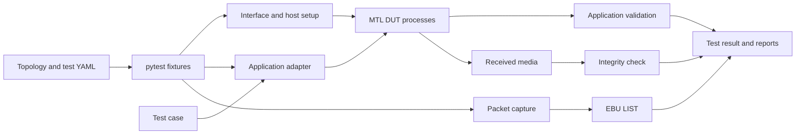

# MTL Pytest Validation Architecture

This document is the architectural introduction to `tests/validation/`. It is
for developers who understand MTL and ST 2110, but are new to the Python test
framework.

For installation and commands, see [validation_framework.md](validation_framework.md)
and [validation_quickstart.md](validation_quickstart.md).

## 1. Purpose

The validation framework tests MTL as an application stack on real hosts and
NICs. It complements C/C++ unit and integration tests by running complete media
flows through RxTxApp, FFmpeg, or GStreamer.

A test may apply several independent oracles:

| Oracle | What it proves |
|---|---|
| Application result | The process completed and its application-specific log/result checks passed |
| Media integrity | Received video or audio matches the source; enabled explicitly by tests that implement an integrity check |
| Packet compliance | A captured stream passes EBU LIST analysis, including the expected ST 2110-21 schedule |
| Performance | A workload sustains the requested session count, frame rate, or capacity target |

Passing one oracle does not imply that the others ran. Tests select the checks
that are meaningful for their scenario.

## 2. Architectural model

The main layers are:

| Layer | Responsibility |
|---|---|
| `configs/` | Describes hosts, NIC inventory, paths, capture policy, and external services |
| `conftest.py` | Owns pytest lifecycle: topology loading, host preparation, VF pools, capture, clock helpers, cleanup, and reporting |
| `common/` | Host-facing helpers such as NIC control, media integrity, and platform collection |
| `mtl_engine/` | Application-independent execution plus adapters for RxTxApp and ecosystem applications |
| `create_pcap_file/` and `compliance/` | Capture orchestration and EBU LIST integration |
| `tests/single/` | End-to-end flows on one host |
| `tests/dual/` | End-to-end flows split across hosts |

The framework is adapter-based. A test chooses an application, builds its
command/configuration through an adapter, and calls `execute_test()`. The base
application layer starts bounded processes and delegates result validation to
the selected adapter. RxTxApp, FFmpeg, and GStreamer therefore share test
lifecycle and reporting while retaining application-specific configuration and
oracles.

## 3. Test lifecycle

A typical test follows this sequence:

1. **Load configuration.** `topology_config.yaml` becomes the host/NIC model;
   `test_config.yaml` supplies paths and policies.
2. **Prepare the host.** Fixtures ensure required host state and, when needed,
   create reusable VF pools.
3. **Allocate interfaces.** `InterfaceSetup` returns VF, PF, mixed, or
   kernel-socket endpoints appropriate for the test.
4. **Create the application.** The test supplies media, network, session, and
   timing parameters to an application adapter.
5. **Execute the flow.** The adapter writes any generated configuration,
   starts one process (single-host) or a TX/RX pair (dual-host), and enforces
   timeouts.
6. **Evaluate selected oracles.** Application output is always validated by
   the adapter. Integrity and packet compliance run only when the test requests
   and configures them.
7. **Clean up.** Per-test PF bindings, addresses, capture processes, output
   files, and clock helpers are released. Session-scoped VF pools remain for
   reuse.

Tests should express media behavior and expected results. Hardware ownership,
process lifetime, and cleanup belong in fixtures and framework helpers.

## 4. Topology and interface ownership

### Single-host topology

TX and RX run on the same host. The framework convention is:

- `network_interfaces[0]`: primary/TX side;
- `network_interfaces[1]`: redundant or RX side.

Several fixtures rely on this ordering. Extra interfaces should be appended,
not inserted before the primary pair. When capture is auto-selected, the
single-host heuristic chooses the highest-index interface as the receive-side
capture port. Hosts with more complex NIC layouts should configure
`capture_cfg.sniff_interface` explicitly rather than rely on this heuristic.

### Dual-host topology

TX and RX applications run on different hosts. The capture host is the host
named `client`, when present, otherwise the first configured host. Automatic
capture selection prefers a kernel PF without active VFs.

The generic application executor validates both applications in dual-host
mode. Packet-capture dispatch is currently integrated into its single-host
execution path; dual-host tests must not assume that passing the application
pair also ran EBU compliance.

### VF mode

VF is the default interface mode. The framework creates a session-scoped pool
of SR-IOV VFs (normally up to six per participating PF), binds them for DPDK,
and reuses them across tests. Reuse avoids repeated SR-IOV/VFIO teardown and
keeps the suite practical and stable.

### PF mode

PF mode binds the selected physical port directly to `vfio-pci`. Before doing
so, existing VFs on that PF are removed. The PF is rebound to its kernel driver
during per-test cleanup.

When capture is enabled, the capture port must remain kernel-owned for
`netsniff-ng`. A PF used by DPDK cannot share an IOMMU group with that capture
port. `InterfaceSetup` reads IOMMU groups from sysfs and excludes conflicting
PFs. If no usable PF remains, the test **fails** (not skips): a PF test
explicitly requesting capture is asserting the host has the hardware to
support it, so a missing second card is a host-configuration defect the run
should surface, not silently hide behind a SKIPPED result.

On common dual-port E810/E830 systems, both ports of one card may share an
IOMMU group. Such a host needs a second physical card (or otherwise genuinely
separate IOMMU group) to run **PF mode and kernel packet capture together**.
This is a conditional requirement, not a requirement for VF tests or PF tests
with capture disabled.

### Mixed and kernel modes

The framework also supports scenarios where TX and RX use different interface
types and hybrid PMD/kernel-socket tests. These require multiple topology
interfaces and leave the kernel endpoint kernel-owned.

## 5. Clock model

Three independent settings are easy to confuse:

| Mechanism | Owner | Purpose | External PTP grandmaster |
|---|---|---|---|
| Default application clock | MTL application | Normal media execution without `enable_ptp` | Not required by the framework |
| `enable_ptp=True` | MTL application | Requests MTL's PTP/PHC path and adds startup time for synchronization | Required if the test intends to prove synchronization to network PTP time |
| `@pytest.mark.ptp` | pytest fixture | Starts slave-only `ptp4l` on the capture interface and prevents `phc2sys` from competing for that PHC | Required for actual lock; the fixture currently checks process startup, not lock state |
| `capture_cfg.phc_sync` | Capture fixture | Disciplines the capture NIC PHC from `CLOCK_REALTIME` plus the kernel TAI-UTC offset | Not required |

### Normal and compliance tests

Most tests do not start a PTP daemon and do not require a grandmaster. For
ST 2110-21 capture analysis, the framework instead aligns the **capture PHC**
to TAI locally:

1. `CLOCK_REALTIME` supplies UTC;
2. the live kernel `CLOCK_TAI - CLOCK_REALTIME` offset supplies leap seconds;
3. `phc2sys` disciplines the capture PHC to that TAI value;
4. capture waits for convergence before recording packets.

This clock path exists only to give hardware capture timestamps the correct
absolute timebase. It does not synchronize the DUT or prove network PTP lock.
The host must have a valid kernel TAI-UTC offset; the framework warns, but does
not stop, if the offset is zero.

### PTP tests

`enable_ptp` is an application option. The `ptp` pytest marker is fixture
policy. They are independent and must be selected deliberately by the test.

For a test that claims PTP synchronization, the network must provide a
compatible grandmaster and the test should verify lock or offset explicitly.
The current `ptp` fixture starts `ptp4l` in slave-only mode and verifies only
that it stays running. Therefore the marker alone is not a PTP conformance
oracle.

When the capture PHC is already disciplined by external PTP, set
`capture_cfg.phc_sync: false`; otherwise the local `phc2sys` helper would
compete for the same clock. Marked PTP tests suppress this helper automatically.

All `ptp4l` and `phc2sys` processes are reaped by process name at test/session
boundaries. This is required because the SSH/sudo wrapper process is not the
actual daemon and killing only the wrapper can leak clock owners into later
NIC reconfiguration.

## 6. Packet capture and compliance

Packet capture uses a kernel-owned NIC and `netsniff-ng`. The framework relies
on hardware RX timestamps and writes nanosecond pcap files so packet spacing is
not reduced to interrupt-delivery timing.

Capture-interface selection uses this priority:

1. explicit `sniff_interface`;
2. explicit `sniff_interface_index`;
3. explicit `sniff_pci_device`;
4. topology heuristic.

Explicit selection is recommended in CI because it documents physical wiring
and avoids ambiguity when DUT and capture cards are both present.

A test using the `pcap_capture` fixture treats capture as enabled unless
`capture_cfg.enable: false` is explicit. Capture is also disabled for 8K media,
which the configured EBU analyser does not support.

For single-host `Application.execute_test()` flows, capture is started after
the application begins (and after the configured PTP startup allowance). The
completed pcap is uploaded to EBU LIST. The result is recorded separately from
the application result:

- a non-compliant stream fails the test;
- gapped ST 2110-21 video fails unless the test has
  `allow_gapped_compliance`;
- an analysis containing no streams is currently recorded as N/A;
- missing EBU configuration, a missing pcap, or failure to dispatch the
  required check is detected by fixture teardown and fails the test.

A non-zero upload command currently logs an error and returns without a hard
failure. This is a known limitation: CI must also monitor upload/connectivity
errors until the compliance client makes that path fail closed.

### Compliance scope: TX-side tests only

EBU LIST compliance measures the on-wire pacing quality (VRX/Cinst, ST
2110-21 gapped/linear scheduling) of what the TX side actually put on the
wire. It says nothing about how the RX side subsequently processes that
traffic. Consequently, `pcap_capture` must only be used by tests whose
parametrized dimension or feature under test is TX-side: pacing mode,
packing, transport/pixel format, ptime/sampling, interlace scheduling.

Tests that parametrize a purely RX-side feature must not use `pcap_capture`:
repeating the same compliance check across `rss_mode` values, for example, is
wasted CI time and capture-analyser load, because RSS only changes how the
NIC distributes *received* packets to RX queues and cannot change what the TX
side transmits. The compliance verdict would be identical (modulo noise) for
every `rss_mode` value, so the check adds no signal.

### Test classification: `tx_side` / `rx_side` / `tx_and_rx` markers

Every test should carry one of these markers to make its intended scope
explicit and reviewable:

- `tx_side`: validates a TX-side property (pacing, packing, transport
  format, on-wire cadence). May use `pcap_capture`.
- `rx_side`: validates a purely RX-side property (RSS queue distribution,
  RX timing-parser analysis). Must not use `pcap_capture`.
- `tx_and_rx`: validates both a TX-side property (compliance) and an
  RX-side property (media integrity, or an RX-only feature flag) in the
  same test.

This classification is about which property the test *validates*, not the
data flow of a single loopback run (nearly every single-host test carries
traffic in both directions). A test that only checks the process exit code
for an RX-side-only parametrization is still `rx_side`, not `tx_and_rx`.

## 7. Test oracles and reporting

### Application validation

Every application adapter owns its functional oracle. For RxTxApp this
includes process return status and session-specific result/log tokens. FFmpeg
and GStreamer use their own adapter rules. This proves application-level
operation, not payload identity or standards compliance.

### Media integrity

Integrity is test-owned, not a universal postcondition. Tests that need it run
the video/audio integrity helpers against source and received files. Some of
those tests consult `test_config.integrity_check` (defaulting to true when the
key is absent); many tests do not implement an integrity step at all.

### Packet compliance

Compliance is independent of media integrity. It checks the captured network
stream through EBU LIST and records a compliance result in the CSV/reporting
state. It does not compare decoded media content.

### Performance

Performance tests use the same application validation but may set
`fail_on_error=False` for intermediate capacity-search iterations. Their
result is the sustainable workload or frame-rate target, not merely process
survival.

Pytest markers (`smoke`, `nightly`, `dual`, `ptp`, `performance`, and others)
select suites or fixture policy. They do not add an oracle unless the marker is
explicitly consumed by framework code. `tx_side`/`rx_side`/`tx_and_rx` (§6) are
an exception in intent, though not enforced by fixture code today: they
document test scope and should be checked in review, e.g. by rejecting a new
`rx_side` test that also requests `pcap_capture`.

## 8. Environment contract

The framework assumes more than a normal unit-test runner:

| Requirement | Framework behavior |
|---|---|
| Root-capable host access | Required for NIC, VFIO, capture, clock, and hugepage operations; not checked up front |
| Validation build in `.local_install` | Application and library paths are resolved from this separate validation install tree |
| Hugepages and supported NICs | Prepared/checked by host fixtures when the relevant interface fixtures are used |
| SR-IOV | Required for VF-mode tests |
| Kernel capture interface | Required when packet capture is enabled |
| Separate IOMMU group | Enforced for PF-mode DUT plus kernel capture; test fails if unavailable |
| Correct topology order/wiring | Operational convention; automatic selection cannot verify the cable or switch |
| Media assets | Tests requiring absent assets skip or fail according to their fixture |
| EBU LIST service | Required for compliance-enabled tests |
| FFmpeg/GStreamer validation builds | Required only by their integration tests |
| PTP grandmaster | Not needed for normal/local-clock tests; required for a meaningful network-PTP synchronization claim |

Rather than satisfying this contract by hand, `.github/scripts/validation_setup.sh`
discovers (`status`) and prepares (`setup`) it end-to-end — see
[validation_quickstart.md § Recommended: Automated Setup Script](validation_quickstart.md#recommended-automated-setup-script).

This contract should drive CI host design. A minimal VF functional runner can
use one SR-IOV-capable card. A runner expected to cover PF mode and EBU packet
capture needs a kernel-owned capture port in a different IOMMU group—typically
a second card. A runner expected to validate network PTP additionally needs a
grandmaster and a test oracle that confirms lock/offset, not only a running
`ptp4l` process.
