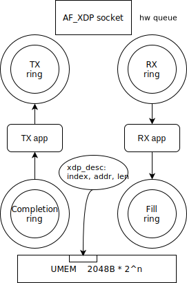

# XDP Guide

This guide provides a comprehensive overview of XDP (eXpress Data Path) and its application within MTL, which utilizes AF_XDP as its new network backend.

## Understanding XDP and AF_XDP

### XDP

XDP is a feature in the Linux kernel that facilitates high-performance networking by allowing packet processing at the very start of the networking stack, prior to their transfer to the kernel network stack. This results in low latency and high throughput networking.

To utilize XDP, an eBPF XDP program is loaded into the kernel and attached to a network interface. This program can filter, modify, or drop packets before they are transferred to the kernel network stack.

### AF_XDP

AF_XDP, a new socket family, enables user space applications to send and receive packets directly with the network driver. To use AF_XDP, a user must first create an AF_XDP socket with the socket() call, then call bind() to start sending and receiving packets.

The AF_XDP socket is bound to one hardware queue of the network interface.
The socket fd needs to be updated to the xsks_map of the xsk XDP program. This allows the program to redirect incoming packets to their intended socket.

Users should allocate a memory region called UMEM in user space for sharing between the kernel and user space, even among different processes.



There are four rings for data path transferring: TX/RX rings and Fill/Completion rings.

On the transmission side, the user space application populates the TX ring with packet descriptors. These descriptors contain pointers to the UMEM area (frames) where the actual data buffers reside.
Once the TX ring is filled, the Network Interface Card (NIC) driver takes over, transmitting the packets onto the network. After the packets have been sent, the NIC driver populates the Completion ring with the descriptors of the packets that have been successfully transmitted.

On the receiving end, the user space application fills the Fill ring with packet descriptors which tell the driver where it should dma/copy the packet buffers.
The NIC driver, upon receiving packets from the network, fills the populated descriptors in the RX ring.

### XDP in MTL


With AF_XDP, MTL can send and receive packets directly with the network driver, bypassing the kernel stack. This makes deployment more efficient and convenient for cloud and edge environments compared to the DPDK backend.

MTL also uses an XDP program to filter data path packets. This XDP program is built with our MTL Manager and is loaded along with the libxdp built-in xsk XDP program that is for AF_XDP. Thanks to libxdp's xdp-dispatcher, we can run multiple XDP programs on the same network interface. For the XDP code, please see [mtl.xdp.c](../manager/mtl.xdp.c).

## Building Guide

To enable XDP support, you need to check some configurations for eBPF and XDP on your system, then re-build MTL with libbpf and libxdp dependencies.

### Kernel Config

To enable eBPF and XDP support, you need to enable CONFIG_BPF_SYSCALL and CONFIG_XDP_SOCKETS. Newer kernel version is recommended.

### Installing Extra Dependencies

You need to install the following packages:

Ubuntu:

```bash
sudo apt-get update
sudo apt-get install -y make m4 clang llvm zlib1g-dev libelf-dev libcap-ng-dev libcap2-bin gcc-multilib
```

CentOS/Red Hat:

```bash
sudo yum update
sudo yum install -y make m4 clang llvm-devel zlib-devel elfutils-libelf-devel libcap-ng-devel libcap-ng-utils
```

Arch Linux:

```bash
sudo pacman -Syu --needed make m4 clang llvm zlib elfutils libcap-ng
```

### Building xdp-tools (including libxdp & libbpf)

Build libxdp and libbpf from the xdp-tools repository using the versions pinned in [`Media-Transport-Library/versions.env`](../versions.env) to ensure consistency.

```bash
./script/build_ebpf_xdp.sh
```

### Building MTL

See [Build Guide](build.md).

Ensure the libbpf and libxdp dependencies are found:

```text
# output from 'meson setup build'
Run-time dependency libxdp found: YES 1.6.0
Run-time dependency libbpf found: YES 1.5.0
```

If not, and you have installed them, you may run this command then reconfigure the project so pkg-config can find them:

```bash
export PKG_CONFIG_PATH=/usr/local/lib64/pkgconfig/:/usr/local/lib/pkgconfig/:/usr/lib64/pkgconfig/
```

The possible additional `PKG_CONFIG_PATH` usually can by resolved by searching the `libxdp.pc` and `libbpf.pc` from system lib path.

```bash
find /usr/ -name libxdp.pc
find /usr/ -name libbpf.pc
```

## Running Guide

Before running MTL apps, you need to start MTL Manager as a daemon, see [MTL Manager](../manager/README.md).

### Network Interface Setup

The interface to be used should have IP configured, use `ifconfig` or `ip a` to check. If not and you want to set a static IP, you can run below commands:

```bash
sudo nmcli dev set ens785f0 managed no
sudo ifconfig ens785f0 192.168.96.101/24
```

### Performance Tuning

To optimize performance, you can adjust the following settings:

```bash
echo 2 | sudo tee /sys/class/net/ens785f0/napi_defer_hard_irqs
echo 200000 | sudo tee /sys/class/net/ens785f0/gro_flush_timeout
```

### Add Capabilities to the Application

The application needs to be run with `CAP_NET_RAW` capability.

For example, before running RxTxApp, you should run:

```bash
sudo setcap 'cap_net_raw+ep' ./tests/tools/RxTxApp/build/RxTxApp
```

### Running RxTxApp

Just configure the network interface in JSON file like this, then you can refer to [Run Guide](run.md) for more usage:

```json
    "interfaces": [
        {
            "name": "native_af_xdp:ens785f0",
        },
        {
            "name": "native_af_xdp:ens785f1",
        }
    ],
```

### API Usage

To configure the network interface in your own app, here is the example code:

```c
/* struct mtl_init_params* p */
snprintf(p->port[i], sizeof(p->port[i]), "%s", "native_af_xdp:ens785f0");
p->pmd[i] = mtl_pmd_by_port_name(p->port[i]);
...
mtl_init(p);
```

## References

For more information, please refer to the following resources:

- [AF_XDP](https://www.kernel.org/doc/html/latest/networking/af_xdp.html)
- [xdp-tools & libxdp](https://github.com/xdp-project/xdp-tools)
- [AF_XDP Poll Mode Driver](https://doc.dpdk.org/guides/nics/af_xdp.html)
