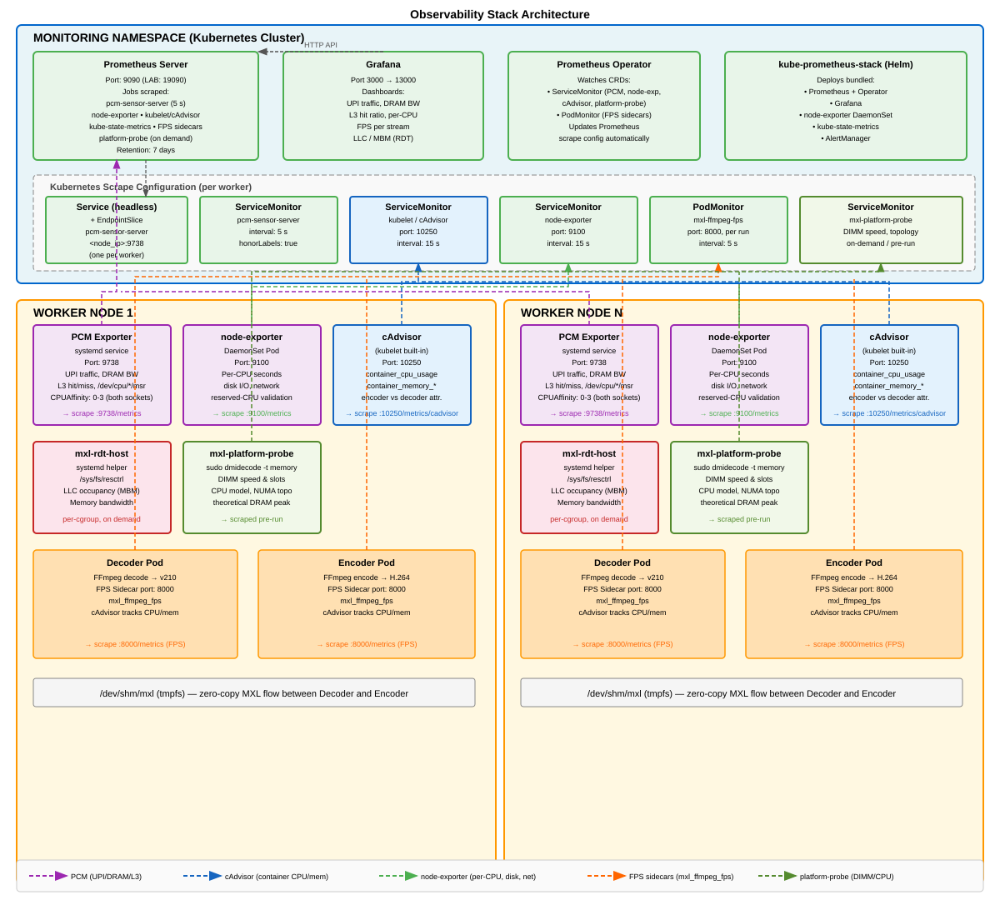

# 6. Observability stack

Install this before deploying DMF containers. The observability stack provides
the instrumentation needed to profile containers, generate DMF-CRM manifests, and
validate benchmark results. A run is only as good as its evidence.

## Architecture Overview

For a detailed architecture breakdown, see [observability-architecture.md](observability-architecture.md).

Visual overview:



## Metric Sources

Five independent metric sources, each answering something none of the others can.

| Source | Runs as | Answers |
|---|---|---|
| FFmpeg FPS sidecar | a container in every decoder/encoder Pod | Did each stream hold 60 FPS? (`mxl_ffmpeg_fps`) |
| cAdvisor (kubelet) | built in | Per-container CPU time — encoder vs decoder attribution |
| node-exporter | DaemonSet | Per-CPU utilisation — *which* cores worked, and whether reserved CPUs stayed quiet |
| **Intel PCM** | **host systemd service** | Cross-socket UPI traffic, DRAM read/write, L3 hit ratio — whole-socket uncore counters |
| Intel RDT (`resctrl`) | on demand, per run | Per-cgroup LLC occupancy and memory bandwidth — see [12-rdt-qos.md](12-rdt-qos.md) |

## Install, in two commands

```bash
scripts/bootstrap-worker.sh            # worker side: PCM, RDT helper, stress-ng, DMI probe
scripts/install-observability.sh       # cluster side: Prometheus, Grafana, scrape wiring
```

Order matters: the second script checks that the first one's PCM exporter is
actually serving counters, and warns you by name if it is not. It also needs
`helm` on the machine you run it from ([00-before-you-start.md](00-before-you-start.md),
step 2), and stops with `FATAL: helm is not installed` if it is missing.

### What `bootstrap-worker.sh` installs

It stages five installers on the worker and runs them there as root (the worker's
`sudo` password is typed into the worker's own prompt):

| Installer | Result |
|---|---|
| `install-worker-limits.sh` | Raises `fs.inotify.max_user_instances` to 8192 in `/etc/sysctl.d/99-mxl-perf-lab.conf`. Every MXL flow holds an inotify instance and the kernel default of 128 is shared with kubelet, containerd, systemd and journald. |
| `install-pcm-host.sh` | Builds `pcm-sensor-server` from `intel/pcm` (pinned `PCM_REF=2026-07-08-public`), installs it to `/usr/local/sbin`, and runs it as `pcm-sensor-server.service` on port 9738. |
| `install-host-noise.sh` | `stress-ng`, `numactl`, `util-linux` — the host-scoped noisy neighbor |
| `install-rdt-host.sh` | Mounts `/sys/fs/resctrl` and installs the `mxl-rdt-host` helper with a narrow sudoers rule |
| `install-platform-probe.sh` | A read-only `sudo` rule for `dmidecode -t memory`, so a run can read the real DIMM speed and compute the theoretical DRAM peak |

### What `install-observability.sh` installs

1. `kube-prometheus-stack` via Helm into namespace `monitoring`, values in
   [observability/kube-prometheus-values.yaml](../observability/kube-prometheus-values.yaml).
2. For every worker: a headless `Service`, a hand-written `EndpointSlice` pointing
   at the node IP, and a `ServiceMonitor`
   ([observability/pcm-host-scrape.yaml](../observability/pcm-host-scrape.yaml)) —
   this is how Prometheus scrapes a *host* process under the job label
   `pcm-sensor-server`.
3. A check that Prometheus really reports `up{job="pcm-sensor-server"}`.


## Access

### Prometheus

Prometheus is the metrics query and API endpoint. It is not exposed outside the
cluster; the helper script creates a local port-forward from `127.0.0.1:19090`
to the in-cluster Prometheus service, so the UI and API are only reachable from
the machine running the command:

```bash
scripts/port-forward-prometheus.sh                  # then http://127.0.0.1:19090
```

Keep this command running in its own terminal while you need access. Press
`Ctrl-C` to stop the forward.

`LAB_PROM_URL` in `config/lab.env` is `http://127.0.0.1:19090`. If nothing is
listening there when a run starts, the runner opens the port-forward itself and
closes it afterwards — you never have to remember.

### Grafana

Grafana is the browser-based visualisation and dashboard UI. The `kubectl`
command below forwards local port `13000` to the Grafana service in the
`monitoring` namespace. Once it is running, open `http://127.0.0.1:13000` in
your browser.

The second command retrieves the auto-generated admin password from the
Kubernetes Secret and base64-decodes it. The username is `admin`.

Repository-provided Grafana dashboards live under
[`monitoring/dashboards/`](../monitoring/dashboards/) and the import notes are
in [`monitoring/README.md`](../monitoring/README.md), including the option to
upload a dashboard JSON file or copy/paste its contents into Grafana.

Two dashboards are intended as the everyday starting points:

- **[`system-overview-grafana-dashboard.json`](../monitoring/dashboards/system-overview-grafana-dashboard.json)** — Default operational view.
  Loads quickly and answers "is the system healthy?" by
  showing workload FPS, node CPU/memory, DRAM bandwidth, package/DRAM power,
  thermal headroom, IPC, UPI, PCIe, and observability status.
- **[`pcm-extended-grafana-dashboard.json`](../monitoring/dashboards/pcm-extended-grafana-dashboard.json)** — Deep-dive investigation view.
  Full hardware-counter detail: per-socket L2/L3 cache, IPC, DRAM bandwidth,
  power, frequency, PCIe, thermal headroom, and measurement interval.

```bash
kubectl -n monitoring port-forward svc/monitoring-grafana 13000:80
kubectl -n monitoring get secret monitoring-grafana \
  -o jsonpath='{.data.admin-password}' | base64 -d    # user: admin
```

Keep the `port-forward` command running in its own terminal while you need
access to the dashboard. Press `Ctrl-C` to stop the forward.

## Verify Configuration

```bash
scripts/preflight.sh
```


Next: [07-container-deployment.md](07-container-deployment.md) — deploy decoder and encoder Pods.
