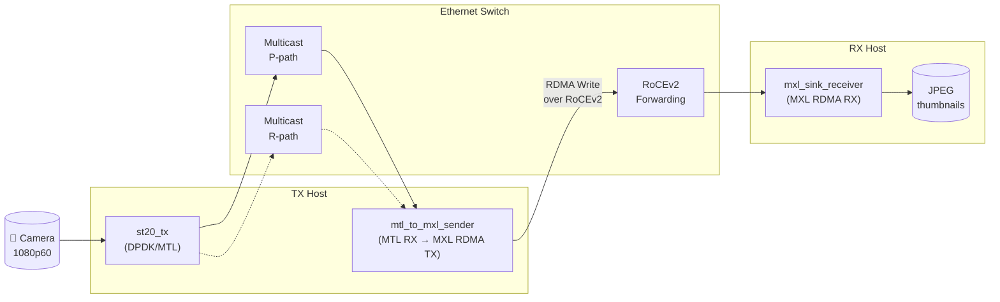
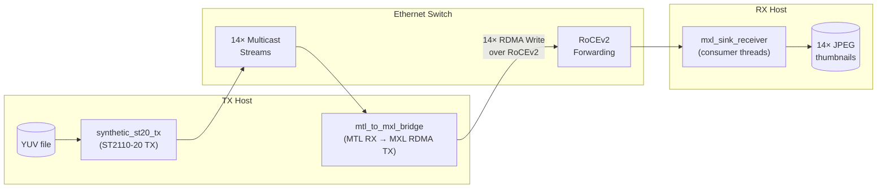
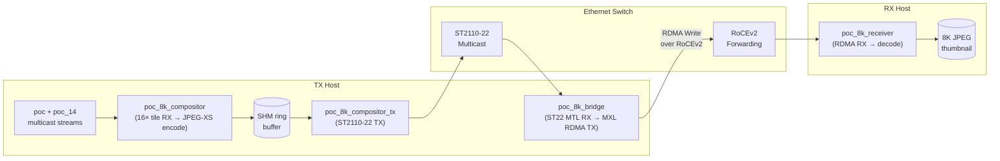
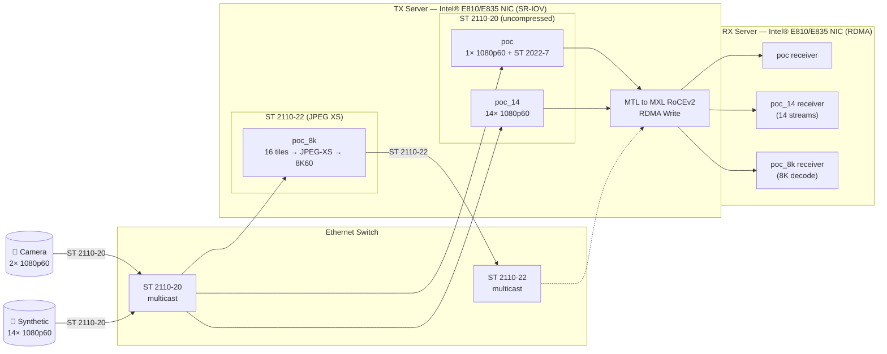

# MTL × MXL — Real-Time ST 2110 Media Ingest to Zero-Copy RDMA Delivery

End-to-end demonstration of bridging SMPTE ST 2110-20/22 broadcast media into
zero-copy RDMA (RoCEv2) — powered by [Intel's Media Transport Library (MTL)](https://github.com/OpenVisualCloud/Media-Transport-Library)
for DPDK-based ST 2110 processing and the
[MXL (Media eXchange Layer) Fabrics SDK](https://github.com/dmf-mxl/mxl) for
RDMA write delivery.

All three pipelines are designed to run concurrently on **Intel® Ethernet
Network Adapter E835/E810** 200GbE NICs (ice driver with SR-IOV) on both source and
destination servers, connected through a standard Ethernet switch with
PFC-enabled RDMA links.

## Performance Highlights

On **Intel® Xeon® 6 processors (Granite Rapids)** with **Intel® Ethernet
Network Adapter E835/E810** 200GbE NICs, running all three pipelines
concurrently following results* were observed:

- **16× 1080p60 uncompressed ST 2110-20 streams** bridged to [MXL](https://github.com/dmf-mxl/mxl) RDMA delivery
- **8K60 JPEG XS pipeline** — RAW tiles → **[Intel® JPEG-XS Library](https://github.com/OpenVisualCloud/SVT-JPEG-XS)** encode →
  ST 2110-22 → [MXL](https://github.com/dmf-mxl/mxl) RDMA delivery
- Zero-copy RDMA transport sustained across all pipelines

The combination of Intel Xeon 6 processors, Intel E835 NICs, and
[Intel® JPEG-XS Library](https://github.com/OpenVisualCloud/SVT-JPEG-XS) delivers
broadcast-grade latency and throughput for next-generation IP media workflows.
All three pipelines sustain full frame rate with zero drops, demonstrating that
ST 2110 broadcast media can be bridged to RDMA without sacrificing real-time
performance.

> * Results may vary based on your specific hardware, software,
> network configuration, and workload.*

## Pipelines

### poc — Single-Stream with ST 2022-7 Redundancy

Bridges a single 1080p60 ST 2110-20 stream over RDMA with optional
ST 2022-7 Class-A seamless protection switching (dual P+R paths).



When ST 2022-7 Class-A redundancy is enabled, the sender receives both P-path
and R-path streams via MTL and merges them into a single RDMA flow with
seamless switchover.
Control server (`poc/scripts/control_server.py`) provides an HTTP API
to toggle VF link state for failover testing.

### poc_14 — 14-Stream Multi-Channel

Bridges 14 concurrent 1080p60 ST 2110-20 streams, each with a dedicated
[MXL](https://github.com/dmf-mxl/mxl) FlowWriter instance and zero-copy RDMA transport.



Each stream gets a dedicated bridge worker thread with its own
[MXL FlowWriter](https://github.com/dmf-mxl/mxl). Bridge workers pass MTL RX
framebuffers directly to RDMA with zero-copy.

### poc_8k — 8K60 Compositor with ST 2110-22 Compressed Transport

Composes a 7680×4320 output at 60 fps from 16 tiled 1080p60 input streams
(sourced from poc and poc_14 multicast), encodes each tile with
**[Intel® JPEG-XS Library](https://github.com/OpenVisualCloud/SVT-JPEG-XS)**
(ISO/IEC 21122), and delivers the compressed 8K frame over RDMA.



### Running All Pipelines Together

All three pipelines can run concurrently on the same pair of servers using
**Intel® Ethernet Network Adapters E810/E835** with SR-IOV. Each
pipeline uses dedicated VFs and disjoint DPDK lcores to avoid resource
conflicts. On Intel Xeon 6 (Granite Rapids) with Intel E835 NICs,
all 16 raw streams and the 8K JPEG XS pipeline run simultaneously
without contention.



Each pipeline's VFs, lcores, and multicast groups must be configured
without overlap. See the template configs in `config/` for the full
set of parameters to fill in.

## Prerequisites

| Dependency | Notes |
|-----------|-------|
| Intel® E810/E835 NIC | 200GbE with ice driver (SR-IOV capable) |
| DPDK | System-wide, linked via pkg-config |
| MTL | Intel® Media Transport Library at commit [`c02b9f6e`](https://github.com/OpenVisualCloud/Media-Transport-Library/commit/c02b9f6e3169d213bc2130f5459b6c1176e5e2e7) (v26.01.0.DEV), with `patches/mtl_disable_remap_lcore_ids.patch` applied |
| [MXL Fabrics SDK](https://github.com/dmf-mxl/mxl) | Build from [source](https://github.com/dmf-mxl/mxl/pull/266/changes/364a1ccd53e643fe1f1e68173dd0436e6bac4829) with `patches/mxl_sdk.patch` applied, pass prefix to `build.sh` |
| libfabric | verbs provider required for RoCEv2 |
| irdma | Intel® OOT driver with `roce_ena=1` for E810/E835 |
| [Intel® JPEG-XS Library](https://github.com/OpenVisualCloud/SVT-JPEG-XS) | Required for poc_8k compositor (ISO/IEC 21122) |
| libcjson | JSON config parser (`libcjson-dev`) |
| `libjpeg-turbo` | Thumbnail generation |
| libcurl | InfluxDB metrics push |

### [MXL](https://github.com/dmf-mxl/mxl) SDK Patch

The `patches/mxl_sdk.patch` file contains required modifications to the
[MXL Fabrics SDK](https://github.com/dmf-mxl/mxl). Apply it before building the SDK:

```bash
cd /path/to/mxl-feature-fabrics-jonas-protocols
git apply /path/to/patches/mxl_sdk.patch
```

Then build the [MXL](https://github.com/dmf-mxl/mxl) SDK according to its own instructions.

### MTL Patch

The `patches/mtl_disable_remap_lcore_ids.patch` disables DPDK's
`--remap-lcore-ids` flag, which causes lcore ID collisions in the
MtlManager table when multiple MTL processes run with disjoint CPU sets.
Apply it against MTL commit
[`c02b9f6e`](https://github.com/OpenVisualCloud/Media-Transport-Library/commit/c02b9f6e3169d213bc2130f5459b6c1176e5e2e7)
before building MTL:

```bash
cd /path/to/Media-Transport-Library
git checkout c02b9f6e3169d213bc2130f5459b6c1176e5e2e7
git apply /path/to/patches/mtl_disable_remap_lcore_ids.patch
```

Then build and install MTL (`meson build && ninja -C build && sudo ninja -C build install`).

## Building

```bash
./build.sh -m /path/to/mxl-sdk/build/Linux-GCC-Release
```

Options:
- `-m <path>` — [MXL](https://github.com/dmf-mxl/mxl) SDK build prefix (required)
- `-t <type>` — CMake build type (default: `RelWithDebInfo`)
- `-j <N>` — Parallel jobs (default: `nproc`)

Output binaries:

| Pipeline | Binary | Description |
|----------|--------|-------------|
| poc | `poc/build/synthetic_st20_tx` | ST2110-20 test pattern TX (P+R) |
| poc | `poc/build/mtl_to_mxl_sender` | MTL RX → RDMA bridge |
| poc | `poc/build/mxl_sink_receiver` | RDMA RX → consumer sink |
| poc_14 | `poc_14/build/synthetic_st20_tx_14` | 14-stream TX source |
| poc_14 | `poc_14/build/mtl_to_mxl_sender_14` | 14-stream MTL→RDMA bridge |
| poc_14 | `poc_14/build/mxl_sink_receiver_14` | 14-stream RDMA receiver |
| poc_8k | `poc_8k/build/poc_8k_compositor` | 16-tile RX + Intel® JPEG-XS encode |
| poc_8k | `poc_8k/build/poc_8k_compositor_tx` | SHM ring → ST2110-22 TX |
| poc_8k | `poc_8k/build/poc_8k_sender` | ST22 MTL RX → RDMA TX |
| poc_8k | `poc_8k/build/poc_8k_receiver` | RDMA RX → decode → 8K thumbnail |

## Configuration

Template configs are in `config/`. Copy them and replace `<PLACEHOLDER>` values
with your deployment-specific IPs, VF BDFs, and lcore assignments.

### poc Config (`config/poc.json`)

| Placeholder | Description | Example |
|-------------|-------------|---------|
| `<SENDER_DPDK_IP>` | DPDK source IP for sender VF (P-path) | `192.168.1.21` |
| `<SENDER_DPDK_IP_R>` | DPDK source IP for sender VF (R-path) | `192.168.1.23` |
| `<SYNTH_TX_DPDK_IP>` | DPDK source IP for synth TX VF (P-path) | `192.168.1.22` |
| `<SYNTH_TX_DPDK_IP_R>` | DPDK source IP for synth TX VF (R-path) | `192.168.1.24` |
| `<MULTICAST_P>` | Multicast group for P-path | `239.0.0.1` |
| `<MULTICAST_R>` | Multicast group for R-path | `239.0.0.2` |
| `<SENDER_RDMA_IP>` | Kernel IP for RDMA sender NIC | `192.168.2.20` |
| `<RECEIVER_RDMA_IP>` | Kernel IP for RDMA receiver NIC | `192.168.2.30` |
| `<SENDER_LCORES>` | DPDK EAL lcores for sender | `3,4` |
| `<SYNTH_TX_LCORES>` | DPDK EAL lcores for synth TX | `1,2` |

### poc_14 Config (`config/streams_14_tx.json`, `config/streams_14_rx.json`)

| Placeholder | Description | Example |
|-------------|-------------|---------|
| `<SENDER_VF_BDF>` | PCI BDF for sender MTL RX VF | `0000:31:01.5` |
| `<SYNTH_TX_VF_BDF>` | PCI BDF for synth TX VF | `0000:31:01.4` |
| `<SENDER_DPDK_IP>` | DPDK source IP for sender | `192.168.1.31` |
| `<SYNTH_TX_DPDK_IP>` | DPDK source IP for synth TX | `192.168.1.32` |
| `<SENDER_RDMA_IP>` | RDMA sender IP (TX config) | `192.168.2.20` |
| `<RECEIVER_RDMA_IP>` | RDMA receiver IP (RX config) | `192.168.2.30` |
| `<MULTICAST_BASE>` | Multicast base (e.g. `239.0.1`) | `239.0.1` |
| `<SENDER_LCORES>` | DPDK lcores for sender | `12,13` |
| `<SYNTH_TX_LCORES>` | DPDK lcores for synth TX | `5,6` |

### poc_8k Config (`config/poc_8k.json`)

All `<PLACEHOLDER>` values in the 8K config follow the same pattern. The
compositor receives tiles from both poc and poc_14 multicast groups, so its
stream table references multicast IPs from both pipelines.

## Running

All binaries accept `--help` for full CLI options. The typical startup order:

1. **Start receivers first** (RDMA endpoints must be ready before senders connect)
2. **Start senders** (establish RDMA connections)
3. **Start synth TX** (begin data flow)

### poc Example

```bash
# Terminal 1 — Receiver (RX host)
FI_VERBS_IFACE=<RX_NIC> numactl --membind=1 \
  ./poc/build/mxl_sink_receiver --config config/poc.json

# Terminal 2 — Sender (TX host)
FI_VERBS_IFACE=<TX_NIC> numactl --membind=0 \
  ./poc/build/mtl_to_mxl_sender --config config/poc.json \
    --port <VF_BDF> --lcores <LCORES>

# Terminal 3 — Synth TX (TX host)
numactl --membind=0 \
  ./poc/build/synthetic_st20_tx --config config/poc.json \
    --port <VF_BDF> --lcores <LCORES>
```

### Environment Variables

| Variable | Purpose |
|----------|---------|
| `FI_VERBS_IFACE` | Pin libfabric to specific NIC (critical for multi-NIC hosts) |
| `INFLUXDB_URL` | InfluxDB endpoint for metrics (default: `http://localhost:8086`) |
| `INFLUXDB_TOKEN` | InfluxDB API token |
| `INFLUXDB_ORG` | InfluxDB organization |
| `INFLUXDB_BUCKET` | InfluxDB bucket |

### NUMA Binding

All TX-side processes should run with `numactl --membind=<TX_NUMA_NODE>` and
RX-side with `numactl --membind=<RX_NUMA_NODE>`. Without NUMA binding, DPDK
hugepage allocations may land on the wrong node, degrading performance.

### Clock Synchronization

For accurate end-to-end latency measurements across TX and RX hosts, synchronize
clocks using PTP:

```bash
# On both hosts — sync NIC PHC to PTP grandmaster
ptp4l -i <NIC> -m -s

# On both hosts — sync system clock to NIC PHC
phc2sys -s <NIC> -c CLOCK_REALTIME -O 0 -m
```

## Monitoring

### InfluxDB + Grafana (`poc/monitoring/`)

```bash
cd poc/monitoring
source env.sh
docker compose up -d
```

- **Grafana**: `http://localhost:3001` (admin/admin)
- **InfluxDB**: `http://localhost:8086`

### Dashboards

| Dashboard | Port | Description |
|-----------|------|-------------|
| `poc/monitoring/diagram/index_v3.html` | 8080 | Animated ST 2022-7 pipeline diagram with live metrics |
| `poc_14/monitoring/14stream/index.html` | 8085 | 14-stream mosaic dashboard |
| `poc_8k/monitoring/diagram/index.html` | 8089 | 8K pipeline dashboard |

### Utility Scripts

| Script | Description |
|--------|-------------|
| `poc/scripts/mjpeg_server.py` | MJPEG thumbnail streaming server for poc |
| `poc/scripts/control_server.py` | HTTP API for VF link-state toggle (ST 2022-7 failover) |
| `poc/scripts/vf_stats_collector.py` | Per-VF NIC stats → InfluxDB collector |
| `poc/scripts/latency_monitor.py` | End-to-end latency monitoring |
| `poc/scripts/generate_flow.py` | NMOS flow descriptor generator |
| `poc_14/scripts/mjpeg_server_14.py` | Multi-stream MJPEG thumbnail server |
| `poc_14/scripts/generate_flows.py` | NMOS flow generator for all streams |

## Network Requirements

- **NICs**: Intel® Ethernet Network Adapter E810 or E835 (200GbE) with ice driver and SR-IOV on both TX and RX servers
- **RDMA**: RoCEv2 via Intel irdma driver (`roce_ena=1 dcqcn_enable=1`) with DCQCN congestion control
- **PFC**: Priority Flow Control enabled on RDMA links (priority 3 recommended)
- **Jumbo frames**: MTU 9000 on RDMA NICs
- **SR-IOV**: VFs bound to vfio-pci for DPDK
- **IGMP snooping**: Recommended on switch to prevent multicast flooding

### Key Tuning Parameters

| Parameter | Location | Description |
|-----------|----------|-------------|
| `data_quota_mbs_per_sch` | Source code (hardcoded) | Bandwidth per MTL scheduler — controls scheduler count |
| `framebuff_cnt` | JSON config | MTL RX framebuffer count (clamped to 2-8) |
| `queue_depth` | JSON config | [MXL](https://github.com/dmf-mxl/mxl) RDMA queue depth |
| `fb_count` | JSON config | Sender-side framebuffer count |
| `compression_ratio` | poc_8k JSON | [Intel® JPEG-XS Library](https://github.com/OpenVisualCloud/SVT-JPEG-XS) compression ratio (e.g. 8:1, 10:1) |

## Directory Structure

```text
MTL_with_MXL/
├── build.sh                    # Build all pipelines
├── README.md
├── config/                     # Template configs with <PLACEHOLDER> values
│   ├── poc.json
│   ├── poc_8k.json
│   ├── streams_14_tx.json
│   └── streams_14_rx.json
├── patches/
│   └── mxl_sdk.patch           # Required MXL Fabrics SDK modifications
├── poc/                        # Single-stream ST2110-20 (ST 2022-7)
│   ├── CMakeLists.txt
│   ├── src/
│   ├── scripts/                # Python monitoring utilities
│   └── monitoring/             # Dashboards, Grafana, Docker Compose
├── poc_14/                     # 14-stream multi-channel
│   ├── CMakeLists.txt
│   ├── src/
│   ├── scripts/
│   └── monitoring/
└── poc_8k/                     # 8K60 compositor
    ├── CMakeLists.txt
    ├── src/
    └── monitoring/
```

## License

SPDX-License-Identifier: BSD-3-Clause

---

<sub>© Intel Corporation. Intel technologies may require enabled hardware, software or service
activation. No product or component can be absolutely secure. Your costs and results may vary.
Performance varies by use, configuration, and other factors.
Learn more at intel.com/performanceindex.
See our complete legal Notices and Disclaimers.
Intel is committed to respecting human rights and avoiding causing or contributing to
adverse impacts on human rights. See Intel's Global Human Rights Principles.</sub>
