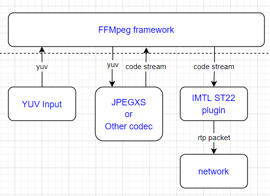

# The MTL Plugin for FFmpeg

## Notice

FFmpeg is an open source project licensed under LGPL and GPL. See <https://www.ffmpeg.org/legal.html>. You are solely responsible for determining if your use of FFmpeg requires any additional licenses. Intel is not responsible for obtaining any such licenses, nor liable for any licensing fees due, in connection with your use of FFmpeg.

## 1. Build

You can use the ./build.sh that will build the script for you automatically,

``` bash
apt-get install wget patch unzip
# in the  ecosystem/ffmpeg_plugin/ folder
./build.sh
```

The manual way of building is described below

### 1.1. Build openh264

Before building, check if openh264 is already installed:

```bash
ldconfig -p | grep libopenh264
```

If the command outputs a path to `libopenh264.so`, openh264 is present and you can skip the build step below.

```bash
git clone https://github.com/cisco/openh264.git
cd openh264
git checkout openh264v2.4.0
make -j "$(nproc)"
sudo make install
sudo ldconfig
cd ../
```


### 1.2. Build FFmpeg with MTL patches

> Note: `$mtl_source_code` should be pointed to top source code tree of Media Transport Library.

```bash
. $mtl_source_code/versions.env

git clone https://github.com/FFmpeg/FFmpeg.git
cd FFmpeg
git checkout release/${FFMPEG_VERSION}
# apply the build patch
git am $mtl_source_code/ecosystem/ffmpeg_plugin/${FFMPEG_VERSION}/*.patch
# copy the mtl in/out implementation code
cp $mtl_source_code/ecosystem/ffmpeg_plugin/mtl_*.c -rf libavdevice/
cp $mtl_source_code/ecosystem/ffmpeg_plugin/mtl_*.h -rf libavdevice/
# build with --enable-mtl, customize the option as your setup
./configure --enable-shared --disable-static --enable-nonfree --enable-pic --enable-gpl --enable-libopenh264 --enable-encoder=libopenh264 --enable-mtl
make -j
sudo make install
sudo ldconfig
```

> Note: For FFmpeg version 4.4 or 6.1, export `FFMPEG_VERSION=4.4` or 6.1.

In order to build the FFmpeg in a non-default path, use `--prefix="<path>"` within the `./configure` command to point to an empty installation folder.

## 2. ST20P raw video run guide

The MTL ST20P plugin is implemented as an FFmpeg input/output device, enabling direct reading from or sending raw video via the ST 2110-20 stream.

> **Note:** The default `payload_type` value for Media Transport Library raw video is 112. Below, it is changed to 96 - a commonly used number for raw video transmissions.

### 2.1. St20p input

Reading a ST 2110-20 10-bit YUV422 stream on 239.168.85.20:20000 with payload_type 96:

```bash
ffmpeg -p_port 0000:af:01.0 -p_sip 192.168.96.2 -p_rx_ip 239.168.85.20 -udp_port 20000 -payload_type 96 -fps 59.94 -pix_fmt yuv422p10le -video_size 1920x1080 -f mtl_st20p -i "k" -f rawvideo /dev/null -y
```

Following error indicates that MTL cannot detect a video stream on the listening address.

```text
[mtl_st20p @ 0x55634f8b3c80] mtl_st20p_read_packet(0), st20p_rx_get_frame timeout
[in#0/mtl_st20p @ 0x55634f8b3b40] Error during demuxing: Input/output error
[in#0/mtl_st20p @ 0x55634f8b3b40] Error retrieving a packet from demuxer: Input/output error
[vost#0:0/rawvideo @ 0x55634f8bcc80] No filtered frames for output stream, trying to initialize anyway.
```

Reading two ST 2110-20 10-bit YUV422 stream, one on 239.168.85.20:20000 and the second on 239.168.85.20:20002:

<!-- markdownlint-disable line-length -->
```bash
ffmpeg -p_port 0000:af:01.0 -p_sip 192.168.96.2 -p_rx_ip 239.168.85.20 -udp_port 20000 -payload_type 96 -fps 59.94 -pix_fmt yuv422p10le -video_size 1920x1080 -f mtl_st20p -i "1" -p_port 0000:af:01.0 -p_rx_ip 239.168.85.20 -udp_port 20002 -payload_type 96 -fps 59.94 -pix_fmt yuv422p10le -video_size 1920x1080 -f mtl_st20p -i "2" -map 0:0 -f rawvideo /dev/null -y -map 1:0 -f rawvideo /dev/null -y
```

Reading a ST 2110-20 10-bit YUV422 stream on 239.168.85.20:20000 with payload_type 96, and use libopenh264 to encode the stream to out.264 file:

```bash
ffmpeg -p_port 0000:af:01.0 -p_sip 192.168.96.2 -p_rx_ip 239.168.85.20 -udp_port 20000 -payload_type 96 -fps 59.94 -pix_fmt yuv422p10le -video_size 1920x1080 -f mtl_st20p -i "k" -c:v libopenh264 out.264 -y
```

### 2.2. St20p output

Reading from a yuv stream from a local file and sending a ST 2110-20 10-bit YUV422 stream on 239.168.85.20:20000 with payload_type 96:

```bash
ffmpeg -stream_loop -1 -video_size 1920x1080 -f rawvideo -pix_fmt yuv422p10le -i yuv422p10le_1080p.yuv -filter:v fps=59.94 -p_port 0000:af:01.1 -p_sip 192.168.96.3 -p_tx_ip 239.168.85.20 -udp_port 20000 -payload_type 96 -f mtl_st20p -
```

### 2.3. y210 format

The y210 format is not supported by the MTL Plugin for FFmpeg.

## 3. ST22 compressed video run guide

A typical workflow for processing an MTL ST22 compressed stream with FFmpeg is outlined in the following steps: Initially, FFmpeg reads a YUV frame from the input source, then forwards the frame to a codec to encode the raw video into a compressed codec stream. Finally, the codec stream is sent to the MTL ST22 plugin.
The MTL ST22 plugin constructs the codec stream and transmits it as ST 2110-22 RTP packets, adhering to the standard. In addition to the JPEG XS stream, the MTL ST22 plugin is capable of supporting various other common compressed codecs, including H.264 (AVC), and H.265 (HEVC), among others.

> **Note:** The default `payload_type` value for Media Transport Library compressed video is 112. Below, it is changed to 98 - a commonly used number for compressed video transmissions.



### 3.1. St22 output

Reading from a yuv stream from local source file, encode with h264 codec and sending a ST 2110-22 codestream on 239.168.85.20:20000 with payload_type 98:

```bash
ffmpeg -stream_loop -1 -video_size 1920x1080 -f rawvideo -pix_fmt yuv420p -i yuv420p_1080p.yuv -filter:v fps=59.94 -c:v libopenh264 -p_port 0000:af:01.1 -p_sip 192.168.96.3 -p_tx_ip 239.168.85.20 -udp_port 20000 -payload_type 98 -f mtl_st22 -
```

### 3.2. St22 input

Reading a ST 2110-22 codestream on 239.168.85.20:20000 with payload_type 98, decode with FFmpeg h264 codec:

```bash
ffmpeg -p_port 0000:af:01.0 -p_sip 192.168.96.2 -p_rx_ip 239.168.85.20 -udp_port 20000 -payload_type 98 -fps 59.94 -video_size 1920x1080 -st22_codec h264 -f mtl_st22 -i "k" -f rawvideo /dev/null -y
```

### 3.3. SVT JPEG XS

Make sure the FFmpeg is build with both MTL and SVT JPEG XS plugin:

```bash
# start rx
ffmpeg -p_port 0000:af:01.0 -p_sip 192.168.96.2 -p_rx_ip 239.168.85.20 -udp_port 20000 -payload_type 98 -fps 59.94 -video_size 1920x1080 -st22_codec jpegxs -timeout_s 10 -f mtl_st22 -i "k" -vframes 10 -f rawvideo /dev/null -y
# start tx
ffmpeg -stream_loop -1 -video_size 1920x1080 -f rawvideo -pix_fmt yuv420p -i yuv420p_1080p.yuv -filter:v fps=59.94 -c:v libsvt_jpegxs -p_port 0000:af:01.1 -p_sip 192.168.96.3 -p_tx_ip 239.168.85.20 -udp_port 20000 -payload_type 98 -f mtl_st22 -
```

### 3.4. SVT HEVC

Make sure the FFmpeg is build with both MTL and SVT HEVC plugin:

```bash
# start rx
ffmpeg -p_port 0000:af:01.0 -p_sip 192.168.96.2 -p_rx_ip 239.168.85.20 -udp_port 20000 -payload_type 98 -fps 59.94 -video_size 1920x1080 -st22_codec h265 -timeout_s 10 -f mtl_st22 -i "k" -vframes 10 -f rawvideo /dev/null -y
# start tx
ffmpeg -stream_loop -1 -video_size 1920x1080 -f rawvideo -pix_fmt yuv420p -i yuv420p_1080p.yuv -filter:v fps=59.94 -c:v libsvt_hevc -p_port 0000:af:01.1 -p_sip 192.168.96.3 -p_tx_ip 239.168.85.20 -udp_port 20000 -payload_type 98 -f mtl_st22 -
```

### 3.5. St22p support

Another option involves utilizing the MTL built-in ST22 codec plugin, where FFmpeg can directly send or retrieve the YUV raw frame to/from the MTL ST22P plugin. MTL will then internally decode or encode the codec stream.

Reading a ST 2110-22 pipeline jpegxs codestream on 239.168.85.20:20000 with payload_type 98:

```bash
ffmpeg -p_port 0000:af:01.0 -p_sip 192.168.96.2 -p_rx_ip 239.168.85.20 -udp_port 20000 -payload_type 98 -st22_codec jpegxs -fps 59.94 -pix_fmt yuv422p10le -video_size 1920x1080 -f mtl_st22p -i "k" -f rawvideo /dev/null -y
```

Reading from a yuv file and sending a ST 2110-22 pipeline jpegxs codestream on 239.168.85.20:20000 with payload_type 98:

```bash
ffmpeg -stream_loop -1 -video_size 1920x1080 -f rawvideo -pix_fmt yuv422p10le -i yuv422p10le_1080p.yuv -filter:v fps=59.94 -p_port 0000:af:01.1 -p_sip 192.168.96.3 -p_tx_ip 239.168.85.20 -udp_port 20000 -payload_type 98 -st22_codec jpegxs -f mtl_st22p -
```

## 4. ST30P audio run guide

> **Note:** The default `payload_type` value for Media Transport Library raw audio is 111. Below, it is changed to 97 - a commonly used number for raw audio transmissions.

### 4.1. St30p input

Reading a ST 2110-30 stream (pcm24, 1ms packet time, 2 channels) on 239.168.85.20:30000 with payload_type 97 and encoded to a wav file:

```bash
ffmpeg -p_port 0000:af:01.0 -p_sip 192.168.96.2 -p_rx_ip 239.168.85.20 -udp_port 30000 -payload_type 97 -pcm_fmt pcm24 -ptime 1ms -channels 2 -f mtl_st30p -i "0" dump.wav -y
```

### 4.2. St30p output

Reading from a wav file and sending a ST 2110-30 stream (pcm24, 1ms packet time, 2 channels) on 239.168.85.20:30000 with payload_type 97:

```bash
ffmpeg -stream_loop -1 -i test.wav -p_port 0000:af:01.1 -p_sip 192.168.96.3 -p_tx_ip 239.168.85.20 -udp_port 30000 -payload_type 97 -ptime 1ms -f mtl_st30p -
```

### 4.3. St30p pcm16 example

For pcm16 audio, use `mtl_st30p_pcm16` muxer, set `pcm_fmt` to `pcm16` for demuxer.

```bash
ffmpeg -stream_loop -1 -i test.wav -p_port 0000:af:01.1 -p_sip 192.168.96.3 -p_tx_ip 239.168.85.20 -udp_port 30000 -payload_type 97 -ptime 1ms -f mtl_st30p_pcm16 -

ffmpeg -p_port 0000:af:01.0 -p_sip 192.168.96.2 -p_rx_ip 239.168.85.20 -udp_port 30000 -payload_type 97 -pcm_fmt pcm16 -ptime 1ms -channels 2 -f mtl_st30p -i "0" dump_pcm16.wav -y
```

## 5. St20 GPU direct guide

The MTL_GPU_DIRECT experimental feature aims at enhancing FFmpeg's performance by allowing direct access to GPU memory, which can be particularly beneficial when working with high-throughput video streams such as those handled by the MTL ST20 codec plugin.

### 5.1. Enabling experimental MTL_GPU_DIRECT in FFmpeg with ST20p Support

To take advantage of the MTL_GPU_DIRECT feature FFmpeg has to be built with this option enabled. Here’s how to do it:

```bash
./configure --enable-shared --disable-static --enable-nonfree --enable-pic --enable-gpl --enable-libopenh264 --enable-encoder=libopenh264 --enable-mtl --extra-cflags="-DMTL_GPU_DIRECT_ENABLED"
```

or use

```bash
./build_ffmpeg_plugin.sh -g
```

Reading a ST 2110-20 10-bit YUV422 stream on 239.168.85.20:20000 with payload_type 96 and
enabled gpu_direct:

```bash
./ffmpeg -p_port 0000:af:01.0 -p_sip 192.168.96.2 -p_rx_ip 239.168.85.20 -udp_port 20000 -payload_type 96 -fps 59.94 -pix_fmt yuv422p10le -video_size 1920x1080 -gpu_direct 1 -gpu_driver 0 -gpu_device 0 -f mtl_st20p -i "k" -f rawvideo /dev/null -y
```

### 5.2. Additional Notes

**GPU Direct Flag:** When compiling FFmpeg with the MTL_GPU_DIRECT feature enabled, ensure that your system's GPU drivers and hardware support direct GPU memory access.  
GPU device IDs and GPU driver IDs are printed during initialization.

**Options:**

1. `-gpu_device`
1. `-gpu_driver`

Both default to 0, but if your device doesn't initialize, adjust it using the information printed during initialization.

**Example:**

```text
Drivers count: 1
Driver: 0: Device: 0: Name: Intel(R) Data Center GPU Flex 170, Type: 1, VendorID: 8086, DeviceID: 22208
```


[GPU Documentation](../../doc/gpu.md)

By following these steps, you can effectively build and utilize FFmpeg with the MTL_GPU_DIRECT feature enabled.
