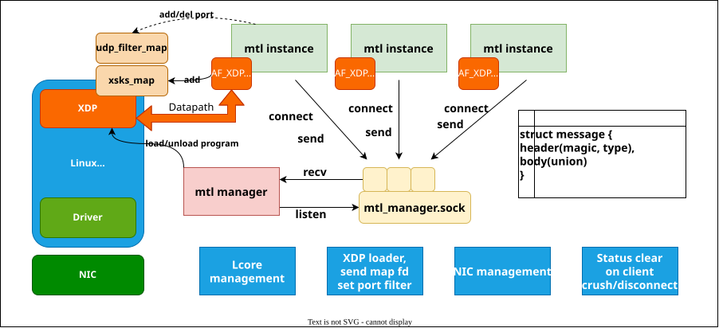

# MTL Manager Documentation

## Overview



MTL Manager is a daemon that arbitrates the host resources the MTL instances on
one machine share:

- **Lcore management**: one instance cannot pin a thread to a core another
  instance already uses.
- **Receive queues**: one queue goes to one instance. Queue 0 always stays with
  the kernel.
- **ethtool flow rules**: the manager installs and removes the rules that steer
  traffic to those queues, and takes them back when the instance goes away.
- **eBPF/XDP loader**: it loads the UDP port filter program of each AF_XDP
  interface and passes the xsks map descriptor to the instance.
- **Instance monitor**: it watches the connections, and frees everything an
  instance held when the instance disconnects or dies.

The client-side of the socket is `mtlm_api.h`, with the record layout in
`mtl_mproto.h`. Both are part of the public API of MTL and live in `include/`
with `mtl_api.h` and the rest. The library uses them, and so can any other
program:

```bash
cc $(pkg-config --cflags mtlm_client) my_tool.c $(pkg-config --libs mtlm_client)
```

The flags give both `<mtl/mtlm_api.h>` and `<mtlm_api.h>`. `MtlManagerProbe`,
under [Tests](#mtlmanagerprobe), is such a program: it tests every action of the
manager through those two headers alone.

## Build

To build with XDP support, install the dependencies:

```bash
sudo apt-get update
sudo apt-get install make m4 clang llvm zlib1g-dev libelf-dev libpcap-dev libcap-ng-dev gcc-multilib
```

To compile and install the MTL Manager, use the following commands:

```bash
meson setup build
meson compile -C build
sudo meson install -C build
```

This installs `MtlManager`, the client library `libmtlm_client`, the headers
`mtl/mtlm_api.h` and `mtl/mtl_mproto.h`, the pkg-config file `mtlm_client.pc`,
and a built-in XDP program for udp port filtering.

`./build.sh` in the repository root builds the manager before `tests/`, because
the manager API test links the client library.

## Run

```bash
MtlManager                 # no root
sudo MtlManager            # the system socket, and the privileged operations
MtlManager --help
```

Root is not needed to start the manager. Without it the socket goes below
`XDG_RUNTIME_DIR`, and only the operations that need privilege fail, which are
the XDP program loads and the ethtool flow rules. A test, a container build, and
any work with lcores and the kernel socket path therefore need no password.

### The socket path

Neither side hard-codes a path. `mtlm_sock_path()` resolves it, in this order:

1. `$MTL_MANAGER_SOCK_PATH`, when set and not empty.
2. `/var/run/imtl/mtl_manager.sock`, when the effective user is root.
3. `$XDG_RUNTIME_DIR/imtl/mtl_manager.sock`.
4. `/tmp/imtl-<uid>/mtl_manager.sock`.

A client walks the same order, so a program without root finds a per-user
manager first and a system manager second. Print the path the manager would
bind:

```bash
MtlManager --print-sock-path
```

The mode of the socket file follows the path: `0600` for a per-user socket,
`0666` for the system socket, and `0660` with `--socket-group`. Use the group
form to let one group of users reach a system manager:

```bash
sudo MtlManager --socket-group mtl
```

### Options

| Option | What it does |
| --- | --- |
| `--sock-path PATH` | Bind `PATH` instead of the resolved default. |
| `--socket-mode OCTAL` | Mode of the socket file, for example `660`. |
| `--socket-group NAME` | Give the socket to group `NAME`, and use mode `0660`. |
| `--max-clients N` | Largest number of instances at once. Default 64. |
| `--log-level LEVEL` | `debug`, `info`, `warning` or `error`. Default `info`. |
| `--print-sock-path` | Print the path that would be bound, then exit. |
| `--version` | Print the version and the protocol version, then exit. |

`SIGINT` and `SIGTERM` both stop the manager. It removes its socket file on the
way out, so a client cannot connect to a manager that is no longer there.

## Install as a service

```bash
sudo ./service/install_service.sh              # the system service
./service/install_service.sh --user            # a service of your own account
sudo ./service/install_service.sh --uninstall
```

The script takes the units from `../build/manager/service`, which
`meson compile` generates from `mtl-manager.service.in` and
`mtl-manager-user.service.in`. Use `--units DIR` for another build directory. It
finds the systemd directories with `pkg-config`, and `MTL_SYSTEMD_SYSTEM_DIR`,
`MTL_SYSTEMD_USER_DIR` and `MTL_TMPFILES_DIR` override them.

```bash
sudo systemctl enable --now mtl-manager        # the system service
systemctl --user enable --now mtl-manager      # your own service
journalctl -u mtl-manager -f
```

Put the options in an environment file, which the unit reads if it exists:

```bash
# /etc/mtl/manager.env, or ~/.config/mtl/manager.env for the user service
MTL_MANAGER_ARGS=--socket-group mtl --log-level debug
```

`meson setup -Dinstall_service=true` makes `ninja install` put the units in
place as well. It is off by default, because the units go outside the prefix.

## The XDP programs

The XDP program for udp port filtering is loaded along with the libxdp's
built-in xsk program when the AF_XDP socket is created. It utilizes the
xdp-dispatcher program provided by libxdp which allows running of multiple XDP
programs in chain on the same interface. You can check the loaded programs with
xdp-loader:

```text
sudo xdp-loader status
```
```text
Interface        Prio  Program name      Mode     ID   Tag               Chain actions
--------------------------------------------------------------------------------------
lo                     <No XDP program loaded!>
ens787f0               <No XDP program loaded!>
ens787f1               <No XDP program loaded!>
ens785f0               xdp_dispatcher    native   23661 90f686eb86991928 
 =>              19     mtl_dp_filter             23670 02aea45cd16e8656  XDP_DROP
 =>              20     xsk_def_prog              23622 8f9c40757cb0a6a2  XDP_PASS
ens785f1               xdp_dispatcher    native   23675 90f686eb86991928 
 =>              19     mtl_dp_filter             23678 02aea45cd16e8656  XDP_DROP
 =>              20     xsk_def_prog              23639 8f9c40757cb0a6a2  XDP_PASS
virbr0                 <No XDP program loaded!>
docker0                <No XDP program loaded!>
```

The manager takes the whole dispatcher off the interface when it lets the
interface go, because `xsk_setup_xdp_prog()` puts a second program in the chain
that no call can take out on its own. An interface the manager holds is an
interface MTL uses alone.

Two environment variables matter for a build tree and for a libxdp that was
built from source:

| Variable | Use |
| --- | --- |
| `MTL_MANAGER_XDP_OBJECT` | Path of `mtl.xdp.o`. Without it the manager asks libxdp to find `mtl.xdp.o` in its own search path, which holds the installed copy only. |
| `LIBXDP_OBJECT_PATH` | Directory that holds libxdp's `xdp-dispatcher.o`. A libxdp built from source can put it in a directory its compiled-in path does not name, and the attach then fails with `Couldn't open BPF file xdp-dispatcher.o`. |

`tools/run_probe.sh` sets both.

## Tests

Three suites. The first two need no NIC, no hugepage and no root. The third one
needs root and an interface for its last four groups, and skips them without
them.

The unit tests cover the daemon logic. Every device call goes through
`mtlm_netdev_ops` or `mtlm_xdp_ops`, so a fake answers it:

```bash
meson setup build
meson test -C build                     # or: ./build/tests/MtlManagerTest
./build/tests/MtlManagerTest --gtest_filter='Interface.*'
```

The API test starts a real `MtlManager` process on a path below `/tmp` and drives
it through `mtlm_api.h` only:

```bash
MTL_MANAGER_BIN=$PWD/build/MtlManager ../build/tests/MtlManagerApiTest
```

`MTL_MANAGER_BIN` names the binary to start. Without it the test takes
`MtlManager` from the `PATH`. A test that needs a real NIC belongs in
`KahawaiTest`.

### MtlManagerProbe

`MtlManagerProbe` tests a manager that already runs, from outside it. It links
`libmtlm_client` and nothing else of MTL, and it includes only `mtlm_api.h` and
`mtl_mproto.h`. Every action of the manager therefore has a case that reaches it
the way any other program on the host does. An action the probe cannot reach is
a gap in the public API.

```bash
tools/run_probe.sh                      # a manager of its own, on a path below /tmp
tools/run_probe.sh --ifname <name>      # add the groups that need an interface
./build/tools/MtlManagerProbe --help
./build/tools/MtlManagerProbe           # the manager the client library would find
./build/tools/MtlManagerProbe --verbose lcore queue
```

`run_probe.sh` starts the manager, waits for the socket, runs the probe against
it, and prints the manager log when a case fails. `MTLM_BUILD_DIR` names the
build directory. `meson test -C build` runs it with no interface, which is the
part that needs no privilege.

Without `--sock-path` the probe takes the same search order as the library, so
it reaches the manager of the service as well:

```bash
systemctl --user start mtl-manager
MtlManagerProbe                         # 149 cases, 4 groups skipped for want of an interface
```

A group name is an argument, and `--list` names them all. The default is every
group, in this order:

| Group | What it proves |
| --- | --- |
| `path` | The socket path order, `mtlm_sock_path`, `mtlm_sock_resolve`, `mtlm_sock_dir_prepare` |
| `api` | The shape of the API, the record layout, and every NULL argument |
| `connect` | Connect, register, heartbeat, and the operations that need a register first |
| `lcore` | Claim an lcore, release it, a rival, and the release on death |
| `queue` | Reserve a receive queue, release it, a rival, and the release on death |
| `flow` | Insert and delete an ethtool flow rule, and the delete on death |
| `filter` | The UDP destination port filter of the XDP program, and its reference count |
| `xdp` | The xsks map descriptor over `SCM_RIGHTS`, and that no program stays on the interface |
| `abuse` | Records the client library would never build, and that the manager keeps serving |

The `abuse` group writes bytes on the socket by hand: a stray byte, a record in
two pieces, two records in one write, 50 records in one write, a wrong magic, an
unknown type, a `body_len` of `0xFFFFFFFF`, half a record and a close, and a
client killed while it holds an lcore, a queue, a flow rule and a filter port.
After each case it opens a new connection and registers, to prove the manager
still serves.

> **Warning:** the manager clears every receive flow rule of an interface it
> takes. `--ifname <name>` therefore deletes the existing `ethtool -n` rules of
> that interface. Name a port that carries no traffic and holds no rule. Read
> the rules first with `ethtool -n <name>`.

A veth pair needs no NIC and is the safe way to run the groups that need an
interface:

```bash
sudo ip link add mtlmprobe0 type veth peer name mtlmprobe1
sudo ip link set mtlmprobe0 up
sudo -E tools/run_probe.sh --ifname mtlmprobe0
sudo ip link del mtlmprobe0
```

A veth has no combined channel and no rule table, so the `queue` and `flow`
groups skip on it. Both run on a real NIC port. A skip is not a failure: the
probe gives 0 when no case failed, 1 when a case failed, and 2 for a usage or
environment fault.

## Run in a Docker container

Please note that the Dockerfile provided is intended for development use only. It has been tested for functionality, but not for security. Users are advised to review and modify it as necessary before using it in a production environment.

Build the Docker image:

```bash
docker build --build-arg VERSION=$(cat ../VERSION) -t mtl-manager:latest .
# docker build --build-arg VERSION=$(cat ../VERSION) -t mtl-manager:latest --build-arg HTTP_PROXY=$http_proxy --build-arg HTTPS_PROXY=$https_proxy .
```

Run the Docker container as a daemon:

```bash
docker run -d \
  --name mtl-manager \
  --privileged --net=host \
  -v /var/run/imtl:/var/run/imtl \
  -v /sys/fs/bpf:/sys/fs/bpf \
  mtl-manager:latest
```

Print the MTL Manager logs:

```bash
docker logs -f mtl-manager
```

Shutdown the Docker container with SIGINT:

```bash
docker kill -s SIGINT mtl-manager
# docker rm mtl-manager
```
