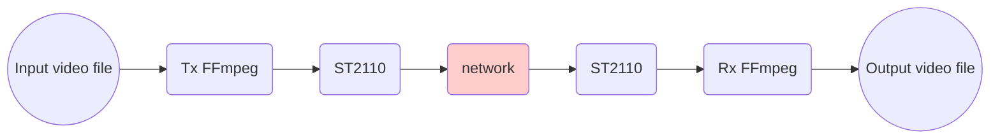
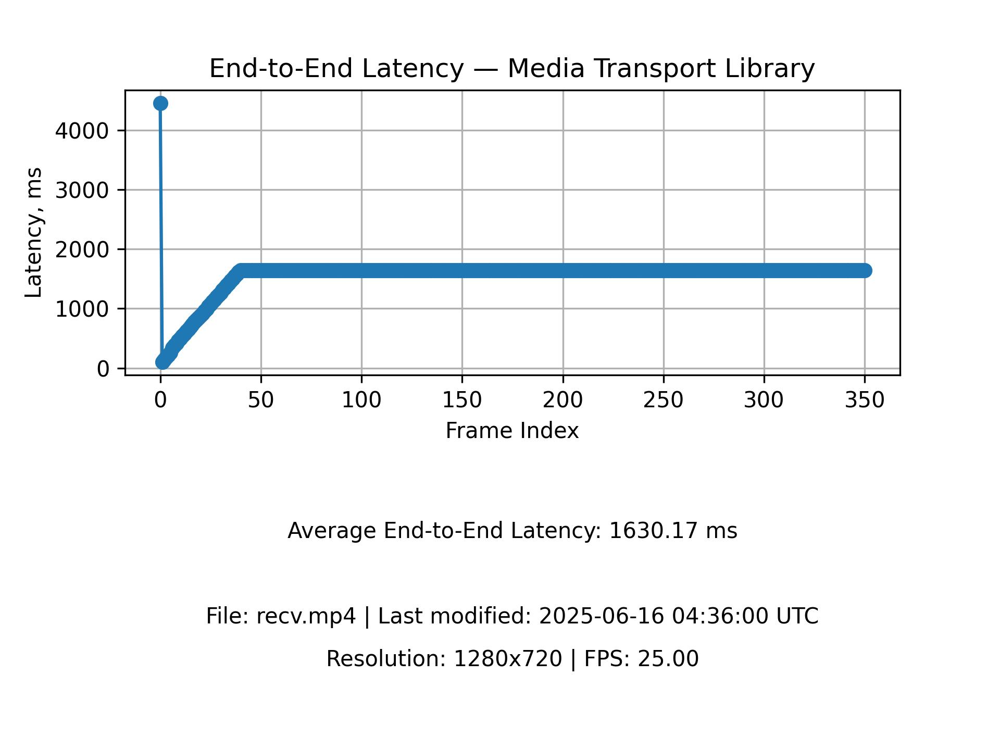

# End-to-End Latency Measurement — Media Transport Library

This document describes a simple solution for measuring end-to-end latency in Media Transport Library.

## Overview

The solution is based on the FFmpeg ability to print current timestamps on the sender side (Tx) and the receiver side (Rx), and the use of Optical Character Recognition (OCR) to read the timestamps out of each received video frame and calculate the delta.
The choice of OCR is determined by the fact that the text can be effectively recognized even if the picture is affected by any sort of a lossy video compression algorithm somewhere in the transmission path. To achieve proper accuracy of the measurement, both Tx and Rx host machines should be synchronized using Precision Time Protocol (PTP).

> Only video payload ST2110-20 and ST2110-22 is supported.



## How it works

1. Tx side – The user starts FFmpeg with special configuration to stream video via the ST2110.
1. Rx side – The user starts FFmpeg with special configuration to receive the video stream from the ST2110.
1. Tx side – FFmpeg prints the current timestamp as a huge text at the top of each video frame and transmits it via the network.
1. Rx side – FFmpeg prints the current timestamp as a huge text at the bottom of each video frame received from the network and saves it on the disk.
1. After transmission is done, there is a resulting MPEG video file on the disk on the Rx side.
1. The user runs the solution script against the MPEG file that recognizes the Tx and Rx timestamps in each frame, and calculates the average latency based on the difference between the timestamps. Additionally, the script generates a latency diagram and stores it in JPEG format on the disk.

## Sample latency diagram



## Important notice on latency measurement results

> Please note the calculated average latency is highly dependent on the hardware configuration and CPU background load, and cannot be treated as an absolute value. The provided solution can only be used for comparing the latency in different network configurations and video streaming parameters, as well as latency stability checks.


## Build and install steps

> It is assumed that Media Transport Library is installed on the Tx and Rx host machines according to [Build Guide](build.md).

If FFmpeg Plugin was installed earlier, remove its directory before proceeding with the following.

1. Install required packages
   ```bash
   sudo apt install libfreetype6-dev libharfbuzz-dev libfontconfig1-dev
   ```
1. Clone build and install FFmpeg.
   ```bash
   git clone https://github.com/FFmpeg/FFmpeg.git
   cd FFmpeg
   git checkout release/7.0
   # apply the build patch
   git am <repo_dir>/ecosystem/ffmpeg_plugin/7.0/*.patch
   # copy the mtl in/out implementation code
   cp <repo_dir>/ecosystem/ffmpeg_plugin/mtl_*.c -rf libavdevice/
   cp <repo_dir>/ecosystem/ffmpeg_plugin/mtl_*.h -rf libavdevice/
   ./configure --enable-shared --enable-mtl --enable-libfreetype --enable-libharfbuzz --enable-libfontconfig
   make -j "$(nproc)"
   sudo make install
   sudo ldconfig
   ```
1. Install Tesseract OCR
   ```bash
   apt install tesseract-ocr
   ```
1. Install Python packages
   ```bash
   pip install opencv-python~=4.11.0 pytesseract~=0.3.13 matplotlib~=3.10.3
   ```
1. Setup time synchronization on host machines

   > Make sure `network_interface_1` and `network_interface_2` are connected to the same network.

   * __host-1 Controller clock__
      ```bash
      sudo ptp4l -i <network_interface_1> -m 2 
      sudo phc2sys -a -r -r -m
      ```

   * __host-2 Worker clock__
      ```bash
      sudo ptp4l -i <network_interface_2> -m 2 -s
      sudo phc2sys -a -r
      ```

## Example – Measuring transmission latency between two FFmpeg instances on different hosts

This example demonstrates sending a video file from the 1st FFmpeg instance to the 2nd FFmpeg instance via Media Transport Library, and then calculate transmission latency from the recorded video.

1. Start the Receiver side FFmpeg instance

   ```bash
   sudo ffmpeg -y                                                            \
      -f mtl_st20p                                                           \
         -p_port 0000:af:01.0                                                \
         -p_sip 192.168.96.2                                                 \
         -p_rx_ip 239.168.85.20                                              \
         -udp_port 20000                                                     \
         -payload_type 96                                                    \
         -fps 59.94                                                          \
         -pix_fmt yuv422p10le                                                \
         -video_size 1920x1080                                               \
          -i -                                                               \
      -vf                                                                    \
          "drawtext=fontsize=40:                                             \
          text='Rx timestamp %{localtime\\:%H\\\\\:%M\\\\\:%S\\\\\:%3N}':    \
          x=10: y=70: fontcolor=white: box=1: boxcolor=black: boxborderw=10" \
      -vcodec mpeg4 -qscale:v 3 recv.mp4
   ```

1. Start the Sender side FFmpeg instance

   ```bash
   sudo ffmpeg -i <video-file-path>                                       \
   -vf                                                                    \
       "drawtext=fontsize=40:                                             \
       text='Tx timestamp %{localtime\\:%H\\\\\:%M\\\\\:%S\\\\\:%3N}':    \
       x=10: y=10: fontcolor=white: box=1: boxcolor=black: boxborderw=10" \
   -f mtl_st20p                                                           \
      -fps 59.94                                                          \
      -p_port 0000:af:01.1                                                \
      -p_sip 192.168.96.3                                                 \
      -p_tx_ip 239.168.85.20                                              \
      -udp_port 20000                                                     \
      -payload_type 96 -
   ```

   When sending a raw video file, e.g. of the YUV format, you have to explicitly specify the file format `-f rawvideo`, the pixel format `-pix_fmt`, and the video resolution `-s WxH`:

   ```bash
   ffmpeg -f rawvideo -pix_fmt yuv422p10le -s 1920x1080 -i <video-file-path> ...
   ```

   It is also recommended to provide the read rate `-readrate` at which FFmpeg will read frames from the file:

   ```bash
   ffmpeg -f rawvideo -readrate 2.4 -pix_fmt yuv422p10le -s 1920x1080 -i <video-file-path> ...
   ```

   The `-readrate` value is calculated from the `-frame_rate` parameter value using the following equation: $readrate=framerate\div25$. Use the pre-calculated values from the table below.

   | frame_rate |      readrate     |
   |------------|-------------------|
   |    25      |   25 / 25 = 1     |
   |    50      |   50 / 25 = 2     |
   |    60      |  60 / 25 = 2.4    |

1. Run the script located in `<repo_dir>/tests/tools/latency_measurement`against the recorded MPEG file. The first argument is the input video file path. The second argument is the optional latency diagram JPEG file path to be generated.

   ```bash
   python text_detection.py recv.mp4 recv-latency.jpg
   ```

   Console output
   ```bash
   ...
   Processing Frame:  235
   Processing Frame:  236
   Processing Frame:  237
   Processing Frame:  238
   Processing Frame:  239
   Processing Frame:  240
   Saving the latency chart to:  recv-latency.jpg
   File: recv.mp4 | Last modified: 2025-06-02 13:49:54 UTC
   Resolution: 640x360 | FPS: 25.00
   Average End-to-End Latency: 564.61 ms
   ```

   See the [Sample latency diagram](#sample-latency-diagram).

## Customization
When modifying FFmpeg commands if you change parameters of `drawtext` filter, especialy `fontsize`, `x`, `y` or `text`, you have to adjust python script __text-detection.py__ too, please refer to function `extract_text_from_region(image, x, y, font_size, length)`
