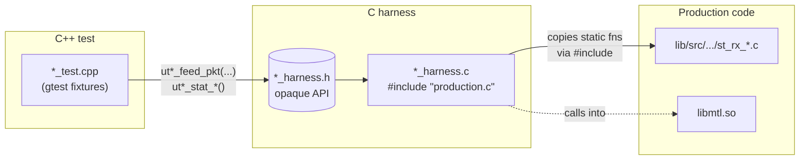

# MTL Unit Tests

> **In-process tests for the Media Transport Library that find real bugs without requiring a NIC, hugepages, root, or PTP hardware.**

[](#quick-start)
[](#what-makes-this-different)

---

## What this is

A `gtest` binary (`UnitTest`) that drives MTL's RX session and pipeline code paths
**directly** — using real DPDK mbufs from a no-hugepage EAL — and asserts on
production behaviour. Tests run on any developer laptop in a fraction of a
second.

The suite covers ST 2110-20 (video), ST 2110-30 (audio), ST 2110-40 (ancillary),
and the ST 2110-40 pipeline. Every media follows the same per-feature layout
under `session/<media>/` (see [Test layout](#test-layout)).

## What makes this different

| Property | Value |
|---|---|
| Hardware required | **None** — no NIC, no PTP clock, no hugepages |
| Privileges required | **None** — runs as a regular user |
| Memory checking | **AddressSanitizer** preloaded on every run |
| Code under test | The **production `.c` files** (not a separate test build) |
| Determinism | **Single-threaded**, no timers, no I/O |
| Isolation | One `mtl_init` per process; per-test ring/state reset |

If a test fails it's a real defect — there are no flaky network-timing tests in
this binary.

## Quick start

```bash
# 1. configure (one-time)
meson setup build_unit -Denable_unit_tests=true

# 2. build
ninja -C build_unit

# 3. run
LD_PRELOAD=/lib/x86_64-linux-gnu/libasan.so.6 \
    ./build_unit/tests/unit/UnitTest
```

Filter to a single suite or test:

```bash
# one suite
./build_unit/tests/unit/UnitTest --gtest_filter='St40RxRedundancyTest.*'

# one test
./build_unit/tests/unit/UnitTest \
    --gtest_filter='St20RxErrPacketsTest.WrongPtCountedAsErr'

# everything related to err_packets across all media
./build_unit/tests/unit/UnitTest --gtest_filter='*ErrPackets*'

# list everything without running
./build_unit/tests/unit/UnitTest --gtest_list_tests
```

> **Why `LD_PRELOAD=libasan.so`?** `libmtl.so` is built with AddressSanitizer
> when `enable_unit_tests=true`. Preloading the runtime first prevents
> init-order interposition issues between gtest, libstdc++, and libasan.

## Test philosophy

The tests are written to **find bugs**, not to mirror current behaviour:

1. **Assertions describe the contract**, not the implementation. Each
   `EXPECT`/`ASSERT` carries a `<<` message explaining which user-visible
   property would break if the assertion did not hold.
2. **Invariants over magic numbers.** Prefer `corrupted ≤ received` and
   `feeds == accepted + rejected` over `EXPECT_EQ(x, 7)`.
3. **Sanity asserts** (`EXPECT_GT(x, 0)`) accompany equality checks where the
   equality could be trivially satisfied by both sides being zero.
4. **A failing test means the library is wrong.** When the lib does something
   illogical, fix the lib — never weaken the assertion. All tests in this
   suite must pass; a red test in CI is the signal to fix the lib.
5. **No special naming for bug-exposing tests.** Every test asserts the contract
   the library should satisfy. We do not tag tests as "known bugs" — a red
   test in CI is the signal, and the fix goes into the lib, not into the
   test. No test is silently allowed to fail.

## Architecture

### High-level view



Each harness `.c` **`#include`s the production `.c` it tests**. This makes every
`static` function in the production unit reachable from the harness without
patching the production source. Non-static collisions with `libmtl.so` are
resolved by `-Wl,--allow-multiple-definition`, which the Meson recipe declares.

### The C++/C split

Internal MTL headers use C identifiers like `new` that are reserved in C++.
The split is:

- `*_harness.c` — pure C, includes internal MTL headers, owns the session
  struct, builds real mbufs, calls the production handler.
- `*_harness.h` — pure C API. Exposes an **opaque** `ut_test_ctx*` and only
  primitive types in signatures. **Each harness function is documented in
  this header** — start there when you don't know which feeder to use.
- `*_test.cpp` — gtest. Includes only the harness `.h`. Never sees an MTL
  internal type.

### How DPDK is initialised

[`common/ut_common.c`](common/ut_common.c)::`ut_eal_init()` runs `rte_eal_init()`
once per process with `--no-huge --no-shconf --no-pci --vdev=net_null0`.

A single shared `rte_pktmbuf_pool` backs all allocations and a small ring
factory hands out named SP/SC rings. Test fixtures drain rings in `TearDown()`,
so suites are mutually independent.

## Test layout

Tests are organised along **one axis: per-media**. Each session type has its
own subdirectory under `session/`:

- `session/st20/` — ST 2110-20 (video)
- `session/st30/` — ST 2110-30 (audio)
- `session/st40/` — ST 2110-40 (ancillary)
- `pipeline/`     — pipeline layer (frame assembly above the session filter)

Within each media subdirectory, tests are split into per-feature files. The
filename maps directly to a concern:

| Filename (where applicable) | What it covers |
|------------------------------|----------------|
| `redundancy_test.cpp`        | Cross-port dispatch, switchover, threshold bypass |
| `header_validation_test.cpp` | RFC PT/SSRC/length/F-bit checks, `ReturnValue*` contract |
| `stats_test.cpp`             | Per-port counters and global ↔ per-port invariants |
| `reorder_test.cpp`           | Per-port reordered/duplicate counters |
| `timestamp_test.cpp`         | 16-bit seq wrap, 32-bit ts wrap, backward ts |
| `err_packets_test.cpp`       | Per-port `err_packets` accounting via `_handle_mbuf` wrapper |
| `bitmap_test.cpp`            | Per-frame bitmap edge cases |
| `slot_test.cpp` (ST20)       | Slot allocation/reuse, frame-gone path |
| `marker_test.cpp` (ST40)     | RTP marker bit preservation |
| `f_bits_test.cpp` (ST40)     | Progressive vs interlaced field bits |
| `prev_window_test.cpp` (ST40)| Previous-timestamp acceptance window |

The shared per-media gtest fixture lives in `<media>/<media>_rx_test_base.h`;
each per-feature file derives a thin subclass so `--gtest_filter` selects only
that feature's tests.

A complete and always-current list of suites and tests is one command away:

```bash
./build_unit/tests/unit/UnitTest --gtest_list_tests
```

## Conventions

### Naming

| Element | Convention | Example |
|---------|-----------|---------|
| Suite class | `<Media>Rx<Concern>Test` | `St20RxBitmapTest`, `St40RxFBitsTest` |
| Test name | Scenario in PascalCase, no numbers | `WrongPtCountedAsErr`, not `Test1` |
| Harness function | `ut<media>_<verb>_<noun>` | `ut40_feed_pkt`, `ut30_stat_received` |

### File structure inside a `*_test.cpp`

```cpp
/* SPDX-License-Identifier: BSD-3-Clause
 * Copyright header
 *
 * File-level docblock: which production code path this file targets,
 * which invariants it asserts, and links to relevant issues.
 */

#include <gtest/gtest.h>
#include "session/<media>/<media>_rx_test_base.h"

class <Suite> : public <Media>RxBaseTest {};

TEST_F(<Suite>, GoodPacketAccepted) { /* ... */ }
TEST_F(<Suite>, WrongPtRejected)    { /* ... */ }
```

### Direct vs wrapper feeders

Each harness exposes two families of feeders:

- `ut<media>_feed_*()` — call the per-packet handler **directly**. Use for
  filter/state assertions; bypasses the wrapper accounting layer.
- `ut<media>_feed_*_via_wrapper()` — call the public `_handle_mbuf` wrapper
  the production tasklet uses. Use whenever the test asserts on
  `port[].err_packets` or on `port[].packets` accounting.

When in doubt, read the function's doc comment in the harness `.h`.

### Assertion style

```cpp
/* good */
EXPECT_EQ(err_packets(), redundant_packets())
    << "every redundant filter rejection must explain one err_packets bump";

/* avoid */
EXPECT_EQ(err_packets(), 5);  // why 5? what does it prove?
```

## How to add a test

1. **Choose the file.** Find the per-media subdirectory (`session/st20/`,
   `session/st30/`, or `session/st40/`) and pick the per-feature file that
   matches the concern (`stats_test.cpp`, `redundancy_test.cpp`, etc.). If no
   existing file fits, add a new per-feature file rather than overloading an
   existing one.
2. **Use existing accessors** in the harness `.h`. If the stat or state you
   need is not exposed, extend the harness rather than reaching into structs.
3. **Pick the right feeder family** — direct for filter/state, `_via_wrapper`
   for `err_packets` / per-port `packets` accounting.
4. **Write the assertion as an invariant** with a `<<` failure message that
   explains the user-visible impact.
5. **Build and run with ASan.** The Meson recipe enables ASan automatically;
   `LD_PRELOAD=libasan.so` is mandatory at runtime.
6. **No magic constants** — derive expected counts from the inputs you fed.

### Worked example

```cpp
TEST_F(St40RxErrPacketsTest, WrongPtCountedAsErr) {
  /* feed one packet with the wrong RTP payload type */
  feed_via(/*seq=*/0, /*ts=*/1000, /*marker=*/1,
           MTL_SESSION_PORT_P, /*pt=*/77);  /* session pt is 113 */

  /* contract: each rejection bumps both the per-reason counter and err_packets */
  EXPECT_EQ(ut40_stat_wrong_pt(ctx_), 1u);
  EXPECT_EQ(err_p(), 1u);
  /* contract: rejected packets must NOT show up as good packets */
  EXPECT_EQ(pkts_p(), 0u);
}
```

## How to add a harness

You need a new harness when you want to test a different production `.c`
(e.g. a new pipeline file or a new RX session type). For most additions, an
existing harness is enough.

1. Create `tests/unit/<layer>/<suite>_harness.{h,c}` and a matching
   `*_test.cpp`.
2. In the harness `.c`:

   ```c
   #undef MTL_HAS_USDT
   #include "common/ut_common.h"
   #include "<path/to/production>.c"   /* the unit under test */

   struct <suite>_ctx { /* session struct + storage */ };
   #include "<layer>/<suite>_harness.h"
   ```

3. Initialise the session struct with the *minimum* fields the production
   handler reads. Reuse `mt_main_impl` and `..._sessions_mgr` patterns from
   existing harnesses.
4. Stub only the libmtl symbols that would otherwise crash (NULL deref,
   missing PTP clock, USDT probe semaphores). Document why above each stub.
5. Add the new sources to `unit_sources` in
   [`tests/unit/meson.build`](meson.build).
6. Run with ASan; fix any leak ASan reports on test allocations.
7. **Document every public function in the harness `.h`** — that header is the
   contract callers see.

### Stubs

A stub is a non-static function with a libmtl-matching signature defined in
the harness `.c`. Because of `-Wl,--allow-multiple-definition`, the harness
copy wins on the link line.

Stubs exist for three reasons only:

| Reason | Example |
|--------|---------|
| Hardware path | `mt_mbuf_time_stamp()` — no NIC RX timestamp available |
| USDT/DTrace | `MTL_HAS_USDT` is `#undef`'d, so probe semaphores are not referenced |
| Missing global init | `mt_get_log_global_level()` — pulled unchanged from libmtl |

The harness `.c` provides a real `rte_spinlock_t` inside its mock
`*_sessions_mgr` so the libmtl stat-overlay path runs end-to-end. Avoid
stubbing anything that would short-circuit the code path you are trying to
test.

## Troubleshooting

| Symptom | Likely cause | Fix |
|---------|--------------|-----|
| `AddressSanitizer:DEADLYSIGNAL` at startup | `LD_PRELOAD=libasan.so.6` not set | Use the launch command shown above |
| `libasan: failed to find runtime library` | Wrong libasan major (e.g. .so.5 vs .so.6) | `dpkg -L libasan6 \| grep libasan.so` to locate the right path |
| Linker: multiple definition of `<symbol>` | New `.c` file in `unit_sources` is missing the `#undef MTL_HAS_USDT` or wrong `#include` order | Match an existing harness `.c` exactly |
| Test passes alone, fails in suite | Shared ring or session state not drained | Add cleanup to fixture `TearDown()`; never rely on test order |
| `EAL: cannot init memory` on second run | Stale shared-memory file under `/var/run/dpdk` | `--no-shconf --in-memory` are already set; delete `/dev/hugepages/rtemap_*` if any leaked |
| New test green but suite total didn't grow | The `.cpp` was not added to `unit_sources` | Add to [`tests/unit/meson.build`](meson.build) |

## What is *not* covered

These tests target RX session and pipeline layers. They intentionally do **not**
cover:

- TX paths (builder, transmitter, pacing) — see integration tests
- DMA copy engine (DMA is disabled in the test EAL)
- Kernel socket / AF\_XDP backends — exercised by validation tests
- Multi-process MTL — single-process by construction

For end-to-end coverage with real NICs see [`tests/integration_tests/`](../integration_tests/)
and [`tests/validation/`](../validation/).

## Contributing

- Run [`format-coding.sh`](../../format-coding.sh) before submitting; CI rejects
  unformatted code.
- New tests must pass under ASan with no leak reports on test allocations.
- Every test must pass. A test that exposes a library bug is a valid
  contribution — fix the lib, not the test. Do not weaken
  the assertion to make it pass.
- Match commit message format: `Test: <imperative description>`.
