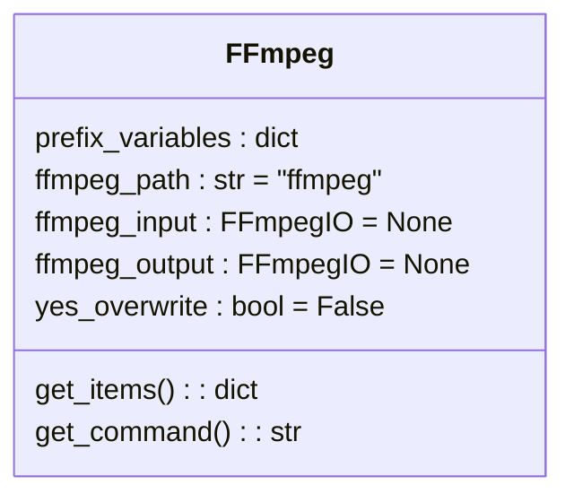
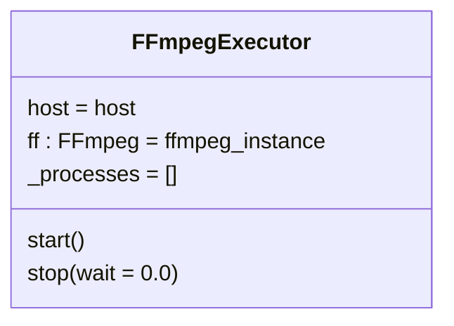

# FFmpeg command handling classes

This document describes the contents of the `ffmpeg_handler` folder.

For instructions on how to run check [Running Guide](RunningGuide.md).

## FFmpegIO class and subclasses

```mermaid
classDiagram
    FFmpegIO <|-- FFmpegVideoIO
    FFmpegIO <|-- FFmpegAudioIO

    FFmpegIO <|-- FFmpegMcmMemifAudioIO
    FFmpegIO <|-- FFmpegMcmMemifVideoIO

    FFmpegIO <|-- FFmpegMcmST2110CommonIO
    FFmpegMcmST2110CommonIO <|-- FFmpegMcmST2110AudioIO
    FFmpegMcmST2110AudioIO <|-- FFmpegMcmST2110AudioRx
    FFmpegMcmST2110AudioIO <|-- FFmpegMcmST2110AudioTx
    FFmpegMcmST2110CommonIO <|-- FFmpegMcmST2110VideoIO
    FFmpegMcmST2110VideoIO <|-- FFmpegMcmST2110VideoRx
    FFmpegMcmST2110VideoIO <|-- FFmpegMcmST2110VideoTx

    FFmpegIO <|-- FFmpegMtlCommonIO
    FFmpegMtlCommonIO <|-- FFmpegMtlCommonRx
    FFmpegMtlCommonIO <|-- FFmpegMtlCommonTx
    FFmpegMtlCommonRx <|-- FFmpegMtlSt20pRx
    FFmpegMtlCommonTx <|-- FFmpegMtlSt20pTx
    FFmpegMtlCommonRx <|-- FFmpegMtlSt22pRx
    FFmpegMtlCommonTx <|-- FFmpegMtlSt22pTx
    FFmpegMtlCommonRx <|-- FFmpegMtlSt30pRx
    FFmpegMtlCommonTx <|-- FFmpegMtlSt30pTx

    class FFmpegIO {
        read_at_native_rate : bool
        stream_loop : int
        input_path : str
        output_path : str
        get_command() : str
    }

    class FFmpegVideoIO {
        video_size : str
        f : str
        pix_fmt : str
    }

    class FFmpegAudioIO {
        ar : int
        f : str
        ac : int
    }

    class FFmpegMcmMemifAudioIO {
        channels : int
        sample_rate : int
        f : str
    }

    class FFmpegMcmMemifVideoIO {
        f : str
        conn_type : str
        frame_rate : str
        video_size : str
        pixel_format : str
    }

    class FFmpegMcmST2110CommonIO {
        buf_queue_cap : int
        conn_delay : int
        conn_type : str
        urn : str
        port : int
        socket_name : str
        interface_id : int
    }

    class FFmpegMcmST2110AudioIO {
        buf_queue_cap : int
        payload_type : int
        channels : int
        sample_rate : int
        ptime : str
        f : str
    }

    class FFmpegMcmST2110AudioRx {
        ip_addr : str
        mcast_sip_addr : str
    }

    class FFmpegMcmST2110AudioTx {
        ip_addr : str
    }

    class FFmpegMcmST2110VideoIO {
        transport : str
        buf_queue_cap : int
        payload_type : int
        transport_pixel_format : str
        video_size : str
        pixel_format : str
        frame_rate : str
        f : str
    }

    class FFmpegMcmST2110VideoRx {
        ip_addr : str
        mcast_sip_addr : str
    }

    class FFmpegMcmST2110VideoTx {
        ip_addr : str
    }

    class FFmpegMtlCommonIO {
        p_port : str
        p_sip : str
        dma_dev : str
        rx_queues : int
        tx_queues : int
        udp_port : int
        payload_type : int
    }

    class FFmpegMtlCommonRx {
        p_rx_ip : str
    }

    class FFmpegMtlCommonTx {
        p_tx_ip : str
    }

    class FFmpegMtlSt20pRx {
        video_size : str
        pixel_format : str
        fps : float
        timeout_s : int
        init_retry : int
        fb_cnt : int
        gpu_direct : bool
        gpu_driver : int
        gpu_device : int
        f : str
    }

    class FFmpegMtlSt22pRx {
        video_size : str
        pixel_format : str
        fps : float
        timeout_s : int
        init_retry : int
        fb_cnt : int
        codec_thread_cnt : int
        st22_codec : str
        f : str
    }

    class FFmpegMtlSt30pRx {
        fb_cnt : int
        timeout_s : int
        init_retry : int
        sample_rate : int
        channels : int
        pcm_fmt : str
        ptime : str
        f : str
    }

    class FFmpegMtlSt20pTx {
        fb_cnt : int
        f : str
    }

    class FFmpegMtlSt22pTx {
        fb_cnt : int
        bpp : float
        codec_thread_cnt : int
        st22_codec : str
        f : str
    }

    class FFmpegMtlSt30pTx {
        fb_cnt : int
        ptime : str
        f : str
    }
```

## FFmpeg class

## FFmpegExecutor class

## Audio format value matrix

> **Note:** Value of "none" in Tx `-pcm_fmt` column, means given switch should not be used for outbound transmissions.

<table>
<tr>
    <th rowspan=3>PCM format</th>
    <th rowspan=2>FFmpeg <code>-f</code></th>
    <th rowspan=2>Media Communications Mesh <code>-f</code></th>
    <th colspan=4>Media Transport Library</th>
</tr>
<tr>
    <th>Tx <code>-pcm_fmt</code></th>
    <th>Rx <code>-pcm_fmt</code></th>
    <th>Tx <code>-f</code></th>
    <th>Rx <code>-f</code></th>
</tr>
<tr>
    <th>FFmpegAudioIO</th>
    <th>FFmpegMcmMemifAudioIO FFmpegMcmMultipointGroupAudioIO FFmpegMcmST2110AudioIO</th>
    <th>FFmpegMtlSt30pTx</th>
    <th>FFmpegMtlSt30pRx</th>
    <th>FFmpegMtlSt30pTx</th>
    <th>FFmpegMtlCommonRx</th>
</tr>
<tr>
    <td>PCM16</td>
    <td><code>s16be</code> FFmpegAudioFormat.pcm16.value</td>
    <td><code>mcm_audio_pcm16</code> McmFAudioFormat.pcm16.value</td>
    <td rowspan=2>none</td>
    <td><code>pcm16</code> MtlPcmFmt.pcm16.value</td>
    <td><code>mtl_st30p_pcm16</code> MtlFAudioFormat.pcm16.value</td>
    <td rowspan=2><code>mtl_st30p</code> "mtl_st30p"</td>
</tr>
<tr>
    <td>PCM24</td>
    <td><code>s24be</code> FFmpegAudioFormat.pcm24.value</td>
    <td><code>mcm_audio_pcm24</code> McmFAudioFormat.pcm24.value</td>
    <!-- colspaned: <td>none</td> -->
    <td><code>pcm24</code> MtlPcmFmt.pcm24.value</td>
    <td><code>mtl_st30p</code> MtlFAudioFormat.pcm24.value</td>
    <!-- colspaned: <td><code>mtl_st30p</code> "mtl_st30p"</td> -->
</tr>
</table>

## Executing assertion tests

In order to run the assertion tests from the `ffmpeg_handler` folder, treat them as a module. Starting from Engine folder,
use `python -m ffmpeg_handler.<module_name>`, e.g. `python -m ffmpeg_handler.test_ffmpeg` to run tests from `./ffmpeg_handler/test_ffmpeg.py`.
